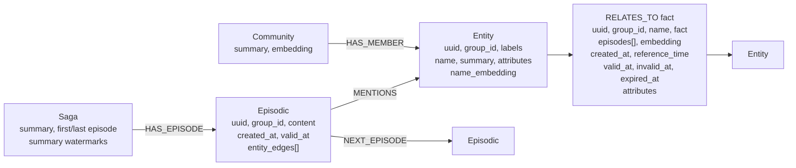
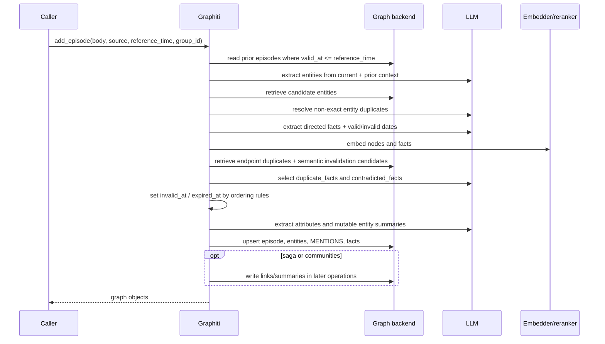

# Graphiti temporal graph and retrieval semantics: clean-room dossier

**Date:** 2026-08-26
**Status:** research only; no implementation, dependency, service, corpus, or
production authority
**Decision target:** whether Graphiti can participate in Curiosity only as a
disposable retrieval projection
**Evidence pin:** `getzep/graphiti` commit
[`683a8539c8925de69071a1305dc8bf0e52e17c65`][source-tree], package version
`0.29.3` ([package metadata][package-metadata])
**License:** Apache-2.0 ([license][license])
**Method:** clean-room static inspection of public source and tests; no hosted
service, private endpoint, credentials, database state, or undocumented runtime
behavior was inspected

## Executive decision

**Inference:** Curiosity should **REJECT Graphiti as canonical memory or
lifecycle authority**, **ADAPT its episode-lineage and valid-time vocabulary**,
and **DEFER running it as a graph projection** until a separately approved,
removable adapter satisfies the gates in this dossier.

Graphiti's strongest transferable mechanism is an entity edge with source
episode IDs and distinct `valid_at`, `invalid_at`, `created_at`, `expired_at`,
and `reference_time` fields. Its source also exposes hybrid BM25, embedding, and
graph-traversal retrieval. Those are useful projection capabilities
([edge schema][edge-schema], [search configuration][search-config]).

They are not a truth authority:

- **Documented:** an LLM extracts facts and dates, selects duplicate and
  contradicted candidate indexes, and may thereby cause existing edges to be
  mutated with `invalid_at` and `expired_at` values
  ([edge prompt][edge-prompt], [contradiction prompt][contradiction-prompt],
  [resolution code][edge-resolution]).
- **Documented:** basic `Graphiti.search()` creates an empty `SearchFilters`
  object. Despite its docstring saying current time is the reference point, it
  supplies no current-time validity or expiry predicate
  ([basic search][basic-search], [empty filter schema][search-filters]).
- **Documented:** graph records do not preserve prompt text/version, exact
  source spans or hashes, model identity, raw decision output, contradiction
  rationale, or an immutable mutation log. The persisted episode and edge
  shapes contain none of those fields
  ([episode schema/save][episode-schema], [edge schema/save][edge-schema]).
- **Documented:** removal is physical, has no tombstone, and can delete a fact
  that later episodes also support merely because the deleted episode is first
  in that fact's `episodes` list ([episode removal][episode-removal]).
- **Documented:** atomicity, queue durability, backend behavior, and test
  coverage diverge materially. Only a Neo4j bulk-save invocation has native
  rollback; a whole ingestion still spans reads, LLM calls, multiple writes,
  and optional saga/community side effects
  ([bulk write][bulk-write], [driver transactions][driver-transactions]).

**Inference:** Graphiti is eligible only as a **loss-tolerant, rebuildable,
untrusted candidate projection downstream of the Ledger**. Curiosity's Ledger
must remain the sole authority for capture, validation, contradiction,
supersession, authorization, retention, deletion, and release. The runtime
constitution also keeps unified retrieval/Ledger decisions design-only
([repository constitution](../../../AGENTS.md)).

## Question, labels, and boundary

The interoperability question is:

> Can Graphiti's temporal graph and recall mechanisms be used without allowing
> model-derived, mutable graph state to become Curiosity's evidence or lifecycle
> truth?

Claim labels used throughout:

- **Documented:** directly supported by inspected public source or tests.
- **Vendor/author claim:** stated by Graphiti/Zep documentation or authors and
  not treated as independent measurement.
- **Inference:** Curiosity's architectural interpretation of documented facts.
- **Unknown:** not established by permitted evidence.

The inspection boundary was the pinned public tree only. It covered core
schemas, write/update/recall/delete paths, prompts, drivers, bundled REST/MCP
servers, focused tests, license, and README claims. It did not evaluate Zep's
proprietary Context Graph Engine; the README explicitly distinguishes that
managed product from this bring-your-own-database framework
([Zep versus Graphiti][zep-vs-graphiti]).

## Vendor position versus inspected behavior

- **Vendor/author claim:** Graphiti tracks what is true now and what was true
  before, supports precise historical queries, preserves full temporal history,
  and provides full lineage from derived facts to raw episodes
  ([README overview][readme-overview], [README features][readme-features]).
- **Vendor/author claim:** the README calls temporal handling "explicit
  bi-temporal tracking with automatic fact invalidation"
  ([README comparison][readme-comparison]). The MCP instructions similarly call
  episode ingestion/reference time a bi-temporal model
  ([MCP instructions][mcp-instructions]).
- **Documented:** the inspected implementation does have two useful time axes
  for entity edges, but it does not implement one uniform, immutable
  bi-temporal history across episodes, entities, facts, summaries, communities,
  sagas, and deletion. The distinctions below therefore remain explicit.
- **Inference:** "bi-temporal" is a reasonable shorthand for part of the edge
  model, not proof that the complete graph is a system-versioned temporal
  authority.

## Graph and storage model

### Logical schema



**Documented:** this is a projection of the public model, not a new Curiosity
schema. `EpisodicNode` stores raw content, source description/type, event
reference time, and edge UUIDs. `EntityNode` stores mutable summaries and
attributes. `EntityEdge` stores the fact, endpoint UUIDs, source episode UUIDs,
embeddings, attributes, and its five edge-time fields
([episode schema][episode-schema], [entity schema][entity-schema],
[edge schema][edge-schema]). `MENTIONS` links episodes to extracted entities
([relationship queries][relationship-queries]); saga links and watermarks are
separate objects ([saga schema][saga-schema]).

| Object | Persisted identity and content | Temporal fields | Authority caveat |
| --- | --- | --- | --- |
| Episode | Random/caller UUID, name, `group_id`, type, source description, content, edge UUID list | `created_at`, `valid_at` | Raw input record, but no content digest, custody receipt, exact source locator, immutable revision, or authorization state |
| Entity | UUID, labels, name, embedding, mutable summary/attributes | `created_at` | Model-extracted/deduplicated object; summary and attributes are overwritten |
| Entity fact | Directed endpoints, relation name, natural-language fact, embedding, episode UUID list, attributes | `created_at`, `reference_time`, `valid_at`, `invalid_at`, `expired_at` | Model-derived assertion; no validation status or decision record |
| Community | UUID, members, name, summary, embedding | `created_at` | Derived clustering/summary and rebuilt destructively |
| Saga | UUID, episode links/order, mutable summary and watermarks | mixed `created_at`, processing and episode watermarks | Convenience narrative, not an immutable chronology |

### Backend realization

- **Documented:** Neo4j, FalkorDB, Neptune plus OpenSearch Serverless, and Kuzu
  are listed backends; Kuzu is deprecated
  ([backend requirements][backend-requirements]).
- **Documented:** Kuzu cannot full-text-index relationship properties, so a
  `RELATES_TO` fact is represented as an intermediate `RelatesToNode_`; its
  explicit schema includes all edge-time fields
  ([Kuzu schema][kuzu-schema]).
- **Documented:** Neptune full-text retrieval is routed through four AOSS
  indexes ([Neptune AOSS schema][neptune-aoss]). Static inspection found an
  in-repository AOSS save call for communities, but not corresponding episode,
  entity, or entity-edge save calls; an external synchronization mechanism is
  **Unknown** ([AOSS community save][aoss-community-save]).
- **Documented:** `group_id` is a graph partition/routing value. Core APIs call
  it a partition, validate its syntax, and may use it as a FalkorDB graph name;
  no principal or policy is part of the schema
  ([add API][add-api], [group validation][group-validation],
  [Falkor routing][falkor-routing]).

### Declared but non-persisted metadata

**Documented:** `EpisodicNode.episode_metadata` is described as customer-defined
filter metadata, but the episode save arguments, database return query, and
record parser omit it ([episode schema/save][episode-schema],
[episode persistence][episode-persistence], [episode parser][episode-parser]).
No other public source use was found. It must not be relied on for provenance,
policy, authorization, or filtering.

## Write and update semantics

### Single-episode sequence



**Documented:** `add_episode()` recommends sequential, awaited ingestion. It
loads prior episodes, constructs the episode with processing `created_at` and
caller `reference_time` as episode `valid_at`, extracts/resolves nodes and
edges, extracts attributes, then persists the graph
([add flow][add-flow]). Prior episode retrieval filters and orders by episode
`valid_at`, not by graph mutation time ([episode retrieval][episode-retrieval]).

**Documented:** exact fact text with identical directed endpoints reuses the
existing edge and adds the new episode UUID. Otherwise an LLM chooses duplicate
and contradiction indexes; code range-checks them and applies temporal ordering
rules ([edge resolution][edge-resolution]).

**Documented:** an existing episode UUID is loaded rather than rebuilt from the
new request. Therefore the high-level method is not an explicit compare-and-set
episode update API; the newly supplied body/reference time do not replace the
loaded episode in that branch ([add flow][add-flow]). Low-level `MERGE ... SET`
queries can overwrite records, but they provide no revision or history
([episode persistence][episode-persistence]).

**Documented:** `add_triplet()` bypasses entity/fact extraction, but still
resolves endpoint duplicates, searches for related and invalidation candidates,
invokes `resolve_extracted_edge()`, and then writes the result. It is not a
model-free authoritative insert path ([triplet flow][triplet-flow]).

### Bulk ingestion

**Documented:** `add_episode_bulk()` performs two separate persistence phases:
it first saves raw episode records, then performs parallel extraction/dedupe and
finally saves episodes again with entities and edges. Saga links are written
after that ([bulk flow][bulk-flow]). A failed extraction can therefore leave
episode-only records, including raw content.

**Documented:** the final bulk resolution does send edges through the same
graph-facing contradiction resolver and persists returned invalidated edges.
The in-batch edge dedupe pass itself explicitly does not track invalidation
([bulk edge dedupe][bulk-edge-dedupe], [bulk final resolution][bulk-final]).

**Documented:** `store_raw_episode_content=False` clears content only in the
single-episode `_process_episode_data()` path. The bulk path saves episode
content before and after extraction and has no corresponding check
([raw-content switch][raw-content-switch], [bulk flow][bulk-flow]).

**Inference:** bulk ingestion must be treated as a resumable projection job with
externally recorded per-phase receipts. Its current return value is not proof
that every side effect happened atomically or that a failed run was rolled back.

## Prompt and model decision surface

**Documented:** the prompt library registers entity extraction, node dedupe,
edge extraction, combined extraction, edge dedupe, node/community summaries,
saga summaries, and evaluation prompts ([prompt registry][prompt-registry]).

| Stage | Model output that changes graph state | Deterministic checks around it | Durable decision evidence |
| --- | --- | --- | --- |
| Entity extraction | Names, type IDs, episode indexes | Type/index validation, exclusions, name normalization | None beyond resulting nodes and `MENTIONS` |
| Entity dedupe | Existing candidate ID and preferred name | Exact/similarity fast paths and candidate-range checks | No retained candidate set, output, rationale, prompt, or model ID |
| Fact extraction | Directed endpoint names, relation, paraphrased fact, `valid_at`, `invalid_at`, episode indexes | Endpoints must be extracted entities; self/empty edges dropped; dates parsed | Resulting edge and episode UUID list only |
| Fact dedupe/contradiction | `duplicate_facts[]`, `contradicted_facts[]` indexes | Index bounds, valid-time ordering, exact duplicate fast path | No contradiction type, rationale, confidence, reviewer, or decision object |
| Attribute extraction | Custom typed values | Pydantic response model and capped fields | Current attributes only |
| Entity/community/saga summary | Replacement prose | Length caps and response schema | Current summary/watermarks only |

Sources: [entity prompt][entity-prompt], [node-dedupe prompt][node-dedupe-prompt],
[edge prompt][edge-prompt], [contradiction prompt][contradiction-prompt],
[summary mutation][summary-mutation], and [saga summary][saga-summary].

**Documented:** episode text, prior context, schema descriptions, and optional
caller-supplied `custom_extraction_instructions` are interpolated into model
prompts. Structured response models and post-validation reduce malformed
outputs; they do not establish factual truth or defend an authorization
boundary ([edge prompt][edge-prompt], [entity prompt][entity-prompt]).

**Documented:** `prompt_name` and provider/model-size information can be added to
tracing spans, while token counts remain in a process object. They are not graph
fields. Optional LLM caching is off by default and, when enabled, stores JSON
responses in a local SQLite cache keyed by a digest of model plus messages
([LLM execution][llm-execution], [LLM cache][llm-cache]).

**Inference:** tracing and an optional cache are observability/optimization, not
an adjudication ledger. Neither provides a stable edge-to-decision record or a
complete replay contract.

## Temporal semantics

### Keep the clocks distinct

| Field or time | Inspected meaning | Source of value | Important non-equivalence |
| --- | --- | --- | --- |
| Episode `created_at` | Episode processing/ingestion wall clock | `utc_now()` in add paths | Not when the described event happened |
| Episode `valid_at` | Reference time of the source episode/original document | Caller `reference_time` or server default current UTC | Not assertion validity and not database mutation time |
| Edge `created_at` | Processing time when the extracted edge object was created | `utc_now()` during extraction | Not necessarily `valid_at`; preserved on later edge mutation |
| Edge `reference_time` | Reference time of the episode attributed as producing the edge | First attributed episode's `valid_at` | Context for resolving relative dates, not itself proof of fact validity |
| Edge `valid_at` | When model output says the fact became true | Fact/timestamp extraction LLM, often episode reference time for present tense | Assertion-level valid time, not episode event time in every case |
| Edge `invalid_at` | When the fact stopped being true | Source extraction or contradiction code using another edge's `valid_at` | Mixes source-stated termination and inferred supersession without recording which |
| Edge `expired_at` | Wall clock when Graphiti processed invalidation/expiry | `utc_now()` in resolution | Bitemporal-like processing bound, but mutable and destroyed by physical deletion |
| Mutation/processing time | Actual read/LLM/write chronology | Runtime execution | Only selected timestamps are persisted; no complete transaction timeline exists |

Sources: [episode construction][episode-construction],
[edge construction][edge-construction], [edge schema][edge-schema], and
[edge invalidation code][edge-invalidation].

**Documented:** saga `created_at` is an exception to the generic name: new sagas
are deliberately stamped with an episode reference time, while saga summary
watermarks separately track processing time and maximum episode valid time
([saga creation][saga-creation], [saga summary][saga-summary]). This is another
reason not to treat all `created_at` fields as one global transaction clock.

### Entity-edge truth rules

**Documented:** Graphiti's context formatter describes a fact as valid from
`valid_at` until `invalid_at`, and treats null `invalid_at` as present
([context formatter][context-formatter]). The mutation code behaves as follows:

1. If a newly resolved edge already has `invalid_at` and lacks `expired_at`, set
   `expired_at` to processing `now`.
2. If an LLM-selected contradiction candidate has a later `valid_at` than the
   new edge, expire the new, older edge at that candidate's `valid_at`.
3. If the candidate is older than the new edge and their intervals overlap,
   set the old candidate's `invalid_at` to the new edge's `valid_at` and set its
   `expired_at` to processing time.
4. If either side lacks the needed dates, or intervals are already disjoint, no
   ordered invalidation occurs.

These rules are directly implemented in
[`resolve_extracted_edge()` and `resolve_edge_contradictions()`][edge-invalidation].

### Temporal truth table

`V` means an event/valid-time query point and `S` means a processing/system-time
query point. "Basic recall" means `Graphiti.search()` with no explicit filter.

| Scenario | Stored transition | Valid-time interpretation | Processing-time interpretation | Basic recall |
| --- | --- | --- | --- | --- |
| Ongoing fact first observed at episode time `T1`, processed `P1` | `reference_time=T1`; normally `valid_at=T1`; `invalid_at=null`; `created_at=P1`; `expired_at=null` | True at/after `T1` | Known at/after `P1` | Candidate |
| Source explicitly says fact ended at `T2` | `valid_at=T1`; `invalid_at=T2`; `expired_at=P1` when processed | True on `[T1,T2)` | Stored already expired at `P1` | Still a candidate unless filtered |
| New contradictory fact valid at `T2>T1`, processed `P2` | Old edge gets `invalid_at=T2`, `expired_at=P2`; new edge starts at `T2` | Old true on `[T1,T2)`; new potentially true from `T2` | Old was graph-current until `P2` | Both may be candidates |
| Late-arriving contradictory fact valid at `T0<T1`, processed `P2` | New older edge gets `invalid_at=T1`, `expired_at=P2`; later candidate remains | Older fact bounded to `[T0,T1)` | Older fact was learned only at `P2` | Both may be candidates |
| Exact/LLM duplicate in later episode `E2` | Existing edge reused; `E2` appended to `episodes`; original times generally retained | No new validity interval | Provenance list mutates after original creation | One edge candidate |
| Dates null or unparseable | Needed temporal fields remain null | Interval cannot be ordered by the contradiction code | Processing mutation may still be known only partially | Candidate |
| Edge/episode/group physically deleted | Record removed; no `deleted_at`/tombstone | Historical interval is no longer queryable | Prior graph state cannot be reconstructed from this store | Absent |

**Inference:** for a retained entity edge, a caller could approximate a
two-dimensional as-of predicate as:

```text
valid_at <= V AND (invalid_at IS NULL OR invalid_at > V)
AND created_at <= S AND (expired_at IS NULL OR expired_at > S)
```

This predicate is **not** supplied automatically, only addresses entity edges,
and fails after physical deletion or in-place overwrites. It is therefore not a
proof of complete bitemporal history.

### Filter mechanics and mismatch

- **Documented:** `SearchFilters` can express DNF date predicates over edge
  `valid_at`, `invalid_at`, `created_at`, and `expired_at`
  ([search filters][search-filters]).
- **Documented:** basic and advanced search both substitute empty filters when
  callers omit them ([basic search][basic-search]). Empty filters exclude
  neither historically invalid facts nor processing-expired facts.
- **Documented:** MCP fact search exposes valid/invalid date ranges but no
  current-time preset, `created_at`, or `expired_at` parameters
  ([MCP fact search][mcp-fact-search], [MCP filter builder][mcp-filter-builder]).
- **Documented:** bundled REST search supplies no temporal filter at all
  ([REST recall][rest-recall]).
- **Inference:** application code must define whether it wants event-time truth,
  graph-knowledge-as-of truth, all history, or unfiltered relevance. Those
  modes cannot safely share the current default.

## Recall architecture

**Documented:** search can operate over facts, entities, episodes, and
communities. Fact/entity methods include BM25, cosine similarity, and BFS;
episodes are BM25-only. Rerankers include RRF, node distance, episode mentions,
MMR, and cross-encoders ([search configuration][search-config]). The default
advanced recipe runs BM25, cosine, and BFS for facts/entities and cross-encoder
reranking ([search recipes][search-recipes]).

**Documented:** search embeds the query when needed, executes enabled scopes in
parallel, and returns objects plus optional reranker scores. It reports no
authorization snapshot, as-of mode, index watermark, coverage, exclusion
counts, partial-store status, provenance hydration status, or validation state
([search execution][search-execution], [search result schema][search-config]).

**Documented:** an absent, empty, or `['']` group list becomes unscoped `None`,
so search can span all graph partitions. Group syntax is validated, but caller
entitlement is not ([search execution][search-execution]).

**Inference:** ranking score is relevance, not confidence or truth. Every
Graphiti result must enter Curiosity as untrusted projection output and be
hydrated/revalidated against Ledger authority before serialization.

## Provenance

### What is preserved

- **Documented:** episodes can store source type, source description, content,
  event reference time, processing time, and entity-edge UUIDs
  ([episode schema/save][episode-schema]).
- **Documented:** `MENTIONS` links an episode to entities, and an entity fact
  stores an `episodes` UUID list ([relationship queries][relationship-queries],
  [edge schema][edge-schema]).
- **Documented:** duplicate resolution can append another episode UUID to the
  reused fact edge ([edge resolution][edge-resolution]).
- **Vendor/author claim:** episodes are the raw-data ground-truth stream and
  every fact traces back to them ([README context graph][readme-context-graph]).

### What is not preserved

- **Documented negative finding:** no exact source span, capture/content digest,
  source URI contract, custody receipt, parser version, ontology version, prompt
  version/text, model identity, sampling configuration, candidate set, raw LLM
  output, contradiction rationale/type, reviewer, or confidence is persisted by
  the episode/fact schemas.
- **Documented:** source content can be blanked in single ingestion and is
  physically removed by deletion. Bulk ingestion does not honor that blanking
  switch ([raw-content switch][raw-content-switch], [bulk flow][bulk-flow]).
- **Documented:** `episode_metadata` is not round-tripped, despite its field
  description ([episode schema/save][episode-schema], [episode parser][episode-parser]).
- **Inference:** an episode UUID list establishes coarse derivation lineage,
  not evidence custody or a proof that a particular text span supports the
  exact edge.

## Delete flows and orphan consequences

| Entry point | Documented behavior | Consequence |
| --- | --- | --- |
| `Graphiti.remove_episode(uuid)` | Loads `episode.entity_edges`; deletes each fact whose first `episodes` element equals the episode; deletes entities with only one incoming `MENTIONS`; deletes the episode | Physical heuristic cascade, no tombstone or decision record |
| MCP `delete_episode` | Calls `Graphiti.remove_episode` | Inherits that heuristic despite MCP prose claiming facts supported by other episodes are preserved |
| REST `DELETE /episode/{uuid}` | Calls `EpisodicNode.delete` directly | Removes the episode and its relationships but deliberately does not run core cascade cleanup |
| Edge delete | Physically deletes the selected relationship/fact | Episode `entity_edges` lists and optional cache are not repaired/purged |
| Scoped `clear_data(group_ids)` | Deletes Entity, Episodic, and Community labels, plus Kuzu fact nodes | Saga nodes are not included; non-Kuzu facts disappear only through detached endpoints |
| Full `clear_data(None)` | `MATCH (n) DETACH DELETE n` | Erases graph history with no tombstone |
| REST group delete | Iterates facts, entities, and episodes | Omits Community and Saga nodes and is non-atomic |

Sources: [episode removal][episode-removal], [MCP deletion][mcp-deletion],
[REST deletion][rest-deletion], [clear data][clear-data], and
[REST group deletion][rest-group-deletion].

**Documented contradiction:** MCP documentation says an episode deletion keeps
facts also supported by other episodes. Core code instead deletes an edge when
the deleted episode is merely `edge.episodes[0]`, even if later UUIDs are
present ([MCP deletion][mcp-deletion], [episode removal][episode-removal]).

**Inference:** deleting the origin episode can leave later episodes' stored
`entity_edges` UUIDs dangling. Deleting a later supporting episode leaves its
UUID in a surviving edge's `episodes` list. Saga first/last pointers and chains
are also not repaired by `remove_episode`. No inspected test covers the shared
fact origin case.

**Documented:** scoped Neptune clear does not remove AOSS documents or indexes;
only index build/delete paths operate on whole AOSS indexes
([Neptune clear][neptune-clear]). Backup expiry and any external index cleanup
are **Unknown**.

**Inference:** Graphiti deletion cannot satisfy Curiosity erasure proof. Ledger
must make records immediately ineligible first, then drive projection cleanup
and reconciliation without depending on Graphiti's continued availability.

## Reconstructibility assessment

| Required reconstruction input | Graphiti state | Assessment |
| --- | --- | --- |
| Exact captured source bytes and identity | Episode content string, optional/physical/mutable; no digest or custody receipt | Insufficient |
| Exact supporting occurrence/span | Episode UUID only | Absent |
| Parser/extractor/prompt version | Source tree outside graph; prompt name may be transient tracing metadata | Absent from graph |
| LLM/embedder/reranker model and configuration | Runtime client configuration | Absent from graph records |
| Raw model outputs and candidate sets | Optional local response cache, not linked to edges | Not a replay contract |
| Validation/contradiction/supersession decision | Current mutated edge timestamps | Decision result only; rationale and prior states absent |
| Stable deterministic derived IDs | Random UUIDs plus model/heuristic dedupe | Not deterministic |
| Mutation/delete history | Current state only; physical deletion | Absent |
| Summary history | Current entity/community/saga summary | Overwritten |
| Backend-independent exact rebuild | Provider-specific schemas/search/index behavior | Not established |

**Documented:** entity summaries are directly replaced by model responses, and
saga summaries overwrite the current summary plus watermarks
([summary mutation][summary-mutation], [saga summary][saga-summary]). Optional
cache responses are local JSON optimization records, not graph-linked events
([LLM cache][llm-cache]).

**Inference:** Graphiti cannot reconstruct its exact graph deterministically
from its own retained records. A functionally similar projection can be rebuilt
only if Curiosity independently owns complete canonical captures, assertion
decisions, stable projection IDs, ontology/prompt/model manifests where needed,
and a replay cursor. Re-running Graphiti extraction may produce a different
projection and must never revise Ledger truth.

## Concurrency, atomicity, and failure recovery

### Backend partial-write matrix

| Backend | One `add_nodes_and_edges_bulk()` invocation | Whole single/bulk ingestion | Retrieval/index caveat | Focused test evidence |
| --- | --- | --- | --- | --- |
| Neo4j | Native driver `execute_write`; statements share one transaction and roll back on failure | Not atomic: prior reads/LLM calls, bulk episode pre-save, final save, saga, and community writes are separate | Native full-text/vector/graph operations | Default matrix and strongest path |
| FalkorDB | Session calls statements immediately; episode/node/MENTIONS/fact statements are sequential | Not atomic; per-group workers also share mutable client routing | Per-`group_id` graph routing and custom full-text syntax | Bulk test and many similarity/BFS/relevance tests explicitly skip it |
| Kuzu | Immediate session; records are inserted one by one because bulk `UNWIND` is unsupported | Not atomic | Deprecated; fact-as-node workaround; full-text tests skipped | Excluded from default matrix unless explicitly enabled |
| Neptune + AOSS | Immediate sequential graph queries; no native transaction wrapper | Not atomic across graph/AOSS or ingestion phases | Full-text is a separate AOSS store; scoped cleanup/sync gaps above | Neptune is forcibly disabled in the shared test matrix |

Sources: [bulk write][bulk-write], [Neo4j transaction][neo4j-transaction],
[Falkor session][falkor-session], [Kuzu session][kuzu-session],
[Neptune session][neptune-session], [backend test matrix][backend-test-matrix],
and [backend skips][backend-skips].

### Cross-phase and service behavior

- **Documented:** bulk episodes are committed before extraction and final graph
  persistence. Even on Neo4j, those are separate transactions
  ([bulk flow][bulk-flow]).
- **Documented:** optional saga and community writes occur after the main graph
  save. Community rebuild deletes existing communities before creating their
  replacements ([bulk flow][bulk-flow], [community rebuild][community-rebuild]).
- **Documented:** core explicitly recommends sequential `add_episode()` calls
  ([add API][add-api]). There is no compare-and-set around graph reads,
  candidate decisions, or edge mutation.
- **Documented:** MCP uses one in-memory `asyncio.Queue` and worker flag per
  `group_id`. Failures are logged and tasks are marked done; there is no durable
  job record, replay cursor, dead-letter queue, or caller-visible completion
  result ([MCP queue][mcp-queue]).
- **Documented:** workers for different MCP groups share one Graphiti client,
  while `add_episode()` mutates `self.driver` and `self.clients.driver` during
  group routing. FalkorDB cloning selects a graph name
  ([add flow][add-flow], [Falkor routing][falkor-routing]).
- **Inference:** concurrent different-group MCP ingestion can race shared
  routing state. Per-group serialization does not establish cross-group client
  isolation.
- **Documented:** bundled REST uses one in-memory worker. A job exception other
  than cancellation exits the worker loop; queued jobs are closures over a
  request-scoped Graphiti dependency that closes its driver when the request
  ends ([REST worker][rest-worker], [REST client lifecycle][rest-client-lifecycle]).
- **Inference:** the REST background path has no reliable completion or recovery
  protocol and may use a closed request client.
- **Documented:** basic search mutates a shared recipe object's `limit` before
  execution ([basic search][basic-search], [search recipes][search-recipes]).
- **Inference:** concurrent callers with different limits can race that global
  mutable configuration.

### Retries and recovery

**Documented:** base LLM calls retry selected rate-limit, empty-response, JSON,
and HTTP 5xx failures with bounded exponential backoff; provider subclasses add
bounded response-validation retries ([LLM retries][llm-retries],
[OpenAI retries][openai-retries]).

**Documented negative finding:** no general database mutation retry, durable
outbox, idempotency record, transaction-wide rollback, partial-write detector,
or graph/index reconciliation loop was found in the inspected paths. `MERGE` on
UUID makes some repeated writes upserts, but does not make the complete
read/LLM/write workflow idempotent.

## Security and privacy posture

| Concern | Evidence | Curiosity consequence |
| --- | --- | --- |
| Client authentication | Bundled FastAPI routes are included without visible auth dependencies/middleware; MCP config covers transport/host/port but no client-auth policy | Do not expose bundled servers; put any adapter behind Curiosity authorization |
| Network bind | MCP HTTP host defaults to `0.0.0.0` | Explicit localhost/private bind is mandatory even for evaluation |
| Tenant isolation | Caller chooses `group_id`; it is syntax-validated and used for filtering/routing | Partition is not authorization; never derive entitlement from possession of a group string |
| Query/label injection | Group IDs, node labels, and Lucene/Falkor queries have validation/sanitization paths | Useful defense in depth, not access control |
| Prompt/data egress | Episode/prior content goes to extraction LLMs; names/facts/query text go to embedding/reranking providers | Only policy-eligible, minimized content may enter a projection evaluation |
| At-rest protection | Raw content and derived text are graph properties; no application-layer encryption/key custody is modeled | Database deployment controls are **Unknown** and cannot substitute for Curiosity custody receipts |
| Raw-content switch | Single ingestion may blank content; bulk ignores the switch | Do not rely on this setting as a privacy control |
| Deletion | Physical graph deletes; no tombstone/proof; optional cache and Neptune AOSS are not projection-reconciled by scoped deletion | Ledger ineligibility and independent cleanup verification are mandatory |
| Telemetry | Initialization telemetry is enabled by default and sends anonymous ID/version/architecture/provider choices to PostHog; README says graph content and queries are excluded | Disable telemetry for any bounded evaluation and verify network policy |

Sources: [REST app][rest-app], [MCP server config][mcp-server-config],
[MCP startup][mcp-startup], [group validation][group-validation],
[telemetry code][telemetry-code], and [telemetry documentation][telemetry-docs].

**Documented negative finding:** searches for authentication/authorization in
the bundled server surfaces found upstream-provider API-key handling, but no
equivalent caller authentication or per-operation authorization. Provider API
keys authenticate Graphiti to LLM services; they do not authenticate a client
to Graphiti.

**Inference:** model-extracted graph data and recall results are untrusted
external data. Graphiti must not receive secrets or restricted captures merely
because its database is self-hosted.

## Curiosity fit

### Requirement comparison

| Curiosity requirement | Graphiti evidence | Disposition |
| --- | --- | --- |
| Ledger is sole lifecycle authority | Graph edge mutation acts directly on model duplicate/contradiction output | **FAIL as authority** |
| Immutable capture and exact support | Raw episode string plus coarse UUID lineage; no digest/span/custody | **FAIL** |
| Explicit validation and typed disputes | No validation state; contradiction indexes become timestamp mutation | **FAIL** |
| Distinct valid/processing time | Strong entity-edge fields, but mixed/global semantics and physical deletion | **ADAPT vocabulary** |
| Authorization before retrieval and delivery | `group_id` filters only; bundled routes show no caller auth | **FAIL** |
| Tombstone and deletion propagation | Physical deletes, orphan risks, no proof | **FAIL** |
| Rebuildable projection | Rebuild possible only from an external canonical source; exact self-replay absent | **CONDITIONAL** |
| Provider-neutral untrusted recall | Core APIs are separable, but backend semantics diverge | **CONDITIONAL** |
| Bounded/explainable retrieval | Methods/config/scores are visible; no eligibility/coverage envelope | **ADAPT with wrapper** |

### Projection-only contract

**Inference:** all of the following are prerequisites, not authority granted by
this report:

1. Ledger records canonical capture, assertion, valid-time, contradiction,
   supersession, authorization, retention, and deletion states before Graphiti
   receives anything.
2. A durable outbox emits only policy-eligible, minimized projection records
   with deterministic Curiosity-owned IDs, tenant/purpose scope, source refs,
   and a Ledger revision/cursor.
3. Graphiti extraction is either disabled for canonical assertions or treated
   only as a proposal generator. Every generated node/fact returns to Ledger as
   `PENDING`/authority-none evidence; it cannot activate, dispute, supersede, or
   delete canonical records.
4. The adapter uses an explicitly qualified backend. Initial qualification
   should target Neo4j only; FalkorDB, Kuzu, and Neptune remain separate NO-GOs
   until equivalent failure, isolation, temporal-filter, and deletion tests pass.
5. Writes carry durable per-item attempt/result receipts, idempotency keys, and
   projection revision. A reconciler can compare Ledger/outbox state to the
   graph, repair missing/stale rows, and destroy/rebuild the entire graph.
6. Recall always supplies an explicit mode: `current`, event-time `as_of`,
   processing-time `known_as_of`, or `history`. Empty temporal filters are
   forbidden for current-memory use.
7. Recall results are treated as untrusted IDs/scores. Curiosity reauthorizes,
   checks purpose/policy/freshness/tombstones, hydrates canonical evidence, and
   rechecks immediately before serialization.
8. Ledger tombstones make data unservable synchronously. Graphiti/cache/index
   deletion is asynchronous projection cleanup with verification, not the
   authority transition.
9. The adapter runs privately with explicit caller authentication, least
   privilege, telemetry disabled, content minimization, isolated clients per
   partition, and no bundled public REST/MCP defaults.
10. Deleting Graphiti and all of its indexes/caches must lose no canonical fact,
    decision, provenance, or lifecycle history. Rebuild is proven from Ledger
    fixtures before any evaluation result is accepted.

### Explicit NO-GOs

- **NO-GO:** making Graphiti episodes, entities, facts, summaries, sagas,
  communities, timestamps, or model outputs canonical Curiosity truth.
- **NO-GO:** dual-writing lifecycle transitions to Ledger and Graphiti or using
  Graphiti invalidation as Ledger adjudication.
- **NO-GO:** interpreting `group_id` as authentication, authorization, tenant
  proof, or purpose limitation.
- **NO-GO:** using basic/default search as "current truth" without explicit
  temporal predicates and final Ledger eligibility checks.
- **NO-GO:** relying on `store_raw_episode_content=False`, bundled deletion, or
  database deletion as custody/erasure proof.
- **NO-GO:** deploying the bundled unauthenticated REST/MCP surfaces, especially
  HTTP bound to `0.0.0.0`.
- **NO-GO:** accepting an in-memory queue acknowledgement as durable ingestion
  success.
- **NO-GO:** initial multi-backend support. Backend parity is not established by
  common Python interfaces.
- **NO-GO:** depending on Graphiti, its optional cache, an embedding provider,
  or AOSS to reconstruct canonical evidence or decisions.
- **NO-GO:** implementation under this research result. Unified
  retrieval/Ledger decisions remain design-only under the repository
  constitution.

## Unknowns and negative findings

- **Unknown:** hosted Zep governance, authentication, storage, temporal, and
  deletion behavior. It is proprietary and outside this Graphiti dossier.
- **Unknown:** production database backup retention, encryption, key custody,
  access logs, point-in-time restore, replication, and physical erasure.
- **Unknown:** whether a deployment supplies external Neptune-to-AOSS indexing
  or deletion not represented in this repository.
- **Unknown:** cross-process behavior of multiple MCP/REST replicas; the bundled
  queues are process-local.
- **Unknown:** exact temporal and contradiction quality across models/languages.
  Prompt intent is not independent accuracy evidence.
- **Unknown:** precise retrieval quality, latency, and scale for Curiosity data.
  README performance/scalability statements are vendor claims and were not
  benchmark-reproduced.
- **Documented negative finding:** no immutable event log, tombstone lifecycle,
  exact support spans, source digests, validation/dispute states, authorization
  snapshots, durable queue status, outbox, or reconciliation protocol was found.
- **Documented negative finding:** backend-focused tests explicitly skip or
  disable material paths, so a shared interface must not be represented as
  behavioral parity ([backend test matrix][backend-test-matrix],
  [backend skips][backend-skips]).

## Confidence and saturation stop

- **High confidence:** public object shapes, orchestration order, prompt
  contracts, filter defaults, mutation rules, physical deletion behavior,
  transaction wrappers, and bundled server queue/auth posture are directly
  visible at the pinned commit.
- **High confidence:** Graphiti cannot be Curiosity's canonical memory authority
  without violating the existing Ledger boundary.
- **Medium-high confidence inference:** a tightly wrapped Neo4j instance could
  be useful as a disposable graph/retrieval challenger after the projection
  contract is implemented and separately approved.
- **Low confidence / unknown:** uninspected external operational controls and
  empirical retrieval quality.

**Saturation stop:** inspection stopped after correlating the core single and
bulk pipelines, every persisted time field, prompt outputs, search defaults and
date filters, all public delete entry points, four driver transaction models,
bundled server queues, security controls, and focused backend tests. Additional
reads were repeating one of four already decision-complete findings: model
judgment mutates graph state, defaults do not enforce current truth, provenance
is coarse/non-replayable, and operations are not universally atomic or durable.
No remaining public-static question could change the projection-only verdict;
the unresolved items require runtime experiments, deployment evidence, or a
separate Curiosity design/approval.

## Verification

This is a documentation-only result. Verify the artifact and exclusive change
boundary with:

```sh
artifact=apps/runtime/docs/research/memory-systems/graphiti-2026-08-26.md
git diff --no-index --check -- /dev/null "$artifact" || test $? -eq 1
git diff --no-index -- /dev/null "$artifact" || test $? -eq 1
git status --short
```

No Graphiti service, LLM, embedder, database, or test suite is required to
establish the static-source claims above.

## Pinned evidence index

[source-tree]: https://github.com/getzep/graphiti/tree/683a8539c8925de69071a1305dc8bf0e52e17c65
[package-metadata]: https://github.com/getzep/graphiti/blob/683a8539c8925de69071a1305dc8bf0e52e17c65/pyproject.toml#L1-L12
[license]: https://github.com/getzep/graphiti/blob/683a8539c8925de69071a1305dc8bf0e52e17c65/LICENSE#L1-L15
[readme-overview]: https://github.com/getzep/graphiti/blob/683a8539c8925de69071a1305dc8bf0e52e17c65/README.md#L37-L50
[readme-context-graph]: https://github.com/getzep/graphiti/blob/683a8539c8925de69071a1305dc8bf0e52e17c65/README.md#L60-L77
[zep-vs-graphiti]: https://github.com/getzep/graphiti/blob/683a8539c8925de69071a1305dc8bf0e52e17c65/README.md#L79-L112
[readme-features]: https://github.com/getzep/graphiti/blob/683a8539c8925de69071a1305dc8bf0e52e17c65/README.md#L114-L130
[readme-comparison]: https://github.com/getzep/graphiti/blob/683a8539c8925de69071a1305dc8bf0e52e17c65/README.md#L136-L152
[backend-requirements]: https://github.com/getzep/graphiti/blob/683a8539c8925de69071a1305dc8bf0e52e17c65/README.md#L154-L166
[telemetry-docs]: https://github.com/getzep/graphiti/blob/683a8539c8925de69071a1305dc8bf0e52e17c65/README.md#L620-L700
[episode-schema]: https://github.com/getzep/graphiti/blob/683a8539c8925de69071a1305dc8bf0e52e17c65/graphiti_core/nodes.py#L318-L359
[entity-schema]: https://github.com/getzep/graphiti/blob/683a8539c8925de69071a1305dc8bf0e52e17c65/graphiti_core/nodes.py#L499-L582
[edge-schema]: https://github.com/getzep/graphiti/blob/683a8539c8925de69071a1305dc8bf0e52e17c65/graphiti_core/edges.py#L263-L375
[saga-schema]: https://github.com/getzep/graphiti/blob/683a8539c8925de69071a1305dc8bf0e52e17c65/graphiti_core/nodes.py#L867-L917
[relationship-queries]: https://github.com/getzep/graphiti/blob/683a8539c8925de69071a1305dc8bf0e52e17c65/graphiti_core/models/edges/edge_db_queries.py#L19-L51
[episode-persistence]: https://github.com/getzep/graphiti/blob/683a8539c8925de69071a1305dc8bf0e52e17c65/graphiti_core/models/nodes/node_db_queries.py#L30-L134
[episode-parser]: https://github.com/getzep/graphiti/blob/683a8539c8925de69071a1305dc8bf0e52e17c65/graphiti_core/nodes.py#L1027-L1047
[kuzu-schema]: https://github.com/getzep/graphiti/blob/683a8539c8925de69071a1305dc8bf0e52e17c65/graphiti_core/driver/kuzu_driver.py#L51-L151
[neptune-aoss]: https://github.com/getzep/graphiti/blob/683a8539c8925de69071a1305dc8bf0e52e17c65/graphiti_core/driver/neptune_driver.py#L62-L136
[aoss-community-save]: https://github.com/getzep/graphiti/blob/683a8539c8925de69071a1305dc8bf0e52e17c65/graphiti_core/driver/neptune/operations/community_node_ops.py#L55-L80
[group-validation]: https://github.com/getzep/graphiti/blob/683a8539c8925de69071a1305dc8bf0e52e17c65/graphiti_core/helpers.py#L136-L186
[falkor-routing]: https://github.com/getzep/graphiti/blob/683a8539c8925de69071a1305dc8bf0e52e17c65/graphiti_core/driver/falkordb_driver.py#L127-L176
[add-api]: https://github.com/getzep/graphiti/blob/683a8539c8925de69071a1305dc8bf0e52e17c65/graphiti_core/graphiti.py#L980-L1059
[add-flow]: https://github.com/getzep/graphiti/blob/683a8539c8925de69071a1305dc8bf0e52e17c65/graphiti_core/graphiti.py#L1067-L1228
[episode-construction]: https://github.com/getzep/graphiti/blob/683a8539c8925de69071a1305dc8bf0e52e17c65/graphiti_core/graphiti.py#L1098-L1112
[episode-retrieval]: https://github.com/getzep/graphiti/blob/683a8539c8925de69071a1305dc8bf0e52e17c65/graphiti_core/utils/maintenance/graph_data_operations.py#L67-L167
[triplet-flow]: https://github.com/getzep/graphiti/blob/683a8539c8925de69071a1305dc8bf0e52e17c65/graphiti_core/graphiti.py#L1645-L1763
[bulk-flow]: https://github.com/getzep/graphiti/blob/683a8539c8925de69071a1305dc8bf0e52e17c65/graphiti_core/graphiti.py#L1230-L1487
[bulk-final]: https://github.com/getzep/graphiti/blob/683a8539c8925de69071a1305dc8bf0e52e17c65/graphiti_core/graphiti.py#L815-L924
[bulk-edge-dedupe]: https://github.com/getzep/graphiti/blob/683a8539c8925de69071a1305dc8bf0e52e17c65/graphiti_core/utils/bulk_utils.py#L489-L581
[raw-content-switch]: https://github.com/getzep/graphiti/blob/683a8539c8925de69071a1305dc8bf0e52e17c65/graphiti_core/graphiti.py#L680-L733
[edge-construction]: https://github.com/getzep/graphiti/blob/683a8539c8925de69071a1305dc8bf0e52e17c65/graphiti_core/utils/maintenance/edge_operations.py#L250-L322
[edge-resolution]: https://github.com/getzep/graphiti/blob/683a8539c8925de69071a1305dc8bf0e52e17c65/graphiti_core/utils/maintenance/edge_operations.py#L623-L847
[edge-invalidation]: https://github.com/getzep/graphiti/blob/683a8539c8925de69071a1305dc8bf0e52e17c65/graphiti_core/utils/maintenance/edge_operations.py#L538-L620
[prompt-registry]: https://github.com/getzep/graphiti/blob/683a8539c8925de69071a1305dc8bf0e52e17c65/graphiti_core/prompts/lib.py#L47-L102
[entity-prompt]: https://github.com/getzep/graphiti/blob/683a8539c8925de69071a1305dc8bf0e52e17c65/graphiti_core/prompts/extract_nodes.py#L28-L80
[node-dedupe-prompt]: https://github.com/getzep/graphiti/blob/683a8539c8925de69071a1305dc8bf0e52e17c65/graphiti_core/prompts/dedupe_nodes.py#L25-L114
[edge-prompt]: https://github.com/getzep/graphiti/blob/683a8539c8925de69071a1305dc8bf0e52e17c65/graphiti_core/prompts/extract_edges.py#L25-L178
[contradiction-prompt]: https://github.com/getzep/graphiti/blob/683a8539c8925de69071a1305dc8bf0e52e17c65/graphiti_core/prompts/dedupe_edges.py#L24-L103
[summary-mutation]: https://github.com/getzep/graphiti/blob/683a8539c8925de69071a1305dc8bf0e52e17c65/graphiti_core/utils/maintenance/node_operations.py#L920-L1007
[saga-creation]: https://github.com/getzep/graphiti/blob/683a8539c8925de69071a1305dc8bf0e52e17c65/graphiti_core/graphiti.py#L346-L390
[saga-summary]: https://github.com/getzep/graphiti/blob/683a8539c8925de69071a1305dc8bf0e52e17c65/graphiti_core/graphiti.py#L438-L568
[llm-execution]: https://github.com/getzep/graphiti/blob/683a8539c8925de69071a1305dc8bf0e52e17c65/graphiti_core/llm_client/client.py#L197-L267
[llm-cache]: https://github.com/getzep/graphiti/blob/683a8539c8925de69071a1305dc8bf0e52e17c65/graphiti_core/llm_client/cache.py#L27-L64
[basic-search]: https://github.com/getzep/graphiti/blob/683a8539c8925de69071a1305dc8bf0e52e17c65/graphiti_core/graphiti.py#L1527-L1629
[search-filters]: https://github.com/getzep/graphiti/blob/683a8539c8925de69071a1305dc8bf0e52e17c65/graphiti_core/search/search_filters.py#L27-L68
[context-formatter]: https://github.com/getzep/graphiti/blob/683a8539c8925de69071a1305dc8bf0e52e17c65/graphiti_core/search/search_helpers.py#L22-L69
[search-config]: https://github.com/getzep/graphiti/blob/683a8539c8925de69071a1305dc8bf0e52e17c65/graphiti_core/search/search_config.py#L29-L129
[search-recipes]: https://github.com/getzep/graphiti/blob/683a8539c8925de69071a1305dc8bf0e52e17c65/graphiti_core/search/search_config_recipes.py#L33-L153
[search-execution]: https://github.com/getzep/graphiti/blob/683a8539c8925de69071a1305dc8bf0e52e17c65/graphiti_core/search/search.py#L98-L250
[mcp-instructions]: https://github.com/getzep/graphiti/blob/683a8539c8925de69071a1305dc8bf0e52e17c65/mcp_server/src/graphiti_mcp_server.py#L134-L173
[mcp-fact-search]: https://github.com/getzep/graphiti/blob/683a8539c8925de69071a1305dc8bf0e52e17c65/mcp_server/src/graphiti_mcp_server.py#L567-L644
[mcp-filter-builder]: https://github.com/getzep/graphiti/blob/683a8539c8925de69071a1305dc8bf0e52e17c65/mcp_server/src/utils/type_config.py#L139-L194
[rest-recall]: https://github.com/getzep/graphiti/blob/683a8539c8925de69071a1305dc8bf0e52e17c65/server/graph_service/routers/retrieve.py#L14-L56
[episode-removal]: https://github.com/getzep/graphiti/blob/683a8539c8925de69071a1305dc8bf0e52e17c65/graphiti_core/graphiti.py#L1765-L1793
[mcp-deletion]: https://github.com/getzep/graphiti/blob/683a8539c8925de69071a1305dc8bf0e52e17c65/mcp_server/src/graphiti_mcp_server.py#L647-L699
[rest-deletion]: https://github.com/getzep/graphiti/blob/683a8539c8925de69071a1305dc8bf0e52e17c65/server/graph_service/routers/ingest.py#L87-L111
[clear-data]: https://github.com/getzep/graphiti/blob/683a8539c8925de69071a1305dc8bf0e52e17c65/graphiti_core/utils/maintenance/graph_data_operations.py#L34-L65
[rest-group-deletion]: https://github.com/getzep/graphiti/blob/683a8539c8925de69071a1305dc8bf0e52e17c65/server/graph_service/zep_graphiti.py#L39-L78
[neptune-clear]: https://github.com/getzep/graphiti/blob/683a8539c8925de69071a1305dc8bf0e52e17c65/graphiti_core/driver/neptune/operations/graph_ops.py#L39-L80
[bulk-write]: https://github.com/getzep/graphiti/blob/683a8539c8925de69071a1305dc8bf0e52e17c65/graphiti_core/utils/bulk_utils.py#L128-L260
[driver-transactions]: https://github.com/getzep/graphiti/blob/683a8539c8925de69071a1305dc8bf0e52e17c65/graphiti_core/driver/driver.py#L146-L166
[neo4j-transaction]: https://github.com/getzep/graphiti/blob/683a8539c8925de69071a1305dc8bf0e52e17c65/graphiti_core/driver/neo4j_driver.py#L148-L178
[falkor-session]: https://github.com/getzep/graphiti/blob/683a8539c8925de69071a1305dc8bf0e52e17c65/graphiti_core/driver/falkordb_driver.py#L90-L124
[kuzu-session]: https://github.com/getzep/graphiti/blob/683a8539c8925de69071a1305dc8bf0e52e17c65/graphiti_core/driver/kuzu_driver.py#L264-L291
[neptune-session]: https://github.com/getzep/graphiti/blob/683a8539c8925de69071a1305dc8bf0e52e17c65/graphiti_core/driver/neptune_driver.py#L367-L395
[community-rebuild]: https://github.com/getzep/graphiti/blob/683a8539c8925de69071a1305dc8bf0e52e17c65/graphiti_core/graphiti.py#L1489-L1524
[mcp-queue]: https://github.com/getzep/graphiti/blob/683a8539c8925de69071a1305dc8bf0e52e17c65/mcp_server/src/services/queue_service.py#L12-L80
[rest-worker]: https://github.com/getzep/graphiti/blob/683a8539c8925de69071a1305dc8bf0e52e17c65/server/graph_service/routers/ingest.py#L13-L70
[rest-client-lifecycle]: https://github.com/getzep/graphiti/blob/683a8539c8925de69071a1305dc8bf0e52e17c65/server/graph_service/zep_graphiti.py#L81-L126
[llm-retries]: https://github.com/getzep/graphiti/blob/683a8539c8925de69071a1305dc8bf0e52e17c65/graphiti_core/llm_client/client.py#L62-L72
[openai-retries]: https://github.com/getzep/graphiti/blob/683a8539c8925de69071a1305dc8bf0e52e17c65/graphiti_core/llm_client/openai_base_client.py#L276-L330
[backend-test-matrix]: https://github.com/getzep/graphiti/blob/683a8539c8925de69071a1305dc8bf0e52e17c65/tests/helpers_test.py#L42-L68
[backend-skips]: https://github.com/getzep/graphiti/blob/683a8539c8925de69071a1305dc8bf0e52e17c65/tests/test_graphiti_mock.py#L118-L128
[rest-app]: https://github.com/getzep/graphiti/blob/683a8539c8925de69071a1305dc8bf0e52e17c65/server/graph_service/main.py#L1-L29
[mcp-server-config]: https://github.com/getzep/graphiti/blob/683a8539c8925de69071a1305dc8bf0e52e17c65/mcp_server/src/config/schema.py#L76-L85
[mcp-startup]: https://github.com/getzep/graphiti/blob/683a8539c8925de69071a1305dc8bf0e52e17c65/mcp_server/src/graphiti_mcp_server.py#L1098-L1285
[telemetry-code]: https://github.com/getzep/graphiti/blob/683a8539c8925de69071a1305dc8bf0e52e17c65/graphiti_core/telemetry/telemetry.py#L15-L117
