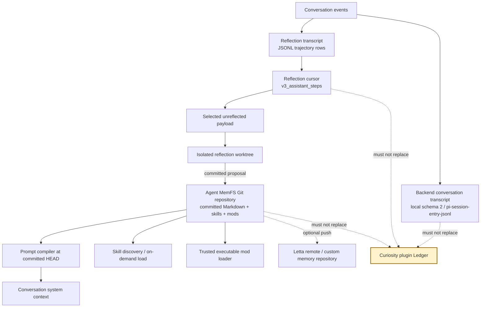

# Letta Code persistent context and self-improvement: clean-room dossier

**Date:** 2026-08-26

**Status:** research only; no implementation, dependency, service, corpus,
publication, deployment, production use, or authority transfer

**Decision target:** which Letta Code persistent-context and reflection
mechanisms Curiosity may independently adapt without creating a second evidence
or lifecycle authority

**Evidence pin:** `letta-ai/letta-code` commit
[`ad7e6cf5ff78c0e757770d66fcf04462a0e65c92`][source-tree], npm package
`@letta-ai/letta-code` `0.31.2`, Node `>=22.19.0`
([package-metadata][package-metadata], [runtime-metadata][runtime-metadata])

**License:** Apache-2.0 ([license][license])

**Method:** bounded clean-room static inspection of public source,
documentation, tests, package metadata, and local Git metadata. No Letta Cloud
account, private service, credentials, user corpus, live model, or undocumented
runtime behavior was inspected.

## Executive decision

**Inference:** Curiosity should **ADAPT the separation of committed prompt
projection, transcript cursors, and isolated reflection proposals**, but
**REJECT Letta Code's MemFS, reflection output, skills, and mods as canonical
memory, evidence, authorization, retention, or lifecycle authority**.

The strongest transferable mechanisms are:

1. A prompt projection compiled from a named, committed memory revision rather
   than an arbitrary dirty working tree.
2. Tiered context in which concise `system/*.md` content is always projected
   and larger reference/skill material is discovered or loaded on demand.
3. A reflection cursor that selects only unreflected transcript slices and is
   advanced only after the proposal is integrated or deliberately produces no
   change.
4. An isolated Git worktree for model-proposed changes, with parent refresh,
   explicit conflict states, cleanup, and retry rather than editing the active
   memory tree in place.
5. A reusable-procedure tier (`skills/<name>/SKILL.md`) distinct from durable
   user/project facts.

Those mechanisms do not establish truth or authority:

- **Documented:** the ordinary `memory` and `memory_apply_patch` tools require
  no approval, directly mutate a clean scoped repository, and create commits
  attributed to the agent ([tool-permissions][tool-permissions],
  [memory-write-flow][memory-write-flow], [patch-write-flow][patch-write-flow]).
- **Documented:** local prompt compilation reads Markdown from committed
  `HEAD`; `system/*.md` bodies enter the prompt while non-system memory appears
  as a file tree and skills are resolved through a separate discovery path
  ([committed-files][committed-files], [prompt-projection][prompt-projection],
  [skill-precedence][skill-precedence]).
- **Documented:** reflection is model-directed. Its prompt asks a background
  subagent to infer lasting facts, preferences, corrections, contradictions,
  and reusable workflows, then edit and commit memory or skills
  ([reflection-policy][reflection-policy], [reflection-commit][reflection-commit]).
- **Documented:** agent/harness commits default to unsigned, synthetic
  identities; reflection integration uses worktrees and merge commits but does
  not add a factual validation decision, authorization receipt, source digest,
  or retention status ([git-identity][git-identity],
  [reflection-worktree][reflection-worktree], [reflection-merge][reflection-merge]).
- **Documented:** `memory/mods` files are trusted executable extensions,
  dynamically imported with command, tool, provider, event, permission, and UI
  capabilities ([mod-sources][mod-sources], [mod-import][mod-import],
  [mod-capabilities][mod-capabilities]).
- **Documented:** conversation transcripts, reflection transcripts/cursors, and
  MemFS Git history are separate state planes. Local agent deletion removes
  agent/conversation records but the inspected path does not remove the
  separate MemFS repository ([local-transcript-schema][local-transcript-schema],
  [reflection-state-schema][reflection-state-schema], [local-delete][local-delete]).

**Inference:** Git provenance, a successful merge, prompt projection, or a
model's repeated conclusion can prove that a state transition occurred. None
proves that the content is true, sufficiently evidenced, currently authorized,
or eligible for retention and delivery. Curiosity's plugin Ledger must remain
the sole lifecycle authority, and any analogous prompt memory must remain a
disposable, policy-derived projection.

## Question, labels, and boundary

The decision question is:

> Can an independent implementation preserve Letta Code's useful persistent
> context and reflection mechanics while ensuring that model-authored memory
> never becomes Curiosity's evidence, policy, or lifecycle truth?

Claim labels used throughout:

| Label                   | Meaning in this dossier                                                                                 |
| ----------------------- | ------------------------------------------------------------------------------------------------------- |
| **Documented**          | Directly supported by inspected pinned source, tests, documentation, package metadata, or Git metadata. |
| **Vendor/author claim** | Stated by Letta authors but not independently measured or accepted as proof.                            |
| **Inference**           | Curiosity-specific architectural conclusion derived from cited behavior.                                |
| **Unknown**             | Not established by the permitted public static evidence.                                                |

Coverage was bounded to creation defaults, MemFS layout/projection/mutation,
Git synchronization, local transcripts and compaction, reflection triggers and
cursors, worktree integration, `letta dream`, subagent isolation, skills,
executable mods, tests, and local deletion. Letta Cloud's private storage,
server-side reflection, authorization, retention, and erasure implementation
are **Unknown**.

**Vendor/author claim:** Letta Code agents have memory, identity, and experience
over time and improve by rewriting memory, skills, prompts, and even the harness
through mods. The README also says all context is tracked via Git
([README positioning][readme-positioning]). These are product descriptions, not
independent correctness, safety, or learning-quality measurements.

## State and authority inventory

### Separate planes



**Documented:** the local backend transcript manifest is schema `2`, message
format `pi-session-entry-jsonl`, provider stack `pi-ai`, and can contain session,
message, and compaction entries ([local-transcript-schema][local-transcript-schema]).
Reflection separately stores a JSONL transcript and `state.json` under an
agent/conversation transcript root. Its current cursor schema is
`v3_assistant_steps` and counts assistant rows as completed steps
([reflection-state-schema][reflection-state-schema],
[reflection-state-logic][reflection-state-logic]). MemFS is a third repository
root selected by agent/runtime scope ([memfs-paths][memfs-paths]).

| Plane                 | Durable object                                                   | Primary key/cursor                    | Mutator                               | What it can establish                        | What it cannot establish                              |
| --------------------- | ---------------------------------------------------------------- | ------------------------------------- | ------------------------------------- | -------------------------------------------- | ----------------------------------------------------- |
| Agent definition      | Agent record, raw system prompt, model, tags, standard blocks    | Agent ID                              | Agent APIs/harness                    | Configured agent state                       | Truth or retention eligibility                        |
| MemFS                 | Git repository of memory Markdown, skills, mods, and other files | Commit SHA / `HEAD`                   | Agent tools, humans, reflection, sync | File bytes and transition ancestry           | Factual support, reviewer authority, complete erasure |
| Compiled context      | Per-conversation rendered prompt cache                           | Raw-system hash + MemFS revision      | Local prompt compiler                 | Which committed context was rendered         | Whether projected text is correct or safe             |
| Backend conversation  | Local records and `messages.jsonl`, or remote backend state      | Conversation/message IDs              | Turn and compaction paths             | Conversation chronology in that backend      | Reflection completion or MemFS revision               |
| Reflection transcript | Normalized user/assistant/reasoning/tool rows                    | Source message IDs and line positions | Post-turn capture/external adapters   | Candidate experience available to reflect on | Canonical evidence or authorization                   |
| Reflection cursor     | `state.json` step totals and reflected-through message ID        | Assistant-step counts/message ID      | Reflection finalizer                  | Progress through a transcript snapshot       | Atomicity with Git across crashes                     |
| Reflection worktree   | Temporary branch rooted at parent `HEAD`                         | Base SHA + temporary branch           | Memory subagent/integrator            | Isolated proposal and merge outcome          | Proposal truth                                        |
| Skills                | `SKILL.md` plus optional companion files                         | Skill ID/path and source precedence   | User, agent, reflection, installer    | Available procedural instructions            | Safe execution or factual validity                    |
| Mods                  | JavaScript/TypeScript executable files                           | Source path/hash-derived import cache | User/agent tooling                    | Loaded extension code and registrations      | Sandboxing or least privilege by itself               |
| Remote/mirror         | Letta MemFS origin or custom Git endpoint                        | Branch/ref                            | Harness and hooks                     | Replicated commits if push succeeds          | Canonical lifecycle or deletion proof                 |

**Inference:** a compliant adaptation must keep at least four identifiers
distinct: canonical evidence revision, transcript capture cursor, reflection
proposal/run ID, and projected prompt revision. Reusing one Git SHA for all four
would erase material authority and failure boundaries.

## Independently implementable behavioral contract

This section describes observable behavior, not copied implementation.

### Minimal logical records

```text
MemoryFile
  path: relative UTF-8 Markdown path
  description: required string for system/reference memory
  read_only: optional protected boolean
  body: text

MemoryRevision
  revision_id: Git commit SHA
  parent_revision_ids: zero, one, or multiple SHAs
  author_name / author_email: attribution only
  reason: commit subject/body

CompiledPrompt
  conversation_id
  raw_system_hash
  memory_revision_id
  compiled_at
  content

ReflectionCursor
  schema_version = v3_assistant_steps
  reflected_through_message_id?
  total_completed_steps
  reflected_completed_steps
  steps_since_last_successful_reflection
  last_reflection_started_at?
  last_reflection_succeeded_at?

ReflectionRun
  run_id
  parent_agent_id / conversation_id
  transcript_start / transcript_end / snapshot_end_line
  parent_memory_revision
  worktree_branch
  outcome: no_changes | merged | parent_dirty | merge_conflict |
           dirty_uncommitted | failed
```

**Documented:** these fields summarize the directly visible file, compiled
prompt, cursor, and worktree shapes. `ReflectionRun` is an independent
reconstruction aid: the implementation exposes the values across transient
objects and telemetry, not as one durable transactional record
([compiled-prompt-shape][compiled-prompt-shape],
[reflection-state-schema][reflection-state-schema],
[reflection-worktree][reflection-worktree]).

### Agent creation and initial state

**Documented trace:**

```text
create agent
  -> detect backend MemFS support and requested prompt mode
  -> force newly created ordinary subagents to non-MemFS mode
  -> choose caller-provided memory blocks or defaults
  -> defaults are persona + human
  -> build raw system prompt for selected memory mode
  -> create agent and retrieve full populated state
  -> local backend initializes per-agent Git repository
  -> seed supplied files and commit, or create an empty initialization commit
  -> compile initial conversation prompt
```

The capability/mode decision and stateless-subagent exception are explicit
([creation-mode][creation-mode]). Standard blocks are `persona` and `human`;
configured read-only labels are marked before creation
([default-memory-blocks][default-memory-blocks]). The local backend stamps the
MemFS tag, initializes a repository, and compiles the prompt
([local-agent-create][local-agent-create]). Initialization creates branch
`main`, installs local Git policy, commits seeded files, or creates an empty
commit so `HEAD` exists ([local-memory-init][local-memory-init]).

**Inference:** an independent implementation should initialize an explicit
empty revision rather than let "repository exists but has no `HEAD`" become an
implicit state. It should not copy Letta's default persona/human text.

### Prompt projection from committed memory

**Documented trace:**

```text
compile(agent, conversation)
  -> resolve the agent-scoped memory directory
  -> read current committed HEAD revision
  -> list committed *.md paths from HEAD
  -> read each file from HEAD and parse description/body
  -> skip files that cannot be read/parsed
  -> render system/persona as <self>
  -> render all other system/*.md bodies under <memory>
  -> render non-system/non-skill files as an external file tree only
  -> omit skills from this MemFS projection
  -> append agent/conversation/time/previous-message metadata
  -> inject into {CORE_MEMORY} in the raw system prompt
  -> cache content with raw-system hash and MemFS revision
```

The compiler invokes `git ls-tree` and `git show HEAD:path`, not working-tree
reads ([committed-files][committed-files]). Persona and other system files are
inlined; external files are names in a tree; `skills/` is excluded from that
projection ([prompt-projection][prompt-projection]). Skills are discovered
separately and their available names/descriptions can be appended to the prompt
([skill-precedence][skill-precedence], [available-skills][available-skills]).

**Documented:** the local backend compares both raw system hash and committed
MemFS revision before each turn. A revision change triggers recompilation. For
exact model handle `anthropic/claude-opus-4-8`, a MemFS-only change can instead
produce one `<memory_update>` mid-conversation message while preserving the
original system prompt ([mid-conversation-support][mid-conversation-support],
[mid-conversation-update][mid-conversation-update]).
Focused tests confirm committed changes are noticed and that Opus 4.8 receives
one update after the change ([local-recompile-tests][local-recompile-tests]).

**Inference:** only committed bytes are prompt-effective in the inspected local
path. A clean working tree is still not a content-safety boundary: malicious,
incorrect, stale, or unauthorized text can be cleanly committed.

### Direct memory mutation

**Documented trace:**

```text
memory or memory_apply_patch(reason, operation)
  -> resolve active agent scope before environment fallbacks
  -> require existing Git-backed memory directory
  -> require completely clean repository
  -> normalize a memory-relative path and reject lexical traversal/outside paths
  -> apply create/update/insert/delete/rename/patch operation
  -> require description frontmatter for editable memory files
  -> reject edits to read_only=true files
  -> stage only affected pathspecs
  -> create commit with agent name and <agent-id>@letta.com author
  -> local mode: stop at local commit
  -> remote mode: leave clean commit for post-turn synchronization
```

The ordinary tool supports create, string replacement, insertion, deletion,
rename, and description updates ([memory-commands][memory-commands]); the patch
tool batches add/update/move/delete operations before writing them
([patch-operations][patch-operations]). Both reject a dirty repository and then
commit through the same path ([git-mutation][git-mutation]). Both are marked
`requiresApproval: false`, unlike general edit/write/shell mutation tools
([tool-permissions][tool-permissions]).

**Documented:** path normalization rejects `.`/`..`, NUL, home-relative paths,
and absolute paths outside the lexical memory root. It uses `resolve` and
`relative`; the direct tool implementation does not call `realpath`, use an
`openat`-style directory handle, or explicitly reject symlink components
([memory-path-checks][memory-path-checks], [patch-path-checks][patch-path-checks]).
Focused tests establish rejection of outside absolute paths and acceptance of
inside absolute paths, plus `read_only` behavior
([memory-path-tests][memory-path-tests], [patch-path-tests][patch-path-tests]).

**Unknown:** whether every enclosing runtime guard and OS sandbox closes
symlink substitution and time-of-check/time-of-use races for every direct
memory-tool invocation. The inspected direct tests do not establish that
stronger property.

**Documented:** a reinstalled pre-commit hook requires description frontmatter
for `system/` and `reference/`, protects `read_only`, tolerates legacy `limit`,
and enforces directory-form skills. It does not validate all repository files
([precommit-hook][precommit-hook], [precommit-tests][precommit-tests]).

**Inference:** a Git hook is policy automation, not a tamper-proof security
boundary. A process with repository write access can alter hooks, use
`--no-verify`, write other file classes, or replace repository history. The
Curiosity equivalent must enforce policy in the authoritative service, not only
in client tools or Git hooks.

### Git synchronization and recovery

**Documented:** local configuration records the agent ID, assigns an agent
email/name when unset, tracks `origin/main`, and defaults commit signing to
`false` when there is no local override ([git-identity][git-identity]). Memory
writes stage scoped paths and create commits with command-line author overrides;
there is no signature requirement ([git-mutation][git-mutation]).

The remote workflow is:

```text
startup
  -> clone remote memory if absent
  -> migrate a legacy directory by moving cloned .git and checking out files
  -> configure credentials, hooks, identity
  -> synchronize attached non-primary repositories
  -> pull --ff-only
  -> if histories have no merge base and tree is clean, fetch + backup local HEAD
     under refs/letta-backup/* + reset --hard origin/main
  -> otherwise try pull --rebase

after memory commit / after turn
  -> refuse push if conflict or dirty working tree
  -> skip remote push for local-only backend
  -> push clean commits when ahead
  -> on non-fast-forward, pull --rebase and retry push
  -> surface conflict, dirty, or push_failed state for later repair/retry
```

Sources: [memory-clone-pull][memory-clone-pull],
[memory-reset-recovery][memory-reset-recovery], and
[post-turn-sync][post-turn-sync].

**Documented:** optional attached repositories are independently listed,
mounted, and synchronized with per-repository success/failure summaries
([attached-repositories][attached-repositories]). An optional custom "memory
repository" is different again: a post-commit hook pushes `main` asynchronously
and logs failure without blocking the commit ([memory-mirror][memory-mirror]).

**Inference:** "committed", "pushed to Letta origin", "mirrored to custom Git",
and "visible in the current conversation prompt" are four different completion
states. A caller must not collapse them into one success boolean.

## Reflection and self-improvement

### Trigger and cursor semantics

**Documented:** default reflection settings are trigger `compaction-event`,
step count `25`, merge `auto`, and empty merge instructions. Other trigger
states are `off` and `step-count`; merge can be `auto` or `explicit`
([reflection-defaults][reflection-defaults]). Local-project settings override
global settings, then agent-scoped values can override both. The step trigger
fires when steps since the last successful reflection meet the threshold
([reflection-settings][reflection-settings]).

**Documented:** reflection transcript rows include user, assistant, reasoning,
error, and tool-call shapes, with source line/message IDs when known. The cursor
counts assistant rows rather than user/assistant pairs
([reflection-state-schema][reflection-state-schema],
[reflection-state-logic][reflection-state-logic]). Appends and cursor writes are
guarded by an in-process per-agent/conversation queue plus a file lock
([reflection-state-lock][reflection-state-lock]).

**Inference:** that lock coordinates cooperating writers using the same lock
protocol. Cross-host and non-cooperating writer behavior is **Unknown**.

### Selection, snapshot, and proposal

**Documented trace:**

```text
post-turn or manual reflection
  -> append normalized transcript delta; increment assistant-step total
  -> evaluate trigger
  -> reserve at most one active reflection per agent in this process
  -> require parent memory working tree clean
  -> select canonical user/assistant range after reflected-through message ID
  -> write bounded normalized payload and mark reflection started
  -> create temporary branch/worktree from parent memory HEAD
  -> render bounded parent-memory snapshot:
       full system-file contents + filesystem tree + truncation notices
  -> start memory-subagent with TRANSCRIPT_PATH and worktree MEMORY_DIR
  -> subagent decides whether and how to edit memory/skills
  -> subagent must commit changes or explicitly produce no commit
```

The one-conversation auto payload selects an unreflected range and records an
end-snapshot line so later transcript appends do not move that run's checkpoint
([auto-reflection-payload][auto-reflection-payload]). Multi-conversation payloads
can contain unreflected or replay slices, cap replay turns/total characters, and
record selection reason/priority ([multi-reflection-payload][multi-reflection-payload]).
The parent snapshot inlines bounded `system/` files while exposing a bounded
tree and direct paths for omitted material ([parent-memory-snapshot][parent-memory-snapshot]).

**Documented:** the reflection procedure prioritizes mistakes/corrections,
preferences, durable facts, contradictions, then reusable procedures. It asks
the model to avoid ephemeral task state, resolve stale memory at its source,
and use skills only for generalized multi-step workflows
([reflection-policy][reflection-policy]). These are model instructions, not
deterministic validators.

### Integration state machine

```mermaid
stateDiagram-v2
  [*] --> Selected: unreflected payload exists
  Selected --> Worktree: parent clean; branch at parent HEAD
  Worktree --> NoChanges: successful run; zero commits
  Worktree --> Proposed: one or more clean commits
  Worktree --> DirtyUncommitted: dirty worktree
  Worktree --> Failed: subagent failure
  Proposed --> ParentDirty: parent has uncommitted changes
  Proposed --> Refresh: parent clean
  Refresh --> Merge: origin refresh succeeds
  Refresh --> Failed: refresh fails
  Merge --> Merged: auto merge succeeds
  Merge --> MergeConflict: merge fails and is aborted
  Proposed --> ExplicitReview: explicit merge policy
  ExplicitReview --> Merged: primary integrator merged branch
  ExplicitReview --> Failed: branch not integrated
  NoChanges --> CursorAdvanced
  Merged --> CursorAdvanced
  DirtyUncommitted --> CursorRetained
  Failed --> CursorRetained
  ParentDirty --> CursorRetained
  MergeConflict --> CursorRetained
```



**Documented:** worktrees use a timestamp/random ID, a
`letta/reflection/<id>` branch, and the parent's verified `HEAD`. Reflection can
write only its worktree/common Git directory while seeing the parent area
read-only; explicit integration broadens write scope to include the parent
([reflection-worktree][reflection-worktree]). Before automatic merge, the
parent fetches `origin/main`, fast-forwards or rebases when necessary, then
merges the proposal. Conflicts are aborted, branches/worktrees are cleaned, and
the transcript remains retryable ([reflection-refresh][reflection-refresh],
[reflection-merge][reflection-merge]). Focused tests cover parent advancement,
remote refresh conflict, dirty parent, no-change, merge conflict, and cleanup
([reflection-worktree-tests][reflection-worktree-tests]).

**Documented:** the cursor advances only when the subagent succeeded and
integration status is `merged` or `no_changes`. On success it checkpoints the
selected snapshot's ending message and assistant-step count; replay slices do
not advance a cursor ([reflection-launch-finalize][reflection-launch-finalize],
[reflection-cursor-finalize][reflection-cursor-finalize]). An end-to-end test
confirms three completed assistant steps can launch and checkpoint three
step-count reflections ([bidirectional-reflection-test][bidirectional-reflection-test]).

**Inference:** this is a useful at-least-once proposal protocol, not one atomic
transaction. A process crash can occur between Git integration and cursor
advance, causing re-review, or after cursor persistence but before a remote
push, leaving replication behind. Re-review is safer than lost experience, but
idempotent proposal IDs and a durable integration receipt would be required for
an authoritative implementation.

### Provenance of reflection commits

**Documented:** the reflection prompt prescribes an author based on the child
agent ID, a human-readable "Reviewed transcript" path, update bullets, and
`Generated-By`, `Agent-ID`, and `Parent-Agent-ID` trailers
([reflection-commit][reflection-commit]). Automatic merge commits use a
synthetic Letta Code author/committer and explicitly disable signing
([reflection-git-identity][reflection-git-identity]).

**Inference:** this is useful attribution and review history, but weak evidence
lineage. A mutable path is not a source digest; the commit does not retain exact
support spans, transcript snapshot hash, model/prompt version, candidate set,
raw reasoning, policy decision, reviewer authority, or retention basis.

## Explicit dreaming and external experience

**Documented:** `letta dream` runs one reflection pass, defaults to the primary
conversation, accepts a bare conversation ID or typed sources such as
`openhands:<path>` and `transcript:<jsonl>`, accepts model/prompt/system overrides,
and waits up to 1,500 seconds by default. `--effort` is accepted but explicitly
not implemented ([dream-interface][dream-interface], [dream-flow][dream-flow]).

Typed source adapters map external records to the reflection transcript shape.
The source type and locator are SHA-1-hashed into a stable synthetic conversation
ID; source message IDs are used to skip repeated overlapping entries
([dream-sources][dream-sources], [external-transcript-dedupe][external-transcript-dedupe]).

**Documented:** `--to <path>` synchronizes an existing target document into
`system/<filename>` with managed frontmatter before reflection, asks the same
reflection pass to maintain it, then copies the committed body back out after a
successful integration. Target-repository revision choice and cross-agent
conflict resolution are explicitly left to calling automation
([dream-target-contract][dream-target-contract], [dream-target-sync][dream-target-sync]).

**Documented failure edge:** if synchronizing a changed, already tracked target
throws during `commitMemoryWrite`, the catch path removes the working file rather
than restoring its committed `HEAD` version ([dream-target-sync][dream-target-sync]).
**Inference:** that recovery cleans a newly created untracked target, but for an
existing tracked target it can leave a staged/unstaged deletion and therefore a
dirty parent that blocks the reflection launch. The focused target tests cover
the null-input no-op and basic file reads/writes, not this commit-failure path
([dream-target-tests][dream-target-tests]).

**Inference:** an external transcript becomes model input, not automatically
trusted evidence. Stable synthetic IDs improve ingestion idempotency but do not
authenticate origin, bytes, custody, consent, or authority. A successful target
copy is also separate from the memory merge; target write failure can leave
memory committed while the command reports failure.

## Subagents, skills, and executable mods

### Subagent memory scope

**Documented:** newly spawned ordinary subagents are explicitly stateless and
non-MemFS. A memory-subagent launch profile can instead set `MEMORY_DIR` and
`LETTA_MEMORY_DIR` to a parent-owned or worktree-scoped root
([stateless-subagents][stateless-subagents], [memory-subagent-env][memory-subagent-env]).
Reflection launches use that profile and a proposal worktree, not the active
parent checkout ([reflection-launch][reflection-launch]).

**Documented:** the memory-subagent process sandbox is enabled by default and
can be disabled with `LETTA_FS_SANDBOX=0`. It returns no wrapper when no kernel
backend is available, so the child then runs unchanged; this behavior is
explicitly described as a no-op ([memory-subagent-sandbox][memory-subagent-sandbox]).
The separately exported `createMemoryConfinementLauncher` is fail-closed and
throws when no backend or memory root is available
([confinement-launcher][confinement-launcher],
[confinement-export][confinement-export]).

**Inference:** "sandbox default-on" must not be represented as "sandbox
guaranteed." Evaluation must record the selected backend and fail closed if
confinement is an acceptance requirement.

### Skill memory

**Documented:** skill ID precedence is project, agent MemFS, global, then
bundled. The implementation loads low priority first and overwrites by ID in
that order ([skill-precedence][skill-precedence]). Reflection may create,
update, extend, split, deprecate, or decline one reusable workflow skill and is
instructed to prefer modifying an existing skill over creating a duplicate
([reflection-skill-policy][reflection-skill-policy]).

**Inference:** separating procedural memory from always-on factual context is
valuable. However, an agent-generated procedure remains untrusted executable
guidance. Curiosity would need source lineage, static review, capability limits,
and explicit activation before any generated skill could affect operations.

### Mods are code, not memory text

**Documented:** when MemFS is enabled, the headless adapter uses
`<agent-memory>/mods` as an agent mod source ([agent-mod-path][agent-mod-path]).
Agent and global sources are marked `trusted: true`; TypeScript is transpiled,
cached by a source hash, dynamically imported, and activated
([mod-sources][mod-sources], [mod-import][mod-import]). Default capabilities
include tools, commands, providers, permissions, lifecycle/turn/tool/compaction/
LLM events, and UI panels ([mod-capabilities][mod-capabilities]). Reflection
children reduce mod capabilities to providers-only, but the primary harness's
default capability surface remains broad ([mod-capabilities][mod-capabilities],
[memory-subagent-env][memory-subagent-env]).

**Inference:** `mods` are a code-supply-chain and authority boundary. They can
change the harness behaviors through which memory is read, approved, executed,
and displayed. Git versioning improves auditability but is not sandboxing,
review, package integrity, or least privilege.

## Failure, concurrency, and recovery matrix

| Boundary                                                | Documented behavior                                                          | Residual consequence                                                             |
| ------------------------------------------------------- | ---------------------------------------------------------------------------- | -------------------------------------------------------------------------------- |
| Dirty MemFS before direct write                         | Memory tools reject the operation                                            | Manual repair required; no automatic overwrite                                   |
| Direct write changes bytes but commit fails             | Tool errors; commit helper best-effort unstages scoped paths                 | Dirty files may remain and block later writes                                    |
| Local commit succeeds                                   | No Letta remote push is attempted                                            | Prompt can advance locally while other machines remain stale                     |
| Remote post-turn tree is dirty/conflicted               | Push is skipped and status is surfaced                                       | Clean commit replication waits for repair                                        |
| Push is non-fast-forward                                | Pull/rebase then retry                                                       | Conflict can remain; no distributed transaction                                  |
| Histories are unrelated                                 | Clean tree may be reset to origin with old `HEAD` preserved under backup ref | Current checkout changes authority to remote history; backup is not active state |
| Custom memory mirror push fails                         | Background hook logs and does not fail commit                                | Mirror can silently lag unless log/status is inspected                           |
| Reflection already active                               | Process-local reservation queues/skips another launch                        | Cross-process singleton behavior is **Unknown**                                  |
| Parent dirty before reflection                          | Launch is skipped                                                            | Transcript remains unreflected for retry                                         |
| Reflection leaves uncommitted changes                   | Worktree/branch are force-cleaned                                            | Proposal is discarded; cursor retained                                           |
| Parent advances compatibly                              | Parent refresh plus merge can preserve both changes                          | Merge history records integration, not semantic correctness                      |
| Parent/remote conflicts                                 | Merge/rebase abort and cleanup                                               | Proposal discarded; cursor retained for regeneration                             |
| Reflection makes no changes                             | `no_changes` consumes selected transcript                                    | Model's no-op judgment advances progress                                         |
| Git merge succeeds, process crashes before cursor write | No cross-plane transaction is visible                                        | **Inference:** duplicate reflection is possible                                  |
| Cursor writes, remote push later fails                  | Cursor and local MemFS can be ahead of remote                                | Other environments may observe stale memory                                      |
| `dream --to` copy fails after merge                     | Integrated memory remains                                                    | Target and memory diverge                                                        |
| Existing `dream --to` target sync commit fails          | Catch removes the working file instead of restoring `HEAD`                   | **Inference:** tracked deletion can leave parent dirty and prevent reflection    |
| Local agent deletion                                    | Agent/conversation files removed, MemFS path untouched by shown method       | Separate memory repository can survive                                           |

**Documented:** reflection reservation uses in-memory sets and the current
subagent registry ([reflection-reservation][reflection-reservation]). Cursor
state uses a file lock, while Git integration uses repository cleanliness and
merge state. No single transaction spans those mechanisms.

## Security, privacy, and authority assessment

| Concern                 | Evidence                                                                                       | Curiosity consequence                                                                           |
| ----------------------- | ---------------------------------------------------------------------------------------------- | ----------------------------------------------------------------------------------------------- |
| Self-mutation approval  | Memory tools are auto-approved; broader edit/shell tools normally require approval             | Do not permit model-authored canonical state transitions merely because a path is called memory |
| Path confinement        | Direct memory checks are lexical; memory-subagent OS sandbox may no-op when unavailable        | Require canonical-path/handle-based confinement and fail-closed sandbox evidence                |
| Read-only policy        | Tool checks plus client-installed pre-commit hook                                              | Enforce immutable/protected fields server-side and in Ledger policy                             |
| Prompt injection        | Committed system memory becomes privileged prompt text                                         | Treat memory proposals as untrusted content; validate and authorize before projection           |
| Transcript sensitivity  | Reflection payload includes conversation and bounded tool data; external sources can be staged | Apply purpose, minimization, custody, retention, and deletion policy before reflection          |
| Model egress            | Reflection and ordinary turns use configured providers; exact deployment controls vary         | Provider/data-egress approval remains separate and **Unknown** for Cloud                        |
| Git credentials/remotes | Harness configures origin credentials and optional custom mirror                               | A mirror is an additional disclosure/retention surface                                          |
| Attribution             | Synthetic agent emails, trailers, unsigned commits                                             | Attribution is not authentication, authorization, or non-repudiation                            |
| Skills                  | Model-generated procedural instructions can guide later tool use                               | Require review and constrained activation                                                       |
| Mods                    | Trusted dynamically imported code can register permission/provider/tool/event/UI behavior      | Keep executable extension installation outside memory-learning authority                        |
| Deletion                | Local record deletion does not remove inspected MemFS path; Git retains history                | Ledger ineligibility and explicit multi-plane erasure proof are mandatory                       |

**Inference:** the highest-risk transition is not "write a Markdown file." It
is `untrusted transcript -> model judgment -> committed system prompt or
executable procedure/code -> future privileged behavior`. Every arrow requires
an explicit authority and policy check in Curiosity.

## Provenance and reconstructibility

### What is retained

- **Documented:** Git retains committed file bytes, ancestry, commit message,
  synthetic author/committer attribution, and merge topology.
- **Documented:** compiled local prompts retain the raw-system hash, MemFS
  revision, compile timestamp, and content in the local conversation store
  ([compiled-prompt-shape][compiled-prompt-shape]).
- **Documented:** reflection payloads retain selected normalized rows and source
  message IDs where available; the cursor retains the reflected-through ID and
  assistant-step counts ([auto-reflection-payload][auto-reflection-payload],
  [reflection-state-logic][reflection-state-logic]).
- **Documented:** reflection commits are instructed to name transcript path and
  parent/child agent IDs ([reflection-commit][reflection-commit]).

### What is not established

- **Documented negative finding:** the inspected memory file and commit path has
  no mandatory source URI, exact supporting span, transcript digest, capture
  receipt, parser version, model identity, prompt version, candidate set,
  confidence, validation status, policy revision, purpose, retention class, or
  authorized reviewer field.
- **Documented negative finding:** the reflection cursor and Git integration are
  separate files/protocols with no shared atomic commit record.
- **Documented negative finding:** standard commits are deliberately unsigned
  by default ([git-identity][git-identity]).
- **Unknown:** exact server-side provenance fields, audit logs, and signing for
  Letta Cloud.

| Reconstruction question                         | Inspected state                                                           | Assessment                                                                           |
| ----------------------------------------------- | ------------------------------------------------------------------------- | ------------------------------------------------------------------------------------ |
| Which memory bytes were projected?              | Prompt cache + committed MemFS SHA                                        | Strong for retained local state                                                      |
| Which transcript interval was considered?       | Payload, message IDs, snapshot line, cursor                               | Generally reconstructible while payload/transcript remains                           |
| Why did the model choose this memory wording?   | Commit prose and final bytes                                              | Insufficient; no required raw decision/rationale contract                            |
| Which exact source text supports each sentence? | Transcript path/IDs at run level                                          | Insufficient; no sentence/span linkage or digest                                     |
| Who was authorized to accept it?                | Agent IDs and merge actor                                                 | Absent as an authorization decision                                                  |
| Can the same model output be reproduced?        | Model may be selected; exact prompt/provider settings not bound to commit | Not established                                                                      |
| Can all state be erased?                        | Multiple stores plus Git history/remotes/mirrors                          | Not established                                                                      |
| Can prompt state be rebuilt?                    | Retained raw prompt + committed repository                                | Yes for a retained local revision; not proof of semantic equivalence across backends |

**Inference:** an independent team can reconstruct the broad mechanism without
copying implementation: versioned tiered files, committed prompt projection,
transcript cursoring, worktree proposals, and conditional integration. It
cannot honestly reconstruct Letta Cloud guarantees, reflection quality, or
evidentiary correctness from this source alone.

## Documentation and behavior qualifications

| Statement or expectation                        | Inspected qualification                                                                                                                                                                                                                                                  | Resolution for this dossier                                                                           |
| ----------------------------------------------- | ------------------------------------------------------------------------------------------------------------------------------------------------------------------------------------------------------------------------------------------------------------------------ | ----------------------------------------------------------------------------------------------------- |
| "All context ... is tracked via git"            | Backend conversations and reflection cursor/transcript are separate; project/global/bundled skills are outside the agent MemFS                                                                                                                                           | Treat the README as referring to agent MemFS context, not every persistent state plane                |
| Memory files are the agent's context            | Only committed `system/*.md` bodies are directly projected; reference files are tree entries and skills use separate discovery                                                                                                                                           | Keep prompt, reference, and skill tiers distinct                                                      |
| The primary agent sees external descriptions    | Reflection instructions say it sees descriptions, but local external projection renders names/tree only; skill descriptions arrive separately through available-skills data ([reflection-memory-tiers][reflection-memory-tiers], [prompt-projection][prompt-projection]) | Exact cross-backend visibility is qualified; local external-description projection is not established |
| `read_only` protects memory                     | Tools and hook reject changes, but the hook is client-side and Git access can bypass it                                                                                                                                                                                  | Policy aid, not an immutable authority boundary                                                       |
| Sandbox is default-on                           | Memory-subagent wrapper no-ops if unavailable or disabled; standalone confinement export throws                                                                                                                                                                          | Record backend and require fail-closed mode where security depends on it                              |
| A successful reflection means learning occurred | `no_changes` is also successful and model judgment drives both content and no-op                                                                                                                                                                                         | Success means workflow completion, not measured improvement                                           |
| `--effort` controls reflection depth            | CLI accepts it but ignores it                                                                                                                                                                                                                                            | Reserved interface only                                                                               |
| Deleting an agent deletes its memory            | Local delete removes records/conversations but not the shown MemFS directory                                                                                                                                                                                             | Broader deletion is **Unknown** and must not be assumed                                               |

## Curiosity fit

| Curiosity requirement                              | Letta Code evidence                                                      | Disposition                             |
| -------------------------------------------------- | ------------------------------------------------------------------------ | --------------------------------------- |
| Plugin Ledger is sole lifecycle authority          | MemFS and reflection directly revise future prompt state                 | **FAIL as authority**                   |
| Exact evidence/custody support                     | Run-level transcript IDs/path, no mandatory digest/span/receipt          | **FAIL**                                |
| Explicit validation and disputes                   | Model resolves contradictions by editing stale text                      | **FAIL**                                |
| Authorization before retrieval/projection/delivery | Agent/path scope and tool approval are not content authorization         | **FAIL**                                |
| Immutable protected fields                         | `read_only` is tool/hook policy                                          | **FAIL as authority**                   |
| Rebuildable prompt projection                      | Committed revision and deterministic local compiler inputs               | **ADAPT**                               |
| Bounded context tiers                              | System/reference/skill separation and truncation notices                 | **ADAPT**                               |
| Isolated model proposals                           | Worktree branch, clean parent, merge/conflict state                      | **ADAPT with Ledger gate**              |
| At-least-once reflection                           | Cursor advances only on merge/no-op                                      | **ADAPT with durable run receipt**      |
| Reusable procedural memory                         | Skills separated from facts                                              | **ADAPT only as quarantined proposals** |
| Executable self-extension                          | Trusted mods from agent memory                                           | **REJECT**                              |
| Erasure proof                                      | Multiple stores, remotes, Git history; local MemFS survives shown delete | **FAIL**                                |

## Curiosity adaptation contract

The following is a design recommendation, not implementation authority.

### Canonical boundaries

1. **Inference:** Ledger records canonical captures, source digests/spans,
   assertions, validation/dispute/supersession, principal/purpose authorization,
   retention, tombstones, and delivery eligibility. No model or Git operation
   can directly transition those states.
2. **Inference:** a Reflection Proposal Store records immutable input evidence
   revision, transcript slice hashes, prompt/model manifest, candidate changes,
   policy result, reviewer decision, and terminal outcome.
3. **Inference:** a Prompt Memory Projection is generated only from
   Ledger-eligible accepted proposal IDs at a named Ledger revision. It is
   disposable and must be rebuildable without its own Git history.
4. **Inference:** skills and executable extensions are separate artifact classes.
   A memory proposal cannot activate a skill, tool, permission, provider, hook,
   or executable mod.

### Proposed workflow

```text
1. CAPTURE
   append canonical conversation/event receipt to Ledger-owned storage
   record source bytes/hash, principal, purpose, policy revision, retention

2. SELECT
   read a durable reflection cursor
   select only eligible, unprocessed capture IDs at a stable snapshot revision
   create ReflectionRun(input_revision, ordered_capture_ids, input_digest)

3. PROPOSE
   start isolated, fail-closed worker
   provide minimized transcript slices and read-only current accepted memory
   emit structured add/update/delete/move proposals with per-claim source spans
   never write canonical memory or active prompt files

4. VALIDATE
   schema/path/size/secret/policy checks
   contradiction detection against accepted memory
   human or separately authorized policy reviewer where required
   record ACCEPTED / REJECTED / DEFERRED with rationale and authority identity

5. INTEGRATE
   compare-and-set against the accepted-memory base revision
   on stale base, re-evaluate or produce explicit CONFLICT; never blind merge
   append immutable integration receipt to Ledger

6. PROJECT
   deterministically compile tiered prompt/reference indexes from accepted IDs
   attach Ledger revision, projection hash, compiler version, and eligibility
   reauthorize at use and immediately before delivery

7. CHECKPOINT
   advance capture cursor only after terminal proposal receipts are durable
   a no-change run must record why and which captures it consumed

8. RECONCILE / ERASE
   compare projection revision to Ledger revision
   tombstone makes content synchronously ineligible
   delete/rebuild all prompt, index, cache, worker, mirror, and backup projections
   retain an authorized erasure receipt, not the erased content
```

### Acceptance gates for any future prototype

1. A complete run manifest binds source revision, schema, compiler, model,
   prompt, policy, and deterministic fixture hashes.
2. Every projected memory sentence links to accepted proposal IDs and exact
   source spans or an explicit non-evidentiary user preference declaration.
3. Fault injection covers every boundary between capture, proposal, validation,
   integration, cursor update, projection, and replication.
4. Re-running the same accepted proposal set yields byte-identical prompt
   projection or a documented deterministic version transition.
5. Concurrent runs prove compare-and-set conflict behavior across processes,
   not only an in-memory reservation.
6. Path tests include symlink ancestors, replacement races, hard links where
   applicable, case-folding, Unicode normalization, alternate data streams on
   supported platforms, and delete/rename races.
7. The worker refuses to run when the required OS sandbox is unavailable and
   has no write path to Ledger, active prompts, project source, credentials,
   other agents, or executable extension directories.
8. Erasure tests cover source payloads, proposal payloads, prompt projections,
   transcript cursors, Git-like history, mirrors, backups, logs, and provider
   retention contracts.
9. Generated skills remain disabled data until independently reviewed and
   signed under a separate capability policy.
10. Removing the entire memory projection loses no canonical evidence,
    decision, authorization, dispute, retention, or deletion history.

## Explicit NO-GOs

1. **NO-GO:** treating Letta MemFS, commits, blocks, reflection output, skills,
   mods, conversations, or cursors as Curiosity Ledger records.
2. **NO-GO:** allowing a model-generated memory update to directly change
   canonical facts, disputes, authorization, retention, tombstones, or delivery
   eligibility.
3. **NO-GO:** automatic merge of model-authored text into Curiosity's active
   system prompt without a separately authorized validation/integration gate.
4. **NO-GO:** installing or dynamically importing executable mods from a memory
   or reflection path.
5. **NO-GO:** representing Git author email, commit trailers, merge topology,
   or optional signatures as factual validation or user authorization.
6. **NO-GO:** relying on client Git hooks or `read_only` frontmatter as immutable
   policy enforcement.
7. **NO-GO:** calling lexical path checks symlink-safe or TOCTOU-safe without
   platform-specific adversarial evidence.
8. **NO-GO:** calling default-on sandboxing fail-closed when the inspected
   subagent wrapper explicitly no-ops without a backend.
9. **NO-GO:** using model-selected `no_changes` as proof that a transcript has no
   important, regulated, contradictory, or deletion-relevant information.
10. **NO-GO:** copying vendor prompts, persona text, reflection instructions, or
    implementation into Curiosity. Only independently specified behavior may be
    considered under a separate design approval.
11. **NO-GO:** depending on a remote MemFS origin, custom Git mirror, local
    transcript, or model provider for canonical reconstruction or erasure proof.
12. **NO-GO:** implementation, package publication, service deployment, corpus
    ingestion, production mutation, or authority transfer under this research
    record. Unified retrieval/Ledger design remains gated by the repository
    constitution ([repository-constitution][repository-constitution]).

## Unknowns and negative findings

- **Unknown:** Letta Cloud's memory/transcript schema, transaction boundaries,
  server-side reflection implementation, access policy, audit trail, backup
  retention, encryption/key custody, residency, and physical erasure.
- **Unknown:** exact behavior and parity of remote MemFS APIs outside the public
  harness's clone/pull/push client path.
- **Unknown:** whether all primary-agent memory mutations are protected from
  symlink/TOCTOU escape by an enclosing guard on every platform and invocation
  surface.
- **Unknown:** multi-process and multi-host reflection serialization. The
  inspected active-run reservation is process-local.
- **Unknown:** empirical reflection precision, false-memory rate, contradiction
  quality, skill quality, long-horizon drift, context efficiency, and behavior
  across model/provider versions. Prompt intent is not independent measurement.
- **Unknown:** whether model providers retain reflection payloads or training
  data under any particular deployment configuration.
- **Unknown:** deletion of remote origins, custom mirrors, Git object history,
  reflogs, backup refs, payload files, reflection transcripts, logs, provider
  copies, and filesystem backups.
- **Documented negative finding:** no mandatory evidence span/digest, validation
  status, policy snapshot, reviewer authority, retention class, tombstone, or
  atomic cross-plane integration receipt was found in the inspected memory
  workflow.
- **Documented negative finding:** local `deleteAgent` removes local agent and
  conversation records but not the separate `memfs/<agent>/memory` path in the
  shown method ([local-memory-path][local-memory-path], [local-delete][local-delete]).

## Curiosity pass and stop decision

Candidate follow-up threads were scored qualitatively by decision relevance,
expected value, novelty, and evidence cost after the core synthesis.

| Thread                                           | Relevance  | Expected value / novelty                                  | Cost      | Decision                                                                          |
| ------------------------------------------------ | ---------- | --------------------------------------------------------- | --------- | --------------------------------------------------------------------------------- |
| Local deletion versus separate MemFS path        | High       | High; changes erasure assessment                          | Low       | Pursued; confirmed only record/conversation removal in inspected path             |
| Direct memory-tool symlink and TOCTOU resistance | High       | High; changes confinement claim                           | Medium    | Pursued to source/tests; bounded as lexical plus **Unknown** enclosing protection |
| Cloud server internals                           | High       | Potentially high but unavailable in permitted static tree | Unbounded | `CURIOSITY_NO_GO`: private/deployment evidence required                           |
| Empirical reflection quality benchmark           | Medium     | Useful for efficacy, cannot change authority verdict      | High      | `CURIOSITY_NO_GO`: requires models, corpus, prompts, repeated judgments           |
| Every skill installer/source registry            | Low-medium | Repeats executable/procedural trust boundary              | Medium    | `CURIOSITY_NO_GO`: no decision-changing gap                                       |
| Every mod event API and UI callback              | Low        | Broadens inventory but not trust conclusion               | Medium    | `CURIOSITY_NO_GO`: capability categories already decision-complete                |
| All Git auth retry/redaction branches            | Low        | Operational detail, no authority change                   | Medium    | `CURIOSITY_NO_GO`: core clone/pull/push/recovery covered                          |
| Cross-platform sandbox execution                 | High       | Could qualify confinement                                 | High      | `CURIOSITY_NO_GO`: requires approved runtime experiments on each platform         |

## Confidence and saturation stop

- **High confidence:** local MemFS path/revision projection, direct mutation
  flow, frontmatter/read-only checks, Git initialization/synchronization,
  reflection defaults/cursor/worktree states, skill precedence, executable mod
  loading, local transcript schema, and local deletion path are directly visible
  at the pinned revision.
- **High confidence:** these mechanisms cannot replace Curiosity's Ledger
  without violating the existing sole-authority boundary.
- **Medium-high confidence inference:** committed projection plus isolated,
  checkpointed proposals is independently adaptable if all model output remains
  non-authoritative and integration is Ledger-gated.
- **Low confidence / unknown:** Cloud internals, empirical learning quality,
  complete cross-platform confinement, and physical erasure.

**Saturation stop:** inspection stopped after creation, all prompt projection
tiers, both direct memory mutation tools, Git initialization/pull/push/reset/
rebase/mirror/attached-repository paths, local transcript schema/compaction,
reflection settings/cursor/payload/worktree/integration/cleanup, explicit dream
sources/targets, ordinary and memory subagents, sandbox behavior, skills, mods,
focused tests, and local delete converged on the same decision. Further static
reads were repeating four decision-complete findings: committed context is
rebuildable, model proposals are isolated but non-authoritative, persistence is
split across non-atomic planes, and executable self-extension is a separate
high-trust boundary. Remaining questions require private service evidence,
controlled fault injection, model evaluations, or platform sandbox experiments.

## Verification

This is a documentation-only result. Verify the artifact and exclusive change
boundary with:

```sh
artifact=apps/runtime/docs/research/memory-systems/letta-code-2026-08-26.md
git diff --no-index --check -- /dev/null "$artifact" || test $? -eq 1
git diff --no-index -- /dev/null "$artifact" || test $? -eq 1
git status --short
```

No Letta service, account, model, reflection run, network endpoint, or test suite
is required to establish the static-source claims above.

## Adaptive bibliography rationale

| Evidence group                                        | Why retained                                                              | Principal claims supported                                                           | Why preferable to alternatives                                         |
| ----------------------------------------------------- | ------------------------------------------------------------------------- | ------------------------------------------------------------------------------------ | ---------------------------------------------------------------------- |
| Pinned repository metadata and README                 | Establishes exact subject, legal/runtime metadata, and author positioning | Version, license, self-improvement claims                                            | Primary repository at exact revision, not secondary commentary         |
| Creation, MemFS paths, local backend, prompt compiler | Defines persisted files and what actually enters context                  | State tiers, committed `HEAD`, recompilation, mid-conversation update                | Executed local control flow is stronger than product prose             |
| Memory tools, permissions, Git hooks, Git sync        | Defines mutation authority and failure/recovery behavior                  | No approval, clean tree, frontmatter, attribution, remote/mirror states              | Direct implementation plus focused tests                               |
| Reflection settings/transcript/launcher/worktree      | Defines self-improvement inputs, cursor, isolation, integration, retry    | Defaults, at-least-once selection, merge/no-op checkpoint                            | End-to-end control flow and state transitions, not prompt intent alone |
| Dream sources/targets                                 | Defines explicit and external reflection surfaces                         | Synthetic conversations, dedupe, target synchronization, unimplemented effort        | CLI implementation resolves ambiguous documentation                    |
| Subagent, sandbox, skills, mods                       | Defines privilege and executable boundaries                               | Stateless defaults, scoped worktrees, no-op versus fail-closed sandbox, trusted code | Source exposes actual capability and launch profiles                   |
| Local transcript/delete and focused tests             | Bounds lifecycle and negative findings                                    | Separate stores, schema, surviving MemFS risk, tested conflict/recompile behavior    | Concrete local paths; avoids extrapolating Cloud behavior              |

## Pinned evidence index

[source-tree]: https://github.com/letta-ai/letta-code/tree/ad7e6cf5ff78c0e757770d66fcf04462a0e65c92
[package-metadata]: https://github.com/letta-ai/letta-code/blob/ad7e6cf5ff78c0e757770d66fcf04462a0e65c92/package.json#L1-L8
[runtime-metadata]: https://github.com/letta-ai/letta-code/blob/ad7e6cf5ff78c0e757770d66fcf04462a0e65c92/package.json#L116-L118
[license]: https://github.com/letta-ai/letta-code/blob/ad7e6cf5ff78c0e757770d66fcf04462a0e65c92/LICENSE#L1-L24
[readme-positioning]: https://github.com/letta-ai/letta-code/blob/ad7e6cf5ff78c0e757770d66fcf04462a0e65c92/README.md#L1-L32
[repository-constitution]: ../../../AGENTS.md
[creation-mode]: https://github.com/letta-ai/letta-code/blob/ad7e6cf5ff78c0e757770d66fcf04462a0e65c92/src/agent/create.ts#L139-L160
[default-memory-blocks]: https://github.com/letta-ai/letta-code/blob/ad7e6cf5ff78c0e757770d66fcf04462a0e65c92/src/agent/memory.ts#L10-L105
[local-agent-create]: https://github.com/letta-ai/letta-code/blob/ad7e6cf5ff78c0e757770d66fcf04462a0e65c92/src/backend/local/local-backend.ts#L392-L440
[memfs-paths]: https://github.com/letta-ai/letta-code/blob/ad7e6cf5ff78c0e757770d66fcf04462a0e65c92/src/agent/memory-filesystem.ts#L41-L127
[local-memory-path]: https://github.com/letta-ai/letta-code/blob/ad7e6cf5ff78c0e757770d66fcf04462a0e65c92/src/backend/local/paths.ts#L27-L53
[local-memory-init]: https://github.com/letta-ai/letta-code/blob/ad7e6cf5ff78c0e757770d66fcf04462a0e65c92/src/agent/memory-git.ts#L1425-L1486
[compiled-prompt-shape]: https://github.com/letta-ai/letta-code/blob/ad7e6cf5ff78c0e757770d66fcf04462a0e65c92/src/backend/local/system-prompt-compilation.ts#L18-L34
[committed-files]: https://github.com/letta-ai/letta-code/blob/ad7e6cf5ff78c0e757770d66fcf04462a0e65c92/src/backend/local/system-prompt-compilation.ts#L60-L117
[prompt-projection]: https://github.com/letta-ai/letta-code/blob/ad7e6cf5ff78c0e757770d66fcf04462a0e65c92/src/backend/local/system-prompt-compilation.ts#L119-L265
[available-skills]: https://github.com/letta-ai/letta-code/blob/ad7e6cf5ff78c0e757770d66fcf04462a0e65c92/src/backend/local/system-prompt-compilation.ts#L305-L372
[mid-conversation-support]: https://github.com/letta-ai/letta-code/blob/ad7e6cf5ff78c0e757770d66fcf04462a0e65c92/src/backend/local/local-backend.ts#L226-L243
[mid-conversation-update]: https://github.com/letta-ai/letta-code/blob/ad7e6cf5ff78c0e757770d66fcf04462a0e65c92/src/backend/local/local-backend.ts#L932-L1012
[local-recompile-tests]: https://github.com/letta-ai/letta-code/blob/ad7e6cf5ff78c0e757770d66fcf04462a0e65c92/src/backend/local-backend.test.ts#L675-L790
[tool-permissions]: https://github.com/letta-ai/letta-code/blob/ad7e6cf5ff78c0e757770d66fcf04462a0e65c92/src/tools/tool-permissions.ts#L4-L48
[memory-write-flow]: https://github.com/letta-ai/letta-code/blob/ad7e6cf5ff78c0e757770d66fcf04462a0e65c92/src/tools/impl/memory.ts#L98-L150
[memory-commands]: https://github.com/letta-ai/letta-code/blob/ad7e6cf5ff78c0e757770d66fcf04462a0e65c92/src/tools/impl/memory.ts#L153-L321
[memory-path-checks]: https://github.com/letta-ai/letta-code/blob/ad7e6cf5ff78c0e757770d66fcf04462a0e65c92/src/tools/impl/memory.ts#L324-L507
[patch-write-flow]: https://github.com/letta-ai/letta-code/blob/ad7e6cf5ff78c0e757770d66fcf04462a0e65c92/src/tools/impl/memory-apply-patch.ts#L104-L160
[patch-operations]: https://github.com/letta-ai/letta-code/blob/ad7e6cf5ff78c0e757770d66fcf04462a0e65c92/src/tools/impl/memory-apply-patch.ts#L163-L290
[patch-path-checks]: https://github.com/letta-ai/letta-code/blob/ad7e6cf5ff78c0e757770d66fcf04462a0e65c92/src/tools/impl/memory-apply-patch.ts#L471-L725
[memory-path-tests]: https://github.com/letta-ai/letta-code/blob/ad7e6cf5ff78c0e757770d66fcf04462a0e65c92/src/tools/memory-tool.test.ts#L357-L474
[patch-path-tests]: https://github.com/letta-ai/letta-code/blob/ad7e6cf5ff78c0e757770d66fcf04462a0e65c92/src/tools/memory-apply-patch.test.ts#L406-L471
[precommit-hook]: https://github.com/letta-ai/letta-code/blob/ad7e6cf5ff78c0e757770d66fcf04462a0e65c92/src/agent/memory-git-hooks.ts#L14-L180
[precommit-tests]: https://github.com/letta-ai/letta-code/blob/ad7e6cf5ff78c0e757770d66fcf04462a0e65c92/src/agent/memory-git.precommit.test.ts#L143-L295
[git-identity]: https://github.com/letta-ai/letta-code/blob/ad7e6cf5ff78c0e757770d66fcf04462a0e65c92/src/agent/memory-git.ts#L863-L910
[git-mutation]: https://github.com/letta-ai/letta-code/blob/ad7e6cf5ff78c0e757770d66fcf04462a0e65c92/src/agent/memory-git.ts#L1188-L1380
[memory-reset-recovery]: https://github.com/letta-ai/letta-code/blob/ad7e6cf5ff78c0e757770d66fcf04462a0e65c92/src/agent/memory-git.ts#L1088-L1156
[attached-repositories]: https://github.com/letta-ai/letta-code/blob/ad7e6cf5ff78c0e757770d66fcf04462a0e65c92/src/agent/memory-git.ts#L1508-L1605
[memory-clone-pull]: https://github.com/letta-ai/letta-code/blob/ad7e6cf5ff78c0e757770d66fcf04462a0e65c92/src/agent/memory-git.ts#L1608-L1802
[post-turn-sync]: https://github.com/letta-ai/letta-code/blob/ad7e6cf5ff78c0e757770d66fcf04462a0e65c92/src/agent/memory-git.ts#L1951-L2090
[memory-mirror]: https://github.com/letta-ai/letta-code/blob/ad7e6cf5ff78c0e757770d66fcf04462a0e65c92/src/agent/memory-git-hooks.ts#L182-L230
[reflection-defaults]: https://github.com/letta-ai/letta-code/blob/ad7e6cf5ff78c0e757770d66fcf04462a0e65c92/src/cli/helpers/memory-reminder.ts#L15-L56
[reflection-settings]: https://github.com/letta-ai/letta-code/blob/ad7e6cf5ff78c0e757770d66fcf04462a0e65c92/src/cli/helpers/memory-reminder.ts#L189-L245
[reflection-state-schema]: https://github.com/letta-ai/letta-code/blob/ad7e6cf5ff78c0e757770d66fcf04462a0e65c92/src/cli/helpers/reflection-transcript.ts#L26-L120
[reflection-state-lock]: https://github.com/letta-ai/letta-code/blob/ad7e6cf5ff78c0e757770d66fcf04462a0e65c92/src/cli/helpers/reflection-transcript.ts#L610-L668
[reflection-state-logic]: https://github.com/letta-ai/letta-code/blob/ad7e6cf5ff78c0e757770d66fcf04462a0e65c92/src/cli/helpers/reflection-transcript.ts#L768-L980
[parent-memory-snapshot]: https://github.com/letta-ai/letta-code/blob/ad7e6cf5ff78c0e757770d66fcf04462a0e65c92/src/cli/helpers/reflection-transcript.ts#L517-L603
[auto-reflection-payload]: https://github.com/letta-ai/letta-code/blob/ad7e6cf5ff78c0e757770d66fcf04462a0e65c92/src/cli/helpers/reflection-transcript.ts#L1663-L1708
[multi-reflection-payload]: https://github.com/letta-ai/letta-code/blob/ad7e6cf5ff78c0e757770d66fcf04462a0e65c92/src/cli/helpers/reflection-transcript.ts#L1786-L1897
[reflection-cursor-finalize]: https://github.com/letta-ai/letta-code/blob/ad7e6cf5ff78c0e757770d66fcf04462a0e65c92/src/cli/helpers/reflection-transcript.ts#L1900-L1956
[reflection-worktree]: https://github.com/letta-ai/letta-code/blob/ad7e6cf5ff78c0e757770d66fcf04462a0e65c92/src/agent/memory-worktree.ts#L104-L205
[reflection-refresh]: https://github.com/letta-ai/letta-code/blob/ad7e6cf5ff78c0e757770d66fcf04462a0e65c92/src/agent/memory-worktree.ts#L245-L322
[reflection-merge]: https://github.com/letta-ai/letta-code/blob/ad7e6cf5ff78c0e757770d66fcf04462a0e65c92/src/agent/memory-worktree.ts#L347-L655
[reflection-launch-finalize]: https://github.com/letta-ai/letta-code/blob/ad7e6cf5ff78c0e757770d66fcf04462a0e65c92/src/cli/helpers/reflection-launcher.ts#L454-L613
[reflection-launch]: https://github.com/letta-ai/letta-code/blob/ad7e6cf5ff78c0e757770d66fcf04462a0e65c92/src/cli/helpers/reflection-launcher.ts#L631-L824
[reflection-reservation]: https://github.com/letta-ai/letta-code/blob/ad7e6cf5ff78c0e757770d66fcf04462a0e65c92/src/cli/helpers/reflection-launcher.ts#L254-L344
[reflection-memory-tiers]: https://github.com/letta-ai/letta-code/blob/ad7e6cf5ff78c0e757770d66fcf04462a0e65c92/src/agent/subagents/builtin/reflection.md#L37-L49
[reflection-policy]: https://github.com/letta-ai/letta-code/blob/ad7e6cf5ff78c0e757770d66fcf04462a0e65c92/src/agent/subagents/builtin/reflection.md#L61-L105
[reflection-skill-policy]: https://github.com/letta-ai/letta-code/blob/ad7e6cf5ff78c0e757770d66fcf04462a0e65c92/src/agent/subagents/builtin/reflection.md#L107-L153
[reflection-commit]: https://github.com/letta-ai/letta-code/blob/ad7e6cf5ff78c0e757770d66fcf04462a0e65c92/src/agent/subagents/builtin/reflection.md#L175-L210
[reflection-git-identity]: https://github.com/letta-ai/letta-code/blob/ad7e6cf5ff78c0e757770d66fcf04462a0e65c92/src/agent/memory-worktree.ts#L12-L55
[reflection-worktree-tests]: https://github.com/letta-ai/letta-code/blob/ad7e6cf5ff78c0e757770d66fcf04462a0e65c92/src/agent/memory-worktree.test.ts#L60-L289
[bidirectional-reflection-test]: https://github.com/letta-ai/letta-code/blob/ad7e6cf5ff78c0e757770d66fcf04462a0e65c92/src/headless-bidirectional-reflection.test.ts#L57-L105
[dream-interface]: https://github.com/letta-ai/letta-code/blob/ad7e6cf5ff78c0e757770d66fcf04462a0e65c92/src/cli/subcommands/dream.ts#L18-L71
[dream-flow]: https://github.com/letta-ai/letta-code/blob/ad7e6cf5ff78c0e757770d66fcf04462a0e65c92/src/cli/subcommands/dream.ts#L127-L270
[dream-sources]: https://github.com/letta-ai/letta-code/blob/ad7e6cf5ff78c0e757770d66fcf04462a0e65c92/src/cli/subcommands/dream-sources/index.ts#L9-L80
[external-transcript-dedupe]: https://github.com/letta-ai/letta-code/blob/ad7e6cf5ff78c0e757770d66fcf04462a0e65c92/src/cli/helpers/reflection-transcript.ts#L1032-L1059
[dream-target-contract]: https://github.com/letta-ai/letta-code/blob/ad7e6cf5ff78c0e757770d66fcf04462a0e65c92/src/cli/subcommands/dream-targets.ts#L11-L29
[dream-target-sync]: https://github.com/letta-ai/letta-code/blob/ad7e6cf5ff78c0e757770d66fcf04462a0e65c92/src/cli/subcommands/dream-targets.ts#L145-L247
[dream-target-tests]: https://github.com/letta-ai/letta-code/blob/ad7e6cf5ff78c0e757770d66fcf04462a0e65c92/src/cli/subcommands/dream-targets.test.ts#L80-L117
[stateless-subagents]: https://github.com/letta-ai/letta-code/blob/ad7e6cf5ff78c0e757770d66fcf04462a0e65c92/src/agent/subagents/manager.ts#L240-L290
[memory-subagent-env]: https://github.com/letta-ai/letta-code/blob/ad7e6cf5ff78c0e757770d66fcf04462a0e65c92/src/agent/subagents/subagent-launcher.ts#L156-L225
[memory-subagent-sandbox]: https://github.com/letta-ai/letta-code/blob/ad7e6cf5ff78c0e757770d66fcf04462a0e65c92/src/agent/subagents/sandbox.ts#L16-L144
[confinement-launcher]: https://github.com/letta-ai/letta-code/blob/ad7e6cf5ff78c0e757770d66fcf04462a0e65c92/src/permissions/memory-confinement-launcher.ts#L59-L102
[confinement-export]: https://github.com/letta-ai/letta-code/blob/ad7e6cf5ff78c0e757770d66fcf04462a0e65c92/src/memory-confinement.ts#L13-L29
[skill-precedence]: https://github.com/letta-ai/letta-code/blob/ad7e6cf5ff78c0e757770d66fcf04462a0e65c92/src/agent/skills.ts#L252-L321
[agent-mod-path]: https://github.com/letta-ai/letta-code/blob/ad7e6cf5ff78c0e757770d66fcf04462a0e65c92/src/headless-mod-adapter.ts#L132-L159
[mod-sources]: https://github.com/letta-ai/letta-code/blob/ad7e6cf5ff78c0e757770d66fcf04462a0e65c92/src/mods/mod-sources.ts#L14-L106
[mod-import]: https://github.com/letta-ai/letta-code/blob/ad7e6cf5ff78c0e757770d66fcf04462a0e65c92/src/mods/mod-engine.ts#L1397-L1502
[mod-capabilities]: https://github.com/letta-ai/letta-code/blob/ad7e6cf5ff78c0e757770d66fcf04462a0e65c92/src/mods/capabilities.ts#L3-L79
[local-transcript-schema]: https://github.com/letta-ai/letta-code/blob/ad7e6cf5ff78c0e757770d66fcf04462a0e65c92/src/backend/local/local-store.ts#L421-L553
[local-delete]: https://github.com/letta-ai/letta-code/blob/ad7e6cf5ff78c0e757770d66fcf04462a0e65c92/src/backend/local/local-store.ts#L1071-L1107
