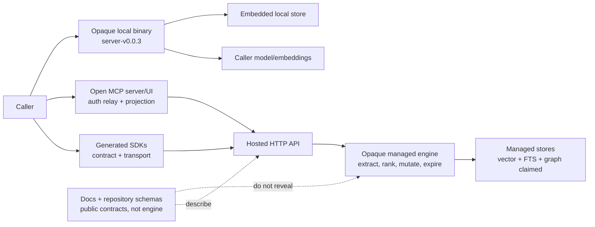
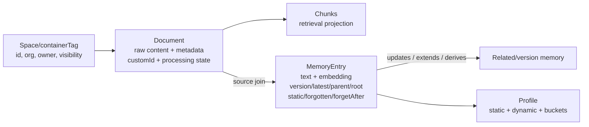
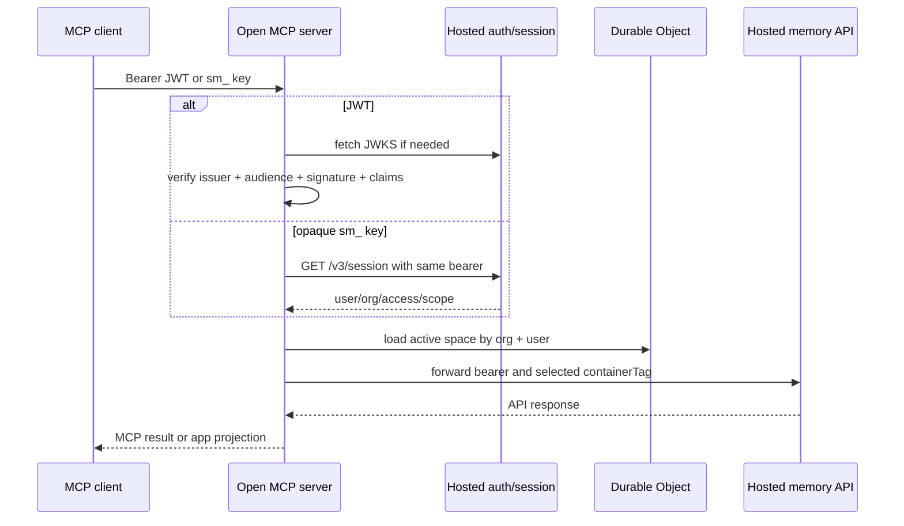

# Supermemory architecture, API, local release, and benchmark dossier

**Date:** 2026-08-26

**Status:** bounded clean-room public-source study complete

**Disposition:** architecture input only; no implementation, composition,
production use, publication, deployment, or authority transfer is authorized by
this record

## Executive decision

**Inference.** Curiosity should **REJECT Supermemory as canonical memory,
evidence, authorization, deletion, or lifecycle authority**, **ADAPT only its
document-versus-memory separation and explicit version/relation vocabulary as
design input**, and **DEFER any hosted or local evaluation** to a separate,
reviewed, disposable qualification.

**Documented.** The public surfaces describe a coherent product contract:
asynchronous document ingestion, raw chunks plus extracted memories, stable
`customId` updates, `updates`/`extends`/`derives` relations, versioned direct
memory operations, soft forgetting, scheduled expiry, profiles, connectors, and
memory/document/hybrid search. Public schemas and graph UI code preserve useful
fields for source links, current/version state, relations, static status, and
forgetting state. [HOW-IT-WORKS] [GRAPH-MEMORY] [MEMORY-SCHEMA]
[TS-DIRECT-MEMORY] [TS-SEARCH]

**Inference.** Those contracts do not establish the properties Curiosity needs
from an authority. The managed extraction, ranking, contradiction resolution,
graph mutation, expiry execution, authorization enforcement, and physical
deletion implementations are not in the inspected public tree. The visible
memory graph package computes a UI projection from API objects; it is not the
managed graph engine. [SEARCH-SCHEMA] [GRAPH-PROJECTION]

**Documented.** The self-hosted distribution does not close that gap. Release
`server-v0.0.3` consists of checksummed installer and binary assets. Its tag
points directly to unsigned commit
`39ef7e1e5ea01b34d2cdd1801d0d227d445a985d`. The complete 1,145-entry tagged
tree reports `truncated: false`, but contains no local-server or embedded-engine
source path. [LOCAL-RELEASE] [LOCAL-TAG] [LOCAL-COMMIT] [LOCAL-TREE]

**Inference.** A checksum detects accidental or post-manifest corruption; it
does not prove who produced an asset when the manifest, installer, and binary
share the same unsigned release channel. Hosted/local behavioral equivalence,
local engine internals, at-rest behavior, queue durability, erasure, and the
claim of no analytics therefore remain unverified vendor claims.

**NO-GO.** Do not install or execute the local binary, probe hosted endpoints,
use credentials, copy vendor prompts or implementation, reproduce benchmarks,
compose Supermemory with the private runtime, or project Supermemory state into
plugin Ledger v1 under this research authority. The repository constitution
keeps Ledger as the sole lifecycle authority and unified retrieval/Ledger work
design-only. [REPOSITORY-CONSTITUTION]

## Decision question, depth, and boundary

The decision question is:

> Which publicly observable Supermemory mechanisms are useful as architecture
> input, and which opaque, contradictory, security-sensitive, or
> non-reconstructible properties prohibit treating the product as Curiosity's
> memory authority?

The bounded sub-questions were:

1. What do the hosted documentation, repository schemas, generated SDKs, and
   open MCP server actually contract for?
2. Which graph, temporal, forgetting, provenance, and profile states are visible,
   and which mutation/ranking semantics remain hidden?
3. Where are authentication and authorization enforced in the open MCP path?
4. What is actually published as "Supermemory local," and can its binary be
   traced to inspectable source?
5. What does MemoryBench measure, and do checked-in artifacts reproduce the
   public LongMemEval claims?

**Documented boundary.** Inspection was limited to static public documentation,
source, generated clients, tests, Git/GitHub metadata, the text installer, and
the public research page. No binary was downloaded, inspected, or executed. No
hosted account, credential, request, access-control test, connector, model,
database, deployment, or private artifact was used. No bypass, implementation,
deployment, publication, or production mutation was attempted.

**Documented depth.** Coverage was considered sufficient after the study
correlated ingestion, retrieval, profiles, direct memory CRUD, graph schemas and
UI projection, MCP authentication and writes, generated-client transport,
self-hosting documentation and release provenance, and the complete benchmark
orchestration/reporting path. Questions requiring a managed-service trace or
binary behavior were stopped as **Unknown**, not guessed.

## Evidence labels and pins

| Label | Meaning in this record |
| --- | --- |
| **Documented** | Directly visible in a pinned public source, schema, test, generated client, release record, or retained static artifact. |
| **Vendor claim** | Stated by Supermemory documentation or research material but not independently reproduced. |
| **Inference** | Bounded architectural or security conclusion derived from cited evidence. |
| **Unknown** | Not determinable from permitted evidence, or dependent on opaque hosted/local behavior. |

| Evidence family | Pin | License observation |
| --- | --- | --- |
| `supermemoryai/supermemory` | `f11d8c4620b222e2bf701380545c6c5dcee70f9d` [SM-SOURCE] | MIT file in the inspected tree [SM-LICENSE] |
| `supermemoryai/memorybench` | `94e2af54b661d90e77dddbd8fa4fa5b28c07a24e` [MB-SOURCE] | MIT file [MB-LICENSE] |
| `supermemoryai/sdk-ts` | `e8ad71abb407eab7b25b863fc1486d7b05c7f024` [TS-SOURCE] | Apache-2.0 LICENSE file; README badge instead says MIT [TS-LICENSE] [TS-README] |
| `supermemoryai/python-sdk` | `600bebede5504bd55c0cae3555b90218253da119` [PY-SOURCE] | Apache-2.0 LICENSE and package metadata [PY-LICENSE] [PY-PACKAGE] |
| Local release | `server-v0.0.3`, commit `39ef7e1e5ea01b34d2cdd1801d0d227d445a985d` | Binary license/source correspondence is **Unknown** |

**Inference.** Public-source licenses permit study and may permit reuse subject
to their terms. They do not make the hosted service or opaque release source
available, resolve the TypeScript SDK's conflicting license statements, or
override Curiosity's clean-room and authority constraints.

## Keep the surfaces separate



| Surface | What is public | What must not be attributed to it |
| --- | --- | --- |
| Hosted contracts | Docs, request/response schemas, generated clients | Managed implementation, operational controls, or observed behavior |
| Open MCP and graph UI | Authentication relay, tool routing, schemas, graph rendering | Hosted policy enforcement, graph mutation, extraction, or ranking |
| Generated TypeScript/Python SDKs | Serialization, validation, retries, errors, logging, base URL overrides | Server-side idempotency, transactions, authorization, or deletion |
| Local release | Installer text, release metadata, checksums, opaque binaries | Inspectable embedded-engine source or hosted-equivalent behavior |
| MemoryBench | Harness control flow, metrics, prompts, checkpoint/report formats | Reproducible vendor results; no run artifacts are committed |

**Inference.** Similar API names across these surfaces are interoperability
signals only. They are not proof of shared code, data models, failure semantics,
security controls, model quality, or hosted/local equivalence.

## Hosted architecture contract

### Ingestion and derived outputs

**Vendor claim.** Supermemory says a custom learning model decides what to learn,
importance, forgetting, and relations, while an internally built temporal
vector-graph engine combines vector, full-text, and graph storage.
[HOW-IT-WORKS]

**Documented contract.** A document is raw input such as text, a conversation,
file, URL, image, audio/video, code, or connector item. The documented pipeline
is `queued -> extracting -> chunking -> embedding -> indexing -> done`, with
`failed` also observable. A stable `customId` is the caller identity for update
and diff processing. [HOW-IT-WORKS] [ADD-CONTEXT] [DOCUMENT-OPS]

```text
POST /v3/documents
  -> validate and accept {content, customId?, containerTag?, metadata?, ...}
  -> return {id, status: "queued"}
  -> extract -> chunk -> embed -> index
  -> status "done" makes document chunks searchable
  -> dynamic or instant "dreaming" extracts/merges graph memories
  -> profiles and relations may change
```

**Documented qualification.** `status: "done"` is not uniformly "all memory
work complete." The default `dreaming: "dynamic"` can continue graph extraction
after document indexing is done; `dreaming: "instant"` is the documented mode
for immediate per-document memory generation. [HOW-IT-WORKS]

**Inference.** Any integration would need separate document-index and
memory-graph completion receipts. Polling only document `status` can race graph
search or profiles.

**Documented.** `taskType: "superrag"` deliberately performs only
chunk/embed/index and skips fact extraction and profile updates. The default
`"memory"` path does both. [ADD-CONTEXT]

**Inference.** Chunks, memories, and profiles are distinct projections from one
write. None should be silently substituted for another in provenance,
authorization, or deletion logic.

### Logical data model



**Documented.** The repository memory schema contains `spaceId`, `orgId`,
`version`, `isLatest`, `parentMemoryId`, `rootMemoryId`, a relation map,
`sourceCount`, `isInference`, `isForgotten`, `isStatic`, `forgetAfter`,
`forgetReason`, embeddings, metadata, and timestamps. A separate source join
connects memory IDs to document IDs with relevance, metadata, and added time.
[MEMORY-SCHEMA]

**Documented.** Search response schemas expose parent and child context with
relative version distance and `updates`, `extends`, or `derives` relation labels.
The generated v5 candidate also exposes a `related` collection for non-version
`extends`/`derives` edges. [SEARCH-SCHEMA] [TS-SEARCH]

**Documented qualification.** The open graph component constructs every
document-to-memory edge as `derives`, then adds memory-to-memory edges from
`memoryRelations`, falling back from `parentMemoryId` to `updates`. Unknown
relation strings are rendered as `updates`. [GRAPH-PROJECTION]

**Inference.** The document `derives` edge in the UI is a rendering convention,
not proof that the backend classified every source relationship as a semantic
derivation. The open package shows how fields are visualized, not how the
managed service creates, validates, or mutates them.

### Relations, time, contradiction, and forgetting

| Mechanism | Publicly visible contract | Authority limitation |
| --- | --- | --- |
| `updates` | New fact replaces prior fact for current search; versions/history remain | **Unknown** candidate selection, conflict rule, or transaction |
| `extends` | New detail enriches an older fact without invalidating it | **Unknown** relation-generation precision and mutation |
| `derives` | Inferred fact from one or more memories | Model-derived proposal, not evidence truth |
| `isLatest` and version links | Current/version lineage fields exist | No immutable decision log or compare-and-set contract is public |
| `isStatic` | Permanent trait marker in direct-memory/profile contracts | "Permanent" is semantic policy, not a retention or legal guarantee |
| `forgetAfter` | Scheduled time after which memory is treated as forgotten | **Unknown** scheduler, lag, retries, and physical cleanup |
| explicit forget | Sets `isForgotten=true`; excluded from default search | Soft delete, expressly retained in the database |
| query forget | Semantic candidate selection, optional `dryRun`, `threshold`, and `maxForget` | Model selection can be broad; preview can drift before apply |

Sources: [GRAPH-MEMORY], [MEMORY-OPS], [TS-DIRECT-MEMORY],
[TS-FORGET-MATCHING], and [TS-DIRECT-SCHEMA].

**Documented.** Exact ID application after a dry run is the documented way to
bind a bulk forget to a reviewed set. Query application re-runs semantic
selection and can drift if the container changes. The generated request defaults
`dryRun` to `false`, threshold to `0.5`, and `maxForget` to `100`.
[MEMORY-OPS] [TS-FORGET-MATCHING]

**Inference.** Soft forgetting is retrieval ineligibility, not erasure. Scheduled
forgetting is also not event time, valid time, retention expiry, tombstoning, or
proof of physical deletion.

**Unknown.** No permitted evidence reveals extraction prompts, model versions,
candidate sets, contradiction rationale, confidence calibration, mutation
transaction boundaries, expiry worker behavior, or a durable adjudication log.

### Profiles, connectors, and multimodal input

**Vendor claim.** Profiles are automatically maintained per `containerTag` with
static, dynamic, and custom bucket views. Documentation says AI adds, updates,
or removes facts and that filters restrict which memories contribute.
[PROFILES]

**Inference.** A profile is a model-derived convenience projection. It has no
public capture digest, supporting-span contract, policy snapshot, validation
state, reviewer, or immutable revision receipt. It cannot be Curiosity evidence
or user truth.

**Vendor claim.** The platform supports text, URLs, PDFs and office files,
images, audio/video, code, JSON/CSV, Drive, Gmail, Notion, OneDrive, GitHub,
Granola, and web crawling, with provider-specific synchronization behavior.
[CONTENT-TYPES] [CONNECTORS]

**Unknown.** Extractor versions, OCR/transcription quality, webhook durability,
connector authorization refresh, deletion propagation, source ACL changes,
duplicate suppression, and exact source-byte custody are not established by the
public descriptions.

## API and contract assessment

### Public operation families

| Surface | Contracted operations | Important behavior |
| --- | --- | --- |
| `/v3/documents` | add, batch add, upload file, list processing, list/get/update/delete, chunks, bulk delete | Asynchronous ingest; stable `customId`; content updates reprocess |
| `/v4/conversations` | ingest/update structured role messages, text/image parts, tags, metadata | Generated TypeScript contract; separate from generic string ingestion |
| `/v4/search` | memory, document, or hybrid retrieval; filters; include context; rerank/rewrite | Scores are relevance fields, not truth confidence |
| `/v4/profile` | static, dynamic, bucket views and optional query results | Derived context by container |
| `/v4/memories` | direct create, list/history, versioned update, soft forget, semantic/exact bulk forget | Bypasses raw ingestion for caller-specified facts |
| `/v3/connections` | create/configure/list/import/resources/delete connector state | Hosted connector control plane |
| container/settings APIs | space metadata, merge, bucket/settings management | Organization/space configuration surface |

Sources: [TS-CONVERSATIONS], [TS-DIRECT-MEMORY], [TS-SEARCH],
[DOCUMENT-OPS], and [CONNECTORS].

**Documented.** Direct v4 creation can provide `isStatic`, `forgetAfter`,
`forgetReason`, and structured `temporalContext` containing `documentDate` and
`eventDate`; it creates a lightweight source document for traceability.
[TS-DIRECT-SCHEMA]

**Inference.** Caller-supplied temporal metadata is input, not independently
validated time. A source-document ID provides lineage at object granularity but
does not prove exact supporting bytes or spans.

### Contract drift and contradictions

| Topic | Conflicting evidence | Resolution for this dossier |
| --- | --- | --- |
| v4 search request | Repository `Searchv4RequestSchema` lacks generated `searchMode`, `containerTags`, `aggregate`, `filepath`, forgotten-memory control, and deprecated `chunks` [SEARCH-SCHEMA] [TS-SEARCH] | Treat generated SDK and docs as a newer contract candidate, not proof of deployed behavior |
| Search threshold | Repository schema defaults to `0.6`; search docs say `0.5` [SEARCH-SCHEMA] [SEARCH-DOC] | Pin the exact client/spec; do not assume one default |
| Direct-memory SDK support | Docs say "SDK support coming soon" while generated TypeScript exposes add, list, update, forget, and forget-matching [MEMORY-OPS] [TS-DIRECT-MEMORY] | Documentation and generator are out of sync |
| Document page size | Document docs say max `200`; MCP graph tool accepts up to `1,000`; repository list schema caps `1,100` [DOCUMENT-OPS] [MCP-GRAPH-FETCH] [PAGINATION-SCHEMA] | Never infer server acceptance from one surface |
| Processing status | Some examples collapse status to `processing`; detailed docs expose extracting/chunking/embedding; how-it-works also names indexing [DOCUMENT-OPS] [HOW-IT-WORKS] | Use the detailed set only as a documented contract, not a universal enum |
| Completion | `status: done` means chunks indexed, but default dynamic dreaming may continue [HOW-IT-WORKS] | Separate document and graph readiness |
| Deletion wording | Document guide says bulk/single document deletes are permanent; direct memory forget is explicitly soft and retained [ADD-CONTEXT] [MEMORY-OPS] | Keep document deletion and memory forgetting as different operations; physical cleanup remains unknown |
| Local/API parity | Self-host docs say full API and identical behavior, while local uses caller models and omits connectors/MCP/optimized extraction [SELF-HOST] [SELF-HOST-CONFIG] | Method parity is a vendor claim, not behavioral equivalence |
| TypeScript SDK license | Repository LICENSE is Apache-2.0; README badge says MIT [TS-LICENSE] [TS-README] | License metadata requires owner clarification before reuse |
| TypeScript SDK maturity/version | README says not production-ready; package is `5.0.0-rc.4`; generated metadata/user-agent says `5.0.0-rc.3` [TS-README] [TS-PACKAGE] [TS-METADATA] | Treat this pin as an RC with internal version drift |

**Inference.** The OpenAPI-generated SDK is useful evidence of intended wire
shape, but generated code, hand-authored docs, repository validation, MCP usage,
and a deployed endpoint can advance independently. Compatibility must be tested
against one explicit server build; no source is automatically authoritative for
all surfaces.

## Security, privacy, and authorization

### Hosted claims versus evidence

| Claim | Label | Qualification |
| --- | --- | --- |
| SOC 2 Type II certified | **Vendor claim** | No report, scope, period, exceptions, or auditor artifact was inspected |
| GDPR compliant; access/erasure workflows | **Vendor claim** | No DPA, subprocessors, retention schedule, backup policy, or erasure evidence was inspected |
| HIPAA BAA available on eligible plans | **Vendor claim** | Plan/contract claim, not universal product compliance |
| TLS in transit and AES-256-class managed-cloud at-rest controls | **Vendor claim** | Cipher/configuration, key custody, rotation, and coverage are unknown |
| Container tags are hard isolation and scoped keys cannot cross them | **Vendor claim** | Public docs describe policy; hosted enforcement was not tested |
| Typical managed search is sub-300ms p50 | **Vendor claim** | No workload, region, percentile sample, or raw measurements supplied |

Sources: [SECURITY-DOC], [MULTI-TENANCY], and [AUTH-DOC].

**Inference.** None of these statements should be represented as verified
security, compliance, authorization, retention, deletion, or performance. The
security page itself directs customers to request legal packs for contractual
wording.

### Open MCP authentication and state



**Documented.** JWTs are verified with remote JWKS, issuer, audience, subject,
and organization claims. Opaque keys matching `sm_...` are validated through
`/v3/session` and cached in-process for 60 seconds. Session schemas model full
or scoped access, read/write permission, tag sets, expiry, role, and restricted
container access. [MCP-AUTH] [MCP-TYPES]

**Documented.** Active space is durable state named by organization and user.
It survives individual stateless MCP transport sessions. [MCP-SERVER]
[MCP-SPACE-STATE]

**Documented.** The RBAC helper computes effective read/write labels for widget
choices. `guided-save` and `upload-file` expose only labels computed as writable.
However, `save-memory` accepts a caller `containerTag` and calls the hosted
client directly, while `add_memory` resolves an explicit/active tag and does the
same. Neither write path invokes `effectiveContainerTagAccess` immediately
before the hosted request. [MCP-RBAC] [MCP-GUIDED-SAVE] [MCP-UPLOAD-UI]
[MCP-SAVE] [MCP-ADD]

**Inference.** The open MCP layer's writable-space picker is presentation
filtering, not a complete write authorization reference monitor. Correctness
depends on hosted API enforcement of the forwarded bearer token and
`containerTag` for every route. That enforcement is **Unknown** under this
credential-free study.

**Documented.** `getDocument` obtains a document by ID, then compares returned
`containerTags` to the active space and emits the same `"Document not found"`
error for an out-of-space object. This is a useful non-oracle presentation
pattern, but the underlying ID fetch and hosted authorization still precede the
local check. [MCP-NONORACLE] [MCP-CLIENT]

**Inference.** Curiosity must authorize before lookup as well as before
delivery. A post-fetch tag check cannot establish least disclosure if the
upstream request itself was not permitted.

### MCP upload capability

**Documented.** A file upload preparation creates a random ID and token with a
two-minute expiry. Only the SHA-256 token hash is stored. Consumption runs in a
Durable Object transaction, checks expiry and hash, deletes the record before
returning it, and is therefore single-use. [MCP-SERVER] [MCP-SPACE-STATE]

**Documented.** The upload proxy then forwards the stored hosted bearer token
and multipart body to `/v3/documents/file`, returning limited response headers
with `Cache-Control: no-store`. [MCP-UPLOAD-PROXY]

**Inference.** This is a narrowly useful one-time capability pattern. It does
not prove file-size enforcement, malware scanning, content-type truth, target
space authorization, upstream cancellation cleanup, storage erasure, or that
the bearer is never exposed through infrastructure logs.

### Telemetry and logs

**Documented.** MCP PostHog analytics are disabled when no key is configured.
When enabled, events include user ID, organization grouping, tool name, outcome,
duration, MCP surface, whether a space was explicit, client name/version,
OAuth client ID, and error type. The shown event does not include query text or
the container-tag value. [MCP-ANALYTICS]

**Inference.** User and organization IDs remain linkable identifiers. Deployment
policy, PostHog tenancy, retention, and any logs outside this event builder are
**Unknown**.

## Generated SDK behavior

### TypeScript candidate

**Documented.** The generated TypeScript SDK validates outbound requests and
inbound responses, exposes typed transport/status errors, supports per-call and
client server overrides, and allows custom HTTP clients, signals, retries,
timeouts, and hooks. A representative operation defaults to retry codes `429`,
`500`, `502`, `503`, and `504`, but its retry strategy defaults to `none` and
its timeout defaults to `-1` (no SDK timeout). [TS-OPERATION] [TS-TRANSPORT]

**Inference.** Listing retryable codes does not mean retries occur. Callers must
configure bounded retries and timeouts explicitly, and must determine whether a
write is safe to retry.

**Documented high-risk logging behavior.** Setting `debugLogger` or
`SUPERMEMORY_DEBUG` logs every request header, JSON/text/form body, every
response header, and JSON/text/form response body. No redaction is visible in
the logging functions. Authorization headers and memory content can therefore
be emitted to the configured logger. [TS-TRANSPORT]

**Inference.** Debug logging must remain disabled anywhere credentials,
personal data, proprietary content, or Ledger-derived IDs might be present.
Transport logs are not safe evidence artifacts without a separately reviewed
redaction boundary.

### Python candidate

**Documented.** Python package `3.59.0` defaults to a 60-second timeout,
5-second connect timeout, and two retries. It retries network/timeout failures
and HTTP `408`, `409`, `429`, and `>=500`, respecting bounded `Retry-After` and
otherwise using exponential backoff with jitter. It maps common HTTP status
codes to typed exceptions. [PY-PACKAGE] [PY-DEFAULTS] [PY-RETRIES] [PY-ERRORS]

**Documented.** The base client generates an idempotency key for non-GET
requests, but `_idempotency_header` is initialized to `None`; the header builder
adds the key only when that name is configured. No generic idempotency header is
therefore emitted by the inspected base path. [PY-IDEMPOTENCY]
[PY-IDEMPOTENCY-GENERATION]

**Inference.** Automatic retries on `409`, timeout, or connection failure do not
prove exactly-once writes. Without a documented server idempotency contract,
callers must assume an ambiguous write may already have committed.

## Supermemory local distribution

### What is claimed

**Vendor claim.** Current self-hosting docs describe a single binary with the
same engine and full API as hosted Supermemory, an embedded graph engine, local
hybrid search, optional fully offline Ollama-compatible LLMs, and default local
`Xenova/bge-base-en-v1.5` 768-dimensional embeddings. They distinguish caller
models from proprietary hosted models and omit hosted connectors, MCP, optimized
extraction, and managed scaling. [SELF-HOST] [SELF-HOST-EMBEDDINGS]
[SELF-HOST-CONFIG]

**Vendor claim.** Interactive first boot saves provider and embedding choices
encrypted under `$SUPERMEMORY_DATA_DIR`; the binary sends no analytics.
[SELF-HOST-EMBEDDINGS] [SELF-HOST-CONFIG]

### What the public release establishes

| Observation | Label | Consequence |
| --- | --- | --- |
| `server-v0.0.3` published 2026-06-13 and targets `main` | **Documented** | Release metadata is public, but `main` is not a reproducibility pin |
| Tag resolves directly to commit `39ef...` | **Documented** | Lightweight tag, no signed tag object |
| Commit verification is `verified:false`, reason `unsigned` | **Documented** | GitHub provides no cryptographic author verification for the commit |
| Release has four platform binaries, manifest, checksums, and installer | **Documented** | Artifact digests exist |
| Installer asset digest is `8b5ed48b23f0d87ccae07c1742409a79227c1eb910aafadd73723f75a7c25d2a` | **Documented** | Retained installer text matched release metadata |
| Complete tag tree has 1,145 entries, `truncated:false`, and no local-server/embedded-engine source path | **Documented negative finding** | Binary internals cannot be reconstructed from the tag |

Sources: [LOCAL-RELEASE], [LOCAL-TAG], [LOCAL-COMMIT], and [LOCAL-TREE].

**Documented.** The installer selects an OS/architecture asset, fetches the
release manifest and binary, compares SHA-256, installs the binary, writes a
version file and shell wrapper, and sources `~/.supermemory/env` on launch. On
macOS, if signature verification fails, it applies and verifies an ad hoc local
signature. [LOCAL-INSTALLER]

**Documented.** Exported or interactively entered provider keys are written as
shell assignments to `~/.supermemory/env` with mode `600`. This conflicts with
the current first-boot documentation's statement that choices are encrypted
under the data directory. [LOCAL-INSTALLER] [SELF-HOST-QUICKSTART]

**Inference.** Mode `600` is useful discretionary filesystem protection but is
not encryption. It does not protect keys from the account owner, malware with
that access, backups, shell sourcing, process environment capture, or privileged
administrators.

**Documented negative finding.** The permitted pinned clone could not resolve
the tag and printed:

```text
fatal: ambiguous argument 'server-v0.0.3^{commit}': unknown revision or path not in the working tree.
```

The tag was resolved only through public GitHub metadata. This is a clone
completeness limitation, not evidence that the public tag is absent. [LOCAL-TAG]

### Local trust assessment

**Unknown.** The embedded database format, graph mutation algorithm, FTS/vector
ranking, transactions, authorization, queue durability, crash recovery, backup
consistency, key encryption, telemetry, update channel, file serving safety,
retention, and erasure behavior cannot be statically established without source
or binary inspection.

**Inference.** "Full API" may mean route compatibility while models, extraction,
quality, concurrency, persistence, and operations differ. The docs expressly say
the hosted system uses proprietary models and optimized extraction, so hosted
and local outputs should be expected to diverge even if every route exists.

**NO-GO.** Checksums and an MIT repository license are insufficient to approve
opaque binary execution. Any future local qualification needs separately
approved provenance, signature/SBOM/source correspondence, sandboxing, network
controls, synthetic fixtures, and deletion/failure tests.

## MemoryBench and public benchmark claims

### Checked-in harness

**Documented.** MemoryBench orchestrates six phases: ingest, wait for indexing,
search, answer with an LLM, evaluate with a judge, and report. It checkpoints
each phase under `./data/runs/{runId}`, writes per-question search results, and
supports phase-specific concurrency and resume. [MB-README] [MB-ORCHESTRATOR]
[MB-CHECKPOINT]

**Documented.** The Supermemory provider stringifies sessions with a date prefix,
ingests each session, waits for both document and memory status to report done,
then requests hybrid search with summaries and deprecated embedded chunks. It
uses provider defaults of 100 ingest and 200 indexing concurrency and depends on
`supermemory ^4.0.0`, not the separately inspected v5 RC. [MB-PROVIDER]
[MB-PACKAGE]

**Inference.** Harness results are configuration-specific. Session formatting,
provider version, concurrency, readiness polling, threshold, limit, search mode,
answer model, judge model, and provider-specific prompt formatting all affect
quality, latency, and token counts.

### Metric semantics

| Metric | Checked-in calculation | Caveat |
| --- | --- | --- |
| Answer quality | Judge label/score against ground truth | LLM judgment, not deterministic ground-truth execution |
| Hit@K | 1 if any top-K result is judged relevant | Judge sees full serialized result and expected answer |
| Precision@K | relevant judged results divided by returned top-K | Binary model-generated relevance labels |
| Recall@K | 1 if any relevant result exists, else 0 | This is binary hit, not conventional recall over known relevant items |
| MRR | reciprocal rank of first judged-relevant item | Depends on judge labels and result serialization |
| NDCG | binary judged relevance against an ideal list sized by retrieved relevance | `totalRelevant` is derived from retrieved labels, not an external relevance set |
| Latency | phase wall-clock durations and search response duration | Includes client/network/provider conditions; concurrency changes conditions |
| Context tokens | answering prompt tokens minus base prompt tokens | Client-side; Google/unknown models use approximate characters/4 |

Sources: [MB-RETRIEVAL-EVAL], [MB-ANSWER], [MB-TOKENS], and [MB-REPORT].

**Documented high-impact caveat.** The harness sets `totalRelevant` to
`max(1, relevantRetrieved)` and `recallAtK` to `1` whenever at least one result
is relevant. Its displayed Recall@K is therefore equivalent to Hit@K, not
retrieved-relevant divided by all relevant items. [MB-RETRIEVAL-EVAL]

**Inference.** MemoryBench retrieval `recallAtK` must not be compared to a paper
or product page without first reconciling metric definitions.

### Reproducibility and the LongMemEval page

**Documented negative finding.** `data/` is gitignored and the pinned repository
commits no run checkpoint, per-question result, report, model response, or raw
judgment artifact. [MB-GITIGNORE] [MB-README]

**Vendor claim.** The public LongMemEval page reports 95% overall Recall@15 with
aggregation, approximately 720 mean added tokens, and 99.4% context reduction,
with category scores including 99% knowledge update and 91% temporal reasoning.
It says the evaluation used LongMemEval-S in May 2026 and describes session-based
ingestion, relational versioning, temporal grounding, and hybrid source-chunk
injection. [LONGMEMEVAL]

**Unknown.** The inspected evidence does not map that page to an immutable code
revision, generated dataset, hosted service build, model snapshot, complete
configuration, raw retrievals, answer outputs, judge outputs, repeated runs, or
confidence intervals. The page's Recall@15 definition also cannot be assumed to
be the checked-in harness's binary `recallAtK` implementation.

**Inference.** The public numbers are useful hypotheses, not acceptance evidence
for Curiosity. They establish neither security, authorization, provenance,
durability, deletion, hosted/local equivalence, nor quality on Curiosity data.

## Failure, concurrency, and lifecycle risks

| Boundary | Public behavior | Residual risk |
| --- | --- | --- |
| Document acceptance to processing | Immediate queued response, asynchronous stages | Acceptance is not durable completion; queue internals unknown |
| Document done to graph memory | Dynamic dreaming may continue after done | Search/profile race unless graph readiness is separately observed |
| Stable `customId` update | Vendor says diff/new content is processed | Concurrent ordering, idempotency, and replacement semantics unknown |
| Versioned memory update | New version, old `isLatest=false` | Atomicity of new version, relation, index, and profile changes unknown |
| Semantic forget preview/apply | Apply-by-query re-runs selection | Candidate drift; default `dryRun:false` increases blast-radius risk |
| Soft forget/expiry | Default search excludes forgotten/expired memory | Physical retention and propagation to chunks, profiles, caches, backups unknown |
| SDK retry after ambiguous failure | Python retries writes; TypeScript can be configured to | Duplicate/partial writes absent server idempotency proof |
| MCP selected space | Durable active tag with explicit override | Stale state and caller-supplied tag still require per-request authorization |
| Connector disconnect | Stops future sync per docs | Previously ingested content remains unless separately deleted |
| Local upgrade/install | Manifest checksum and wrapper | Same-channel integrity, unsigned provenance, migration/rollback unknown |

**Inference.** No public control flow provides the durable outbox, idempotency
receipt, policy snapshot, transaction boundary, reconciliation cursor, or erasure
receipt Curiosity would require before accepting cross-projection state.

## Hypotheses and results

| Hypothesis | Result | Evidence |
| --- | --- | --- |
| Public repository schemas fully match current generated v4 search. | **Falsified.** Material fields are absent from `Searchv4RequestSchema`. | [SEARCH-SCHEMA] [TS-SEARCH] |
| Document `done` means graph memories and profiles are ready. | **Falsified.** Dynamic dreaming may continue. | [HOW-IT-WORKS] |
| Updating a direct memory overwrites and erases the prior value. | **Falsified.** The generated contract creates a new version and preserves the original. | [TS-DIRECT-MEMORY] |
| Forgetting a memory physically deletes it. | **Falsified.** It is marked forgotten and retained. | [MEMORY-OPS] [TS-DIRECT-MEMORY] |
| Every MCP write is locally checked against effective read/write RBAC. | **Falsified.** Picker tools compute writable tags; direct write paths forward selected tags without that helper. | [MCP-RBAC] [MCP-SAVE] [MCP-ADD] |
| The local release tag contains the embedded engine source. | **Falsified for the complete tagged tree.** No matching source path exists. | [LOCAL-TREE] |
| A release checksum proves publisher authenticity. | **Falsified as a general claim.** The same unsigned channel supplies manifest and assets. | [LOCAL-RELEASE] [LOCAL-COMMIT] |
| Checked-in MemoryBench results reproduce the vendor score. | **Falsified.** `data/` is ignored and no run artifacts are committed. | [MB-GITIGNORE] |
| MemoryBench Recall@K is conventional corpus recall. | **Falsified.** It is implemented as binary any-hit. | [MB-RETRIEVAL-EVAL] |
| Local and hosted behavior are equivalent. | **Unknown.** Public docs claim API parity, but engine code and runtime evidence are absent and model stacks differ. | [SELF-HOST] [LOCAL-TREE] |

## Reconstructibility assessment

| Behavior | Confidence | Basis and limit |
| --- | --- | --- |
| Hosted route names and nominal wire shapes | Medium-high | Docs plus two generated clients; drift prevents a single authoritative contract |
| Document lifecycle vocabulary | High as documentation | Multiple docs converge; deployed transition behavior untested |
| Memory object/version/relation fields | High as schema | Repository and generated schemas converge on core fields |
| Open graph rendering | High | Pure projection code is visible; backend relation creation is not |
| TypeScript/Python transport behavior | High | Generated control flow is explicit at pinned commits |
| MCP authentication, active-space, and tool routing | High | Source and tests expose the complete open path |
| Hosted authorization enforcement | Low / unknown | Docs claim it; no service source or credentialed test |
| Hosted extraction/ranking/mutation/expiry | Low / unknown | Vendor descriptions only |
| Local binary architecture and hosted parity | Low / unknown | Binary opaque; tagged source absent |
| MemoryBench harness metrics | High | Calculation and orchestration source visible |
| Public benchmark result reproduction | Low / unknown | Immutable runs and raw artifacts absent |

**Inference.** An independent implementation could reconstruct a compatible
facade for many nominal request/response shapes and could reproduce the open MCP
projection. It could not honestly claim equivalent extraction, graph evolution,
ranking, contradiction handling, profile synthesis, expiry, authorization,
local persistence, or benchmark performance from this evidence.

## Curiosity fit

| Curiosity requirement | Supermemory evidence | Disposition |
| --- | --- | --- |
| Ledger v1 is sole lifecycle authority | Hosted model mutates current/version/forgotten/profile state opaquely | **FAIL as authority** |
| Exact capture, provenance, and support spans | Coarse document source links; no public span/digest/custody contract | **FAIL** |
| Explicit validation/dispute decisions | Relation and inference fields, but no durable rationale/reviewer record | **FAIL** |
| Authorization before lookup and delivery | Hosted enforcement unknown; MCP has some post-fetch/presentation checks | **FAIL** |
| Tombstone and erasure proof | Memory forget is soft; document/backup/cache physical deletion unknown | **FAIL** |
| Provider-neutral, rebuildable projection | Hosted and local engine internals opaque | **FAIL** |
| Separate source and derived memory | Documents/chunks/memories/profiles are distinct | **ADAPT vocabulary only** |
| Version and relation vocabulary | `updates`, `extends`, `derives`, parent/root/latest fields | **ADAPT as non-authoritative proposal metadata** |
| Bounded retrieval | Threshold/limit/mode controls exist but ranking/coverage unknown | **CONDITIONAL design input** |
| Reproducible qualification | Harness exists, committed result artifacts do not | **FAIL current evidence** |

**Inference.** The reusable ideas are conceptual, not a dependency decision:
preserve raw-source retrieval separately from derived atomic memories; make
version links explicit; distinguish replacement from enrichment and inference;
and make soft-forgotten state queryable for review. Curiosity must specify those
ideas independently under Ledger authority rather than importing Supermemory
state or semantics.

## Requirements for any separately approved future evaluation

These are prerequisites, not authorization granted by this report.

1. **Inference.** Use disposable synthetic data, a dedicated test organization
   or sandbox, one narrowly scoped expiring key, and no personal, production,
   credential, Ledger, EventCapture, or proprietary corpus data.
2. **Inference.** Pin the exact API/OpenAPI revision, SDK package and generated
   metadata version, base URL, model stack, region, account plan, and every
   request parameter. Disable TypeScript debug logging.
3. **Inference.** Treat `containerTag` as untrusted input. Test allow and deny
   cases for every read/write route with multiple principals and tags, including
   known out-of-scope IDs, before relying on hosted isolation.
4. **Inference.** Record separate acceptance, document-ready, memory-ready, and
   profile-ready receipts. Fault-inject timeout/retry/concurrent-`customId`
   cases and classify ambiguous outcomes.
5. **Inference.** Verify soft forget, scheduled forget, direct update, document
   deletion, container deletion, profile removal, connector disconnect, caches,
   exports, and backups separately. Never call an API success physical erasure
   without provider evidence.
6. **Inference.** For local evaluation, require publisher-verifiable signatures,
   immutable checksums obtained through an independent channel, SBOM, license
   mapping, source/build correspondence, network-deny sandboxing, and an explicit
   prohibition on ad hoc resigning as a substitute for provenance.
7. **Inference.** Benchmark from immutable datasets, exact prompts, provider and
   model revisions, complete run manifests, raw retrievals/answers/judgments,
   repeated seeds, confidence intervals, and corrected metric definitions.
8. **Inference.** Keep every Supermemory result untrusted and non-authoritative.
   Reauthorize, check Ledger eligibility/tombstones, hydrate canonical evidence,
   and recheck immediately before delivery.
9. **Inference.** Prove that deleting the entire external system loses no
   canonical capture, decision, policy, provenance, lifecycle, or audit state.

## Curiosity-specific NO-GOs

1. **NO-GO.** No production/public crawling, deployment, package publication,
   signing, notarization, or other-platform release.
2. **NO-GO.** No hosted account creation, API probing, credential use,
   connector authorization, access-control bypass, or production mutation.
3. **NO-GO.** No download, inspection, installation, execution, or reverse
   engineering of Supermemory release binaries under this static study.
4. **NO-GO.** No composition of hosted Supermemory, the local binary, SDKs, MCP,
   graph UI, or MemoryBench into the private runtime.
5. **NO-GO.** No representation of documents, memories, profiles, relations,
   versions, scores, static flags, expiry, forgetting, or benchmark labels as
   canonical Ledger evidence or truth.
6. **NO-GO.** No dual-write, synchronization, or conflict flow that creates a
   second lifecycle authority beside plugin Ledger v1.
7. **NO-GO.** No reliance on `containerTag`, active-space state, metadata filters,
   or MCP picker labels as Curiosity authorization.
8. **NO-GO.** No claim that soft forget, document delete, container delete,
   disconnect, local storage removal, or a successful response proves erasure.
9. **NO-GO.** No claim of SOC 2, GDPR, HIPAA, encryption, tenant isolation,
   latency, benchmark quality, or hosted/local parity as independently verified.
10. **NO-GO.** No copying of vendor extraction prompts, proprietary behavior, or
    implementation. Only independently specified concepts may enter a separately
    approved design.
11. **NO-GO.** No implementation of unified retrieval/Ledger work from this
    dossier. The repository constitution keeps that work design-only.

## Residual unknowns

**Unknown.** Hosted extraction prompts and models; relation candidate generation;
duplicate, contradiction, update, and derive decisions; profile synthesis;
ranking/fusion/reranking; score calibration; graph/store transactions; queue
durability; reconciliation; and failure recovery.

**Unknown.** Hosted authorization implementation for every route, key type,
container/tag combination, direct ID lookup, connection, bulk operation, and
race with membership/key revocation.

**Unknown.** Physical retention and deletion across source files, chunks,
embeddings, memories, profiles, relation history, logs, caches, exports,
connectors, replicas, backups, and third-party model/subprocessor systems.

**Unknown.** Exact deployed contract among current docs, repository schemas,
TypeScript RC, Python SDK, open MCP dependency version, and local server release.

**Unknown.** Local binary source, build recipe, dependency inventory, signature,
embedded database, encryption format and key custody, network behavior,
telemetry, authorization, migration, backup, crash consistency, and API parity.

**Unknown.** Reproducibility and uncertainty of public LongMemEval claims under
fixed artifacts, and whether the page's Recall@15 uses the checked-in harness's
non-conventional recall implementation.

## Curiosity pass and stop decision

| Candidate thread | Decision relevance / novelty / cost | Decision |
| --- | --- | --- |
| Compare generated v4 search to repository schema | High / high / low | Pursued; established material drift |
| Trace MCP write permission from session to hosted call | High / high / medium | Pursued; local picker enforcement is incomplete |
| Resolve local tag, commit signature, complete tree, and installer digest | High / high / medium | Pursued; binary remains opaque |
| Inspect or execute release binary | High / potentially high / prohibited | `CURIOSITY_NO_GO`: outside static clean-room boundary |
| Probe hosted authorization and deletion | High / high / credentialed and prohibited | `CURIOSITY_NO_GO`: requires account/data mutation |
| Reproduce LongMemEval | Medium-high / medium / high and credentialed | `CURIOSITY_NO_GO`: immutable run inputs absent and execution out of scope |
| Inspect private compliance reports or production controls | High / high / unavailable | `CURIOSITY_NO_GO`: requires a new evidence class and contractual access |

**Saturation stop.** The investigation stopped after independent public surfaces
converged on a decision-complete model: useful API vocabulary, opaque managed
semantics, an open MCP/UI projection with incomplete local write enforcement,
generated-client transport risks, an opaque unsigned local distribution, and a
benchmark harness without reproducible results. Further static searching was
repeating contracts or claims rather than revealing engine behavior. Every
remaining decision-critical gap requires prohibited binary work, credentialed
hosted tests, private operational evidence, or benchmark execution. Those gaps
are explicitly retained as **Unknown**.

## Adaptive bibliography rationale

| Source family | Why retained | Claims supported | Why preferable / limitation |
| --- | --- | --- | --- |
| Pinned Supermemory docs and validation schemas | First-party intended contract plus repository-visible drift | Pipeline, graph vocabulary, profiles, search, forgetting, self-host claims | Primary public source; managed runtime still opaque |
| Pinned TypeScript and Python SDKs | Exact generated serialization and transport paths | v4 surface, retry/timeout/errors, debug logging, version/license drift | Direct code; generated intent is not deployed behavior |
| Pinned open MCP and graph package | Inspectable security and projection control flow | JWT/API-key auth, RBAC presentation, space state, upload capability, UI edges | Strong for the open layer only; hosted enforcement unknown |
| GitHub release/ref/commit/tree APIs and retained installer | Immutable public release facts and complete tree | Asset digests, unsigned commit, source absence, plaintext key file | Strong metadata; no binary behavior inspected |
| Pinned MemoryBench source | Exact metric and orchestration semantics | Checkpoints, concurrency, judge labels, recall flaw, token accounting | Strong for harness; result artifacts absent |
| Public LongMemEval page | Vendor's current benchmark claim and methodology narrative | 95% Recall@15, about 720 tokens, 99.4% reduction | First-party claim only; not immutable or independently reproduced |
| Public security page | Explicit compliance/security positioning | SOC 2/GDPR/HIPAA/encryption/isolation/latency claims | Vendor overview, not audit/control evidence |

## Verification

This is a documentation-only result. No Supermemory service, binary, model,
connector, SDK test, or benchmark run is required to verify the exclusive change
boundary:

```sh
artifact=apps/runtime/docs/research/memory-systems/supermemory-2026-08-26.md
git diff --no-index --check -- /dev/null "$artifact" || test $? -eq 1
git diff --no-index -- /dev/null "$artifact" || test $? -eq 1
git status --short
```

## Pinned evidence index

[REPOSITORY-CONSTITUTION]: ../../../AGENTS.md
[SM-SOURCE]: https://github.com/supermemoryai/supermemory/tree/f11d8c4620b222e2bf701380545c6c5dcee70f9d
[SM-LICENSE]: https://github.com/supermemoryai/supermemory/blob/f11d8c4620b222e2bf701380545c6c5dcee70f9d/LICENSE#L1-L21
[HOW-IT-WORKS]: https://github.com/supermemoryai/supermemory/blob/f11d8c4620b222e2bf701380545c6c5dcee70f9d/apps/docs/concepts/how-it-works.mdx#L8-L165
[GRAPH-MEMORY]: https://github.com/supermemoryai/supermemory/blob/f11d8c4620b222e2bf701380545c6c5dcee70f9d/apps/docs/concepts/graph-memory.mdx#L41-L142
[ADD-CONTEXT]: https://github.com/supermemoryai/supermemory/blob/f11d8c4620b222e2bf701380545c6c5dcee70f9d/apps/docs/ingestion/add-memories.mdx#L67-L125
[DOCUMENT-OPS]: https://github.com/supermemoryai/supermemory/blob/f11d8c4620b222e2bf701380545c6c5dcee70f9d/apps/docs/ingestion/document-operations.mdx#L48-L178
[CONTENT-TYPES]: https://github.com/supermemoryai/supermemory/blob/f11d8c4620b222e2bf701380545c6c5dcee70f9d/apps/docs/concepts/content-types.mdx#L8-L150
[CONNECTORS]: https://github.com/supermemoryai/supermemory/blob/f11d8c4620b222e2bf701380545c6c5dcee70f9d/apps/docs/connectors/overview.mdx#L8-L128
[PROFILES]: https://github.com/supermemoryai/supermemory/blob/f11d8c4620b222e2bf701380545c6c5dcee70f9d/apps/docs/concepts/user-profiles.mdx#L8-L182
[MEMORY-OPS]: https://github.com/supermemoryai/supermemory/blob/f11d8c4620b222e2bf701380545c6c5dcee70f9d/apps/docs/recall/memory-operations.mdx#L8-L340
[SEARCH-DOC]: https://github.com/supermemoryai/supermemory/blob/f11d8c4620b222e2bf701380545c6c5dcee70f9d/apps/docs/recall/search.mdx#L8-L215
[SEARCH-SCHEMA]: https://github.com/supermemoryai/supermemory/blob/f11d8c4620b222e2bf701380545c6c5dcee70f9d/packages/validation/api.ts#L470-L558
[PAGINATION-SCHEMA]: https://github.com/supermemoryai/supermemory/blob/f11d8c4620b222e2bf701380545c6c5dcee70f9d/packages/validation/api.ts#L175-L190
[MEMORY-SCHEMA]: https://github.com/supermemoryai/supermemory/blob/f11d8c4620b222e2bf701380545c6c5dcee70f9d/packages/validation/schemas.ts#L218-L294
[GRAPH-PROJECTION]: https://github.com/supermemoryai/supermemory/blob/f11d8c4620b222e2bf701380545c6c5dcee70f9d/packages/memory-graph/src/hooks/use-graph-data.ts#L193-L455
[SECURITY-DOC]: https://github.com/supermemoryai/supermemory/blob/f11d8c4620b222e2bf701380545c6c5dcee70f9d/apps/docs/overview/security.mdx#L12-L71
[MULTI-TENANCY]: https://github.com/supermemoryai/supermemory/blob/f11d8c4620b222e2bf701380545c6c5dcee70f9d/apps/docs/concepts/multi-tenancy.mdx#L8-L95
[AUTH-DOC]: https://github.com/supermemoryai/supermemory/blob/f11d8c4620b222e2bf701380545c6c5dcee70f9d/apps/docs/authentication.mdx#L8-L110
[MCP-TYPES]: https://github.com/supermemoryai/supermemory/blob/f11d8c4620b222e2bf701380545c6c5dcee70f9d/apps/mcp/src/shared/types.ts#L6-L37
[MCP-AUTH]: https://github.com/supermemoryai/supermemory/blob/f11d8c4620b222e2bf701380545c6c5dcee70f9d/apps/mcp/src/server/auth/index.ts#L15-L189
[MCP-RBAC]: https://github.com/supermemoryai/supermemory/blob/f11d8c4620b222e2bf701380545c6c5dcee70f9d/apps/mcp/src/server/auth/rbac.ts#L3-L34
[MCP-SERVER]: https://github.com/supermemoryai/supermemory/blob/f11d8c4620b222e2bf701380545c6c5dcee70f9d/apps/mcp/src/server/server.ts#L26-L118
[MCP-SPACE-STATE]: https://github.com/supermemoryai/supermemory/blob/f11d8c4620b222e2bf701380545c6c5dcee70f9d/apps/mcp/src/server/space-state.ts#L4-L72
[MCP-CLIENT]: https://github.com/supermemoryai/supermemory/blob/f11d8c4620b222e2bf701380545c6c5dcee70f9d/apps/mcp/src/server/client/index.ts#L135-L175
[MCP-GUIDED-SAVE]: https://github.com/supermemoryai/supermemory/blob/f11d8c4620b222e2bf701380545c6c5dcee70f9d/apps/mcp/src/server/tools/guided-save.ts#L8-L59
[MCP-UPLOAD-UI]: https://github.com/supermemoryai/supermemory/blob/f11d8c4620b222e2bf701380545c6c5dcee70f9d/apps/mcp/src/server/tools/upload-file.ts#L8-L51
[MCP-SAVE]: https://github.com/supermemoryai/supermemory/blob/f11d8c4620b222e2bf701380545c6c5dcee70f9d/apps/mcp/src/server/tools/save-memory.ts#L8-L42
[MCP-ADD]: https://github.com/supermemoryai/supermemory/blob/f11d8c4620b222e2bf701380545c6c5dcee70f9d/apps/mcp/src/server/tools/add-memory.ts#L7-L63
[MCP-NONORACLE]: https://github.com/supermemoryai/supermemory/blob/f11d8c4620b222e2bf701380545c6c5dcee70f9d/apps/mcp/src/server/tools/get-document.ts#L10-L64
[MCP-UPLOAD-PROXY]: https://github.com/supermemoryai/supermemory/blob/f11d8c4620b222e2bf701380545c6c5dcee70f9d/apps/mcp/src/server/index.ts#L258-L305
[MCP-ANALYTICS]: https://github.com/supermemoryai/supermemory/blob/f11d8c4620b222e2bf701380545c6c5dcee70f9d/apps/mcp/src/server/analytics.ts#L35-L126
[MCP-GRAPH-FETCH]: https://github.com/supermemoryai/supermemory/blob/f11d8c4620b222e2bf701380545c6c5dcee70f9d/apps/mcp/src/server/tools/fetch-graph-data.ts#L8-L44
[TS-SOURCE]: https://github.com/supermemoryai/sdk-ts/tree/e8ad71abb407eab7b25b863fc1486d7b05c7f024
[TS-PACKAGE]: https://github.com/supermemoryai/sdk-ts/blob/e8ad71abb407eab7b25b863fc1486d7b05c7f024/package.json#L1-L12
[TS-METADATA]: https://github.com/supermemoryai/sdk-ts/blob/e8ad71abb407eab7b25b863fc1486d7b05c7f024/src/lib/config.ts#L62-L68
[TS-README]: https://github.com/supermemoryai/sdk-ts/blob/e8ad71abb407eab7b25b863fc1486d7b05c7f024/README.md#L1-L12
[TS-LICENSE]: https://github.com/supermemoryai/sdk-ts/blob/e8ad71abb407eab7b25b863fc1486d7b05c7f024/LICENSE#L1-L30
[TS-TRANSPORT]: https://github.com/supermemoryai/sdk-ts/blob/e8ad71abb407eab7b25b863fc1486d7b05c7f024/src/lib/sdks.ts#L90-L443
[TS-OPERATION]: https://github.com/supermemoryai/sdk-ts/blob/e8ad71abb407eab7b25b863fc1486d7b05c7f024/src/funcs/memories-add.ts#L83-L168
[TS-DIRECT-MEMORY]: https://github.com/supermemoryai/sdk-ts/blob/e8ad71abb407eab7b25b863fc1486d7b05c7f024/src/sdk/memories.ts#L15-L99
[TS-DIRECT-SCHEMA]: https://github.com/supermemoryai/sdk-ts/blob/e8ad71abb407eab7b25b863fc1486d7b05c7f024/src/models/operations/post-v4-memories.ts#L13-L97
[TS-FORGET-MATCHING]: https://github.com/supermemoryai/sdk-ts/blob/e8ad71abb407eab7b25b863fc1486d7b05c7f024/src/models/operations/post-v4-memories-forget-matching.ts#L12-L126
[TS-SEARCH]: https://github.com/supermemoryai/sdk-ts/blob/e8ad71abb407eab7b25b863fc1486d7b05c7f024/src/models/operations/post-v4-search.ts#L15-L90
[TS-CONVERSATIONS]: https://github.com/supermemoryai/sdk-ts/blob/e8ad71abb407eab7b25b863fc1486d7b05c7f024/src/models/operations/post-v4-conversations.ts#L11-L52
[PY-SOURCE]: https://github.com/supermemoryai/python-sdk/tree/600bebede5504bd55c0cae3555b90218253da119
[PY-PACKAGE]: https://github.com/supermemoryai/python-sdk/blob/600bebede5504bd55c0cae3555b90218253da119/pyproject.toml#L1-L36
[PY-LICENSE]: https://github.com/supermemoryai/python-sdk/blob/600bebede5504bd55c0cae3555b90218253da119/LICENSE#L1-L30
[PY-DEFAULTS]: https://github.com/supermemoryai/python-sdk/blob/600bebede5504bd55c0cae3555b90218253da119/src/supermemory/_constants.py#L1-L14
[PY-RETRIES]: https://github.com/supermemoryai/python-sdk/blob/600bebede5504bd55c0cae3555b90218253da119/src/supermemory/_base_client.py#L717-L808
[PY-IDEMPOTENCY]: https://github.com/supermemoryai/python-sdk/blob/600bebede5504bd55c0cae3555b90218253da119/src/supermemory/_base_client.py#L363-L457
[PY-IDEMPOTENCY-GENERATION]: https://github.com/supermemoryai/python-sdk/blob/600bebede5504bd55c0cae3555b90218253da119/src/supermemory/_base_client.py#L965-L982
[PY-ERRORS]: https://github.com/supermemoryai/python-sdk/blob/600bebede5504bd55c0cae3555b90218253da119/src/supermemory/_client.py#L405-L436
[SELF-HOST]: https://github.com/supermemoryai/supermemory/blob/f11d8c4620b222e2bf701380545c6c5dcee70f9d/apps/docs/self-hosting/overview.mdx#L8-L74
[SELF-HOST-QUICKSTART]: https://github.com/supermemoryai/supermemory/blob/f11d8c4620b222e2bf701380545c6c5dcee70f9d/apps/docs/self-hosting/quickstart.mdx#L42-L166
[SELF-HOST-EMBEDDINGS]: https://github.com/supermemoryai/supermemory/blob/f11d8c4620b222e2bf701380545c6c5dcee70f9d/apps/docs/self-hosting/embeddings.mdx#L8-L130
[SELF-HOST-CONFIG]: https://github.com/supermemoryai/supermemory/blob/f11d8c4620b222e2bf701380545c6c5dcee70f9d/apps/docs/self-hosting/configuration.mdx#L8-L136
[LOCAL-RELEASE]: https://api.github.com/repos/supermemoryai/supermemory/releases/tags/server-v0.0.3
[LOCAL-TAG]: https://api.github.com/repos/supermemoryai/supermemory/git/ref/tags/server-v0.0.3
[LOCAL-COMMIT]: https://api.github.com/repos/supermemoryai/supermemory/commits/server-v0.0.3
[LOCAL-TREE]: https://api.github.com/repos/supermemoryai/supermemory/git/trees/39ef7e1e5ea01b34d2cdd1801d0d227d445a985d?recursive=1
[LOCAL-INSTALLER]: https://github.com/supermemoryai/supermemory/releases/download/server-v0.0.3/install.sh
[MB-SOURCE]: https://github.com/supermemoryai/memorybench/tree/94e2af54b661d90e77dddbd8fa4fa5b28c07a24e
[MB-LICENSE]: https://github.com/supermemoryai/memorybench/blob/94e2af54b661d90e77dddbd8fa4fa5b28c07a24e/LICENSE#L1-L21
[MB-PACKAGE]: https://github.com/supermemoryai/memorybench/blob/94e2af54b661d90e77dddbd8fa4fa5b28c07a24e/package.json#L1-L29
[MB-README]: https://github.com/supermemoryai/memorybench/blob/94e2af54b661d90e77dddbd8fa4fa5b28c07a24e/README.md#L115-L169
[MB-ORCHESTRATOR]: https://github.com/supermemoryai/memorybench/blob/94e2af54b661d90e77dddbd8fa4fa5b28c07a24e/src/orchestrator/index.ts#L252-L313
[MB-CHECKPOINT]: https://github.com/supermemoryai/memorybench/blob/94e2af54b661d90e77dddbd8fa4fa5b28c07a24e/src/orchestrator/checkpoint.ts#L25-L163
[MB-PROVIDER]: https://github.com/supermemoryai/memorybench/blob/94e2af54b661d90e77dddbd8fa4fa5b28c07a24e/src/providers/supermemory/index.ts#L14-L141
[MB-RETRIEVAL-EVAL]: https://github.com/supermemoryai/memorybench/blob/94e2af54b661d90e77dddbd8fa4fa5b28c07a24e/src/orchestrator/phases/retrieval-eval.ts#L10-L147
[MB-ANSWER]: https://github.com/supermemoryai/memorybench/blob/94e2af54b661d90e77dddbd8fa4fa5b28c07a24e/src/orchestrator/phases/answer.ts#L100-L159
[MB-TOKENS]: https://github.com/supermemoryai/memorybench/blob/94e2af54b661d90e77dddbd8fa4fa5b28c07a24e/src/utils/tokens.ts#L1-L50
[MB-REPORT]: https://github.com/supermemoryai/memorybench/blob/94e2af54b661d90e77dddbd8fa4fa5b28c07a24e/src/orchestrator/phases/report.ts#L71-L279
[MB-GITIGNORE]: https://github.com/supermemoryai/memorybench/blob/94e2af54b661d90e77dddbd8fa4fa5b28c07a24e/.gitignore#L1-L8
[LONGMEMEVAL]: https://supermemory.ai/research/longmembench
