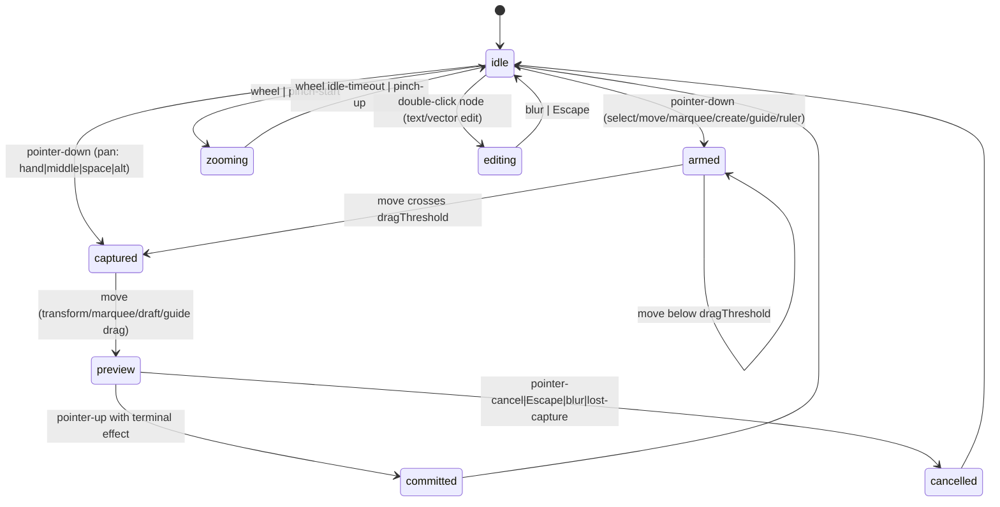

# Deep Research: Multi-Page Document Grid — Durable Model and Infinite-Canvas Interaction Design

Status: research, August 2026 · Feeds: `docs/editor/document-model.md`, `docs/editor/target-architecture.md`, `docs/editor/coordinate-spaces.md`, `docs/editor/input-and-tools.md`, `specs/007-editor-kernel-integration`

This document is a domain design and evidence review only. It proposes the durable
workspace/project/file/page/canvas model and the infinite-canvas interaction system for the
next editor slice: multiple pages per project, page-local viewport persistence, a true
adaptive grid (major/minor, dots/lines, axes, snapping, guides, rulers), cursor-anchored zoom,
precision at extreme zoom, frames and hierarchy, multi-select, constraints/auto-layout,
components/variants/tokens, text/vector/image placeholders, cross-page copy/paste, undo/redo,
and migrations. No production source, package manifest, or non-research doc is modified by
this report; nothing is committed.

---

## 1. Method and Evidence Log

**Inspection (local, read-only).** `packages/editor-kernel/src/*` (document, commands,
interaction, coordinates, kernel, scene-adapter, stress-fixtures, tests),
`packages/scene-model/src/*` (index, spatial-index, tests), `apps/crafty-web/src/App.tsx`,
and `docs/editor/*` (document-model, target-architecture, coordinate-spaces, input-and-tools,
current-state-audit, invariants, renderer-contract, renderer-failure-policy, wasm-boundary,
final-gap-analysis, implementation-roadmap, research-ledger) plus `docs/research/pen-dev-and-paper-deep-research.md`.

**Web verification (fetched 2026-08-06, cited inline).** Claimed behaviors of Figma, Penpot,
and tldraw below were verified against primary documentation during this session, except
where a claim is explicitly marked *observed, unverified in this session* or carries an
in-repo citation (the research ledger already records the Figma multiplayer article and
Penpot architecture links).

| Source | Fetched URL | What it proves |
|---|---|---|
| Figma "Adjust your zoom and view options" | https://help.figma.com/hc/en-us/articles/360041065034 | Default open = zoom-to-fit; zoom changes are per-tab; zoom presets and Shift+1/Shift+2; Cmd/Ctrl+scroll zoom; pixel grid visible only at 400%+ zoom; snap-to-pixel-grid works while grid is invisible; frames/sections/components always snap to pixel grid; layout-guides global toggle |
| Figma "Adjust alignment, rotation, position, and dimensions" | https://help.figma.com/hc/en-us/articles/360039956914 | Snap-to settings (geometry / objects / pixel grid); red guide as snap indicator; Control temporarily disables snapping; nudge small=1 / big=10; distribution keeps outermost objects; up to 1px rounding tolerance with pixel snap; auto-layout reorder changes position; instance children block aspect-ratio editing |
| Figma "Create layout guides" (layout grids, renamed May 2025) | https://help.figma.com/hc/en-us/articles/360040450513 | Three guide types: uniform grid, column, row; default color red #FF0000 @ 10% opacity; count / type (fixed vs stretch) / offset / margin / gutter; guides attach to frames; guide styles; 8-point hard/soft grid patterns; hidden guides still snap |
| Penpot "Workspace basics" | https://help.penpot.app/user-guide/designing/workspace-basics/ | Infinite viewport; pages as tabs; page separators; space+drag pan; Cmd/Ctrl+scroll zoom and Z-lens zoom; dynamic alignment guides (edges/centers) plus distance guides; rulers measure pixels; ruler guides (drag from ruler, double-click pill for exact value, right-click color, drag back to delete); square/row/column board guides with gutter/margin/defaults; snap-to-guides and snap-to-pixel toggles; guides never export; nudge amounts; focus mode; file versions + session action undo |
| tldraw Editor API reference | https://tldraw.dev/reference/editor/Editor | Per-page instance state (`getCurrentPageState`, `TLInstancePageState`); `moveShapesToPage`; clipboard content model (`getContentFromCurrentPage` / `putContentOntoCurrentPage`); screen-constant hit margin (`getHitTestMargin` = option / zoom); debounced and efficient zoom levels; mark-based undo (`markHistoryStoppingPoint`, `bail`, `bailToMark`); camera API (`zoomToFit`, `zoomToSelection`, `setCamera`, `centerOnPoint`); page CRUD (`createPage`, `duplicatePage`, `renamePage`, `deletePage`) |
| In-repo research ledger | `docs/editor/research-ledger.md` | Figma multiplayer: stable object identity, property-level updates, parent links, tree-cycle rejection, ordered children; Penpot workspace/selection module boundaries; tldraw tool/shape/binding extensibility; W3C WebGPU, wgpu |
| In-repo pen.dev deep research | `docs/research/pen-dev-and-paper-deep-research.md` | `.pen` format: one canvas per file (no pages); component refs by raw id; `descendants` overrides keyed by id paths orphan silently on restructure; imports by alias + relative URI; no auto-save |

**Rejected or deferred patterns** (same spirit as the ledger): no CRDT before local
semantics are proven; no DOM/React/GPU graph as authored document; no external format as
persistence format; pen-dev's id-path override scheme is the cautionary counter-example for
override remapping (see §5.7).

---

## 2. Baseline: What Exists Today and Where the Gaps Are

### 2.1 Kernel document (v1) — `packages/editor-kernel/src/document.ts`

`EditorDocument` v1 already contains workspace/project/file identity, `pages` map + ordered
`pageOrder`, a stable-ID `nodes` map with parent links and ordered `childIds`, component
definitions with properties/variants/states, instances with overrides keyed by node ID,
library references (id/version/integrity/status), and a `variables` map (document.ts:69-83).
Node kinds: `page-root | frame | group | rectangle | text | image` (document.ts:4). Validation
rejects duplicate IDs, dangling parent/child refs, parent mismatches, and hierarchy cycles
(document.ts:113-153). Canonical serialization sorts keys (document.ts:155-160).

**Gap for this report:** there is no per-page canvas record (grid, rulers, guides, rest
viewport); no layout/constraint records; no vector or image payload (image is a bare kind);
no asset registry; no clipboard concept; viewport is kernel-runtime state only
(kernel.ts:13); selection is a single flat array (kernel.ts:10) with no per-page or
isolation-aware depth semantics beyond one `isolationRootId`.

### 2.2 Commands and history — `commands.ts`, `kernel.ts`

Commands are immutable, validated, inverse-returning (`applyDocumentCommand` returns
`{ document, inverse, changed }`, commands.ts:26-103). Kernel wraps them in transactions
(begin/preview/commit/rollback) and linear undo/redo stacks (kernel.ts:46-99). Selection is
filtered against document on every apply (kernel.ts:53). `dispatchBatch` exists for
multi-command gestures (kernel.ts:83-93). Viewport (pan/zoom) is *not* in history and *not*
persisted; `zoomAt` preserves the cursor anchor (coordinates.ts:20-25); zoom is clamped to
[0.05, 8] per call.

**Gap:** undo/redo are file-global but page-agnostic (no `pageId` on history entries, so
undoing a cross-page gesture leaves the user on the wrong page); no history marks/targets;
no selection snapshots in entries.

### 2.3 Interaction state machine — `interaction.ts`

Explicit tools (`select | rectangle | hand`), phases `idle → armed → captured → preview →
committed/cancelled`, a screen-space drag threshold, navigation classified before creation
(middle button, Alt, Space, Hand), wheel → zoom effect without pointer capture, marquee and
move effects stubbed, and a document hit test that walks page roots with parent transforms
(interaction.ts:19-43, 45-59). The accidental-rectangle invariant is enforced by the effect
vocabulary (only the rectangle tool can emit `commit-rectangle`).

**Gap:** no resize/rotate gesture, no guide/ruler drag, no pinch state (the browser app
tracks pinch separately in `apps/crafty-web/src/App.tsx` `pinchRef`), no marquee completion
against the index, no selection-bounds computation, no snap service, no deep-select through
frames/groups, no text-edit state.

### 2.4 Scene model — `packages/scene-model/src/index.ts`

Legacy `Scene` v1 (frames with recursive layers + story overrides) is a bounded compatibility
format (document-model.md:17-19). `sceneToEditorDocument` maps each frame to one page root
(scene-adapter.ts:47-61) — so the legacy "one frame = one page" mapping is already the
multi-page seam. `editorDocumentToScene` reverses it (scene-adapter.ts:69-78).

### 2.5 Browser surface — `apps/crafty-web/src/App.tsx`

React owns `scene`, `selectedId`, `viewport`, drag/pinch refs, and renders via a
scene-renderer adapter; the current-state audit classifies every one of these as
Replace/Refactor (current-state-audit.md:13-28). The browser keeps a useful pinch midpoint
helper (`pinchRef`, App.tsx:87, 236-241) that the kernel should absorb.

### 2.6 Documented constraints this design must obey

- Authored ≠ resolved; resolved snapshots are disposable render inputs (document-model.md:9-11;
  target-architecture.md:51-57).
- Runtime state (transient selection/hover/viewport/transactions) is never serialized
  (target-architecture.md:53) — *this report refines the rule: the page's rest camera becomes
  a durable page record; transient mid-gesture camera remains unsaved* (see §4.3).
- Selection and guides are editor overlays, never authored node geometry (invariants.md:31) —
  *this report refines the rule: durable ruler guides become authored page records; transient
  magnet guides remain overlays* (see §4.6).
- Kernel owns commands/tools/selection/transactions; React owns chrome and narrow
  projections (target-architecture.md:61).
- `Scene` v1 is a temporary adapter; new features target `EditorDocument` (target-architecture.md:67-69).

---

## 3. External Models Studied

### 3.1 Figma (proprietary, cited concepts only)

- **Pages**: files contain pages; zoom resets to *zoom-to-fit on open* and zoom changes are
  per-tab, not persisted per page
  ([zoom article](https://help.figma.com/hc/en-us/articles/360041065034)). Lesson: page-local
  camera persistence is a *product decision*, not an inherent property; tldraw goes further
  and stores per-page instance state.
- **Layout guides** (renamed from "layout grids", May 2025): three kinds — uniform grid,
  column, row — attached to **frames**, not the world; default red #FF0000 at 10% opacity;
  count/type (left/right/center/stretch), width/height, offset (fixed types), margin+gutter
  (stretch types); hidden guides still snap; guide styles; 8-point hard/soft patterns
  ([layout-guides article](https://help.figma.com/hc/en-us/articles/360040450513)).
- **Pixel grid**: visible only at ≥400% zoom; snap-to-pixel-grid works while invisible;
  frames/sections/components always snap to the pixel grid; Control temporarily disables
  snapping; up to 1px rounding tolerance
  ([zoom article](https://help.figma.com/hc/en-us/articles/360041065034),
  [alignment article](https://help.figma.com/hc/en-us/articles/360039956914)).
- **Snapping**: snap to geometry / objects (centers + outermost points) / pixel grid; a red
  guide is the visual indicator ([alignment article](https://help.figma.com/hc/en-us/articles/360039956914)).
- **Stable identity**: stable object IDs, parent links, ordered children, cycle rejection,
  property-level updates are the foundation of Figma's multiplayer semantics (research-ledger.md:9).
- **Instances restrict child editing**: aspect ratio cannot be edited on instance children
  ([alignment article](https://help.figma.com/hc/en-us/articles/360039956914)) — evidence
  that instance override surface is a defined, finite set.

### 3.2 Penpot (MPL-2.0, concepts only)

- **Pages**: "Pages allow you to organize layers into separate sections inside a file, and
  are shown in separate tabs"; page separators by naming an empty page `---`
  ([workspace-basics](https://help.penpot.app/user-guide/designing/workspace-basics/)).
- **Infinite canvas + navigation**: space+drag pan; Cmd/Ctrl+scroll zoom; Z+click zoom lens;
  focus mode (F) zooms into a selection and hides the rest
  ([workspace-basics](https://help.penpot.app/user-guide/designing/workspace-basics/)).
- **Guides**: three board-level types (square, row, column) with gutter/margin/offset and
  per-file defaults; "Guides are only visible in the viewport and will never be shown on
  exports"; snap-to-guides toggle
  ([workspace-basics](https://help.penpot.app/user-guide/designing/workspace-basics/)).
- **Rulers and ruler guides**: rulers measure in pixels; guides are dragged from the ruler;
  double-click the pill for an exact value; right-click for color; drag back to the ruler to
  delete ([workspace-basics](https://help.penpot.app/user-guide/designing/workspace-basics/)).
- **Dynamic alignment**: edge/center guides while moving plus distance guides when ≥2 layers
  are near ([workspace-basics](https://help.penpot.app/user-guide/designing/workspace-basics/)).
- **Snap to pixel**: on by default; disable for subpixel precision; pixel-grid color
  customizable ([workspace-basics](https://help.penpot.app/user-guide/designing/workspace-basics/)).
- **History**: file versions (manual/autosave/pinned, 7-day window) and a session *Actions*
  panel for item-level undo/revert
  ([workspace-basics](https://help.penpot.app/user-guide/designing/workspace-basics/)).

### 3.3 tldraw (custom-commercial license; API studied, no code)

- **Per-page instance state**: `TLInstancePageState` carries each page's camera and
  selection; `getCurrentPageState` returns it — the reference model for page-local viewport
  persistence ([Editor API](https://tldraw.dev/reference/editor/Editor)).
- **Cross-page moves**: `moveShapesToPage(shapes, pageId)` is a first-class operation
  ([Editor API](https://tldraw.dev/reference/editor/Editor)).
- **Clipboard content model**: `getContentFromCurrentPage` / `putContentOntoCurrentPage`
  ([Editor API](https://tldraw.dev/reference/editor/Editor)) — content is a detached, importable
  payload rather than raw store records.
- **Precision at zoom**: `getHitTestMargin` "resolves to `hitTestMargin` … divided by the
  current zoom level, so it stays a constant distance in screen space"
  ([Editor API](https://tldraw.dev/reference/editor/Editor)) — exactly the screen-space
  tolerance the Crafty kernel already uses for drag thresholds, generalized to hit tests.
- **Zoom performance**: `getDebouncedZoomLevel` / `getEfficientZoomLevel` trade camera
  precision for render cost during camera moves
  ([Editor API](https://tldraw.dev/reference/editor/Editor)).
- **Mark-based undo**: `markHistoryStoppingPoint`, `bail`, `bailToMark`
  ([Editor API](https://tldraw.dev/reference/editor/Editor)) — the model for Escape-rollback
  of multi-command gestures and for gesture-spanning undo boundaries.

### 3.4 pen.dev `.pen` format (in-repo research)

One document = one infinite canvas; **no pages**; `reusable: true` nodes become components;
`ref` nodes are instances; overrides via `descendants: { "id-path": {...} }`; imports by
alias+URI; variables/themes (`$name` binding); no auto-save
([pen-dev-and-paper-deep-research.md](../research/pen-dev-and-paper-deep-research.md),
§1.2-1.3). **Lesson for Crafty**: pen.dev demonstrates the pain of id-path keyed overrides —
restructures silently orphan them (pen-dev research §1.3) — which is why §5.7 pairs stable
IDs with path remapping on paste.

### 3.5 Design decisions taken from this evidence

| Question | Decision | Evidence |
|---|---|---|
| Where does the rest camera live? | Durable per-page `canvas.viewport` record (single-user first), separate from transient gesture camera | tldraw `TLInstancePageState`; Figma per-tab zoom proves camera is view state but not durable per page — Crafty makes it durable because page switching is a core navigation pattern |
| World grid vs frame guides | Both: world canvas grid/axes/rulers (adaptive, durable) *and* frame-attached guides (durable, per-frame) | Figma attaches layout guides to frames; Penpot attaches guides to boards but also has world rulers; the adaptive world grid replaces Figma's "pixel grid" role |
| Snap while hidden | Snap is decoupled from visibility; each snap family has its own toggle | Figma pixel grid snaps while invisible; layout guides "still work, even when they aren't visible" |
| Guides never render in exports | Guides/grid/rulers are overlay or authored-auxiliary records excluded from export packets | Penpot: "Guides … will never be shown on exports" |
| Paste mints new IDs + remaps refs | Clipboard content is a detached payload; on paste, IDs are minted, component/instance/variable refs remapped, overrides re-keyed | tldraw content API; pen.dev id-path override failure mode; Figma multiplayer stable identity |
| Hit tolerance is screen-space | `tolerance_world = tolerance_screen / zoom` | tldraw `getHitTestMargin`; kernel already measures dragThreshold in viewport px |
| Undo groups by gesture, marked | Mark + bail for Escape; one history entry per committed gesture | tldraw marks; kernel transaction semantics |
| Undo restores page context | History entries carry `pageId`; undo switches page when needed | Penpot session Actions + page tabs; Figma undo jumps to the affected context (observed behavior) |

---

## 4. Durable Model Proposal (Schema v2)

### 4.1 Shape of the model

`Workspace → Project → File → Page → Canvas`. The Canvas is the page's infinite world:
`page-root` nodes already provide the node-hierarchy root; the new `PageCanvas` record owns
world-level view settings (grid, rulers, guides, rest camera). One canvas per page; canvas
settings are page-local by construction, which is what makes the world grid, guides, rulers,
and camera "page-local viewport persistence" without a second keying dimension.

```ts
// --- document.ts v2 additions (proposal) ---
export const EDITOR_DOCUMENT_SCHEMA_VERSION = 2 as const;

export const ZOOM_MIN = 0.05;          // matches coordinates.ts clamp today
export const ZOOM_MAX = 64;            // world units per screen px; 64x => 1px ≈ 0.0156 world units
export const WORLD_LIMIT = 1e7;        // pan clamp; keeps double precision ~1e-9 absolute
export const SNAP_TOLERANCE_SCREEN_PX = 6;

export interface ViewportRest {
  panX: number;
  panY: number;
  zoom: number;                        // within [ZOOM_MIN, ZOOM_MAX]
}

export type GuideAxis = "x" | "y";
export interface GuideRecord {
  id: DocumentId;
  axis: GuideAxis;                     // x = vertical line at x, y = horizontal line at y
  position: number;                    // world units on the canvas
  color?: string;
}

export interface GridSnapSettings {
  grid: boolean;       // snap to world grid intersections
  guides: boolean;     // snap to durable ruler guides (and, when active, magnet guides)
  objects: boolean;    // snap to object edges/centers (dynamic alignment)
  pixel: boolean;      // snap to device-pixel grid
}

export interface GridDescriptor {
  kind: "dots" | "lines" | "none";
  minorStep: number;                   // world units between minor ticks (> 0, finite)
  majorDivisions: number;              // minor ticks per major tick (>= 1, safe integer)
  origin: { x: number; y: number };    // world origin of the grid (defaults to page-root origin)
  showAxes: boolean;
  majorColor: string;                  // default "#FF0000" per Figma default; themeable
  majorOpacity: number;                // 0..1, default 0.15
  minorColor: string;
  minorOpacity: number;                // 0..1, default 0.10
  axisColor: string;
  axisOpacity: number;                 // 0..1, default 0.35
  snap: GridSnapSettings;
}

export interface RulerSettings {
  visible: boolean;
  unit: "world-units";                 // world units; rulers re-label by zoom (see §6.3)
  color: string;
  opacity: number;
}

export interface PageCanvas {
  grid: GridDescriptor;
  rulers: RulerSettings;
  guides: GuideRecord[];               // durable ruler guides (page-local)
  viewport: ViewportRest;              // page-local rest camera
}

export interface PageRecord {          // v1 PageRecord + canvas
  id: DocumentId;
  name: string;
  rootId: DocumentId;
  canvas: PageCanvas;
}

// EditorDocument v2: pages: Record<DocumentId, PageRecord> (canvas embedded), plus:
export interface EditorDocument {
  schemaVersion: 2;
  // ...v1 fields unchanged (workspace/project/file, pages, pageOrder, nodes,
  //    components, instances, libraries, variables, metadata)
  assets: Record<DocumentId, AssetRecord>;
}

export interface AssetRecord {
  id: DocumentId;
  kind: "image" | "font";
  mime: string;
  bytesHash: string;                   // content-address for dedupe and integrity
  uri?: string;                        // local/blob URL; never an authored truth
  width?: number;                      // intrinsic size, informational
  height?: number;
}
```

Design notes:

- **Canvas embedded in PageRecord** (not a separate map) so page/canvas can never desync and
  validation stays a single pass. Alternative (separate `canvases` map keyed by pageId) was
  rejected: it adds a second id-domain and a pairing invariant with no benefit at v2.
- **Rest camera is durable; gesture camera is not.** Only a camera at rest (no active
  pointer) may be written to `canvas.viewport`. Mid-gesture pan/zoom remains kernel-runtime
  state (kernel.ts:13) and is never serialized — this preserves the existing "runtime
  viewport never serialized" invariant while adding the page-local persistence the product
  needs. The write happens as a dedicated `set-page-viewport` command (see §4.7) so it flows
  through validation, revision, and (optionally) autosave dedupe.
- **Single-user semantics**: `canvas.viewport` is shared file state. The multiplayer
  trajectory (deferred) will need per-user camera overrides; keeping the rest camera as a
  documented *document* record now is still correct because collaboration is explicitly
  post-local (implementation-roadmap.md:24).

### 4.2 Node-level records: frames, hierarchy, layout, constraints, placeholders

```ts
export type LayoutMode = "absolute" | "auto";
export type LayoutDirection = "row" | "column";
export type Alignment = "start" | "center" | "end" | "stretch";
export type Justify = "start" | "center" | "end" | "space-between" | "space-around";

export interface LayoutRecord {
  mode: LayoutMode;
  direction?: LayoutDirection;          // auto only
  gap?: number;                         // auto only
  padding?: { top: number; right: number; bottom: number; left: number };
  align?: Alignment;                    // cross axis
  justify?: Justify;                    // main axis
  wrap?: boolean;                       // v2 reserves; not resolved yet
}

export type ConstraintAxis = "min" | "max" | "center" | "scale" | "none";
// Figma constraint vocabulary (horizontal/vertical pairs), see §3.1

export interface ConstraintRecord {
  horizontal: ConstraintAxis;
  vertical: ConstraintAxis;
}

export interface LayoutSettings {
  layout?: LayoutRecord;                // containers
  layoutPosition?: "auto" | "absolute"; // escape hatch for children (pen.dev pattern)
  constraints?: ConstraintRecord;       // absolute children only
}

export interface VectorPayload { path: string; }   // SVG path data, authored truth
export interface ImagePayload { assetId: DocumentId; }

export interface DocumentNode {
  // ...v1 fields unchanged
  clipContent?: boolean;                // frames clip children by default? default true for frames
  layout?: LayoutSettings;
  vector?: VectorPayload;               // vector placeholder payload
  image?: ImagePayload;                 // image placeholder payload
}
```

- `frame` = clip container + optional auto-layout; `group` = transparent hierarchy node
  (children keep absolute positions); `rectangle/text/vector/image` = leaves. This preserves
  the current kind set and adds payloads instead of kinds, so existing commands and the
  legacy adapter stay valid.
- Auto-layout children: authored `bounds` are a *measured cache*, not truth — resolution
  recomputes them (see §5.2). Figma evidence: layer order inside auto-layout changes position
  ([alignment article](https://help.figma.com/hc/en-us/articles/360039956914)); the same
  article confirms constraints apply to non-auto-layout children. `layoutPosition: "absolute"`
  is the pen.dev escape hatch
  ([pen-dev research §1.2](../research/pen-dev-and-paper-deep-research.md)).
- Constraint axis vocabulary intentionally matches Figma's five values per axis so the
  inspector and export mapping are predictable.

### 4.3 Tokens, components, variants (v1 records, refined)

Keep the v1 shapes (document.ts:54-82): `ComponentDefinition` with `propertyDefinitions`,
`variants`, `states`; `ComponentInstance` with `properties` and `overrides` keyed by node ID;
`variables` keyed by name. Two refinements:

1. **Token binding is a first-class reference.** Replace raw-string color usages
   (`fill: string`) with a `Paint` union: `{ kind: "color"; value: string } |
{ kind: "token"; token: DocumentId | { file: DocumentId; token: DocumentId } } |
{ kind: "asset"; assetId: DocumentId }` — authored documents keep bindings, never resolved
   colors (document-model.md:9-11). `fill: string` stays as a v1-compat projection during
   migration.
2. **Override keys get a path fallback.** `overrides: Record<DocumentId, ...>` stays, but the
   paste pipeline also records `overridePath: string[]` (child-index path from instance root)
   so pasted instances whose node IDs were reminted can be re-keyed deterministically
   (see §5.7; the pen.dev `descendants` failure mode is the evidence for the fallback).

### 4.4 Clipboard (ephemeral kernel record, serializable payload)

Clipboard is kernel state, not document state (invariants: only durable records serialize).

```ts
export interface ClipboardContent {
  type: "crafty-nodes";
  nodes: ClipboardNode[];                       // pruned subtrees, authored payloads only
  components: ComponentDefinition[];            // referenced definitions (deduped)
  instances: Record<DocumentId, ComponentInstance>;
  variables: Record<string, VariableDefinition>; // referenced tokens
  libraries: LibraryReference[];
  assets: AssetRecord[];                        // content-addressed images/fonts
  sourcePageId: DocumentId;
  sourceFileId: DocumentId;                     // for cross-file paste diagnostics
}
```

`ClipboardNode` is the serializable node record (id + kind + name + bounds + transform +
visibility + paints + text + layout + clip + payload refs) with `children: ClipboardNode[]`
order preserved. The OS clipboard gets a MIME-tagged JSON payload plus a text fallback;
the kernel keeps a process-local clipboard for in-file paste regardless of OS permission
(design editors paste within the app even when the OS board is blocked — observed
behavior; low risk to adopt).

### 4.5 Migrations

```ts
export interface DocumentMigration {
  id: string;              // "v1-to-v2-add-page-canvas"
  from: number;
  to: number;
  apply(input: unknown, context: MigrationContext): { document: unknown; diagnostics: string[] };
}
```

- Loader contract: `parse → validateAt(parsed.schemaVersion) → run migrations in order →
  validateAt(CURRENT) → return { document, applied: string[], diagnostics }`. Rejected input
  never reaches the kernel (mirrors `parseEditorDocument`, document.ts:162-168).
- **v1→v2 migration**: mint `canvas` for every page (`grid` defaults: lines, minorStep 8,
  majorDivisions 5 — the 8-point system is the documented convention, Figma layout-guides
  article; `guides: []`, `rulers` hidden or visible by preference, `viewport` = identity
  rest `{0,0,1}`); `assets = {}`; coerce `fill/stroke` strings into `{kind:"color"}` paints
  with a reversible projection for the legacy adapter.
- Migration of the legacy `Scene` stays on the adapter path: `sceneToEditorDocument`
  emits v1, the loader migrates to v2. The adapter is removed after the server API migrates
  (target-architecture.md:67-69), not extended (document-model.md:17-19).
- Diagnostics for missing definitions/orphaned overrides/cycles already exist in the
  resolution contract (document-model.md:15); migration adds its own diagnostic channel and
  never silently rewrites.

### 4.6 What is authored vs overlay (refined rule)

| Record | Durable (authored or kernel-validated) | Ephemeral overlay |
|---|---|---|
| World grid descriptor | `PageCanvas.grid` | — |
| Durable ruler guides | `PageCanvas.guides` | — |
| Magnet guides (snap indicators) | — | overlay, computed per gesture (Figma red guide, §3.1) |
| Rulers | `PageCanvas.rulers` settings; tick layout derived | rendered from viewport + grid |
| Rest camera | `PageCanvas.viewport` | transient gesture camera |
| Selection bounds / handles | — | overlay (invariants.md:31 kept for *transient* selection) |
| Snap hints / smart guides | — | overlay |

This replaces the blanket "guides are never authored" phrasing with a precise split:
*durable user guides are authored page records; transient visual aids are overlays*. Both
rules stay testable.

### 4.7 Command vocabulary additions

```ts
// new DocumentCommand (v2)
| { type: "set-page-viewport"; pageId: DocumentId; viewport: ViewportRest }
| { type: "set-grid"; pageId: DocumentId; grid: GridDescriptor }
| { type: "set-rulers"; pageId: DocumentId; rulers: RulerSettings }
| { type: "add-guide"; pageId: DocumentId; guide: GuideRecord }          // inverse: remove-guide
| { type: "remove-guide"; pageId: DocumentId; guideId: DocumentId }
| { type: "move-guide"; pageId: DocumentId; guideId: DocumentId; position: number }
| { type: "create-page"; page: PageRecord; index: number }
| { type: "delete-page"; pageId: DocumentId }
| { type: "reorder-page"; pageId: DocumentId; index: number }
| { type: "set-node-layout"; nodeId: DocumentId; layout?: LayoutSettings }
| { type: "set-node-clip"; nodeId: DocumentId; clipContent: boolean }
| { type: "set-vector-path"; nodeId: DocumentId; path: string }
| { type: "set-image-asset"; nodeId: DocumentId; assetId: DocumentId }
| { type: "set-paint"; nodeId: DocumentId; paint: Paint }                // fills/strokes move to Paint[]
| { type: "move-subtree"; nodeId: DocumentId; targetParentId: DocumentId; index: number; targetPageId?: DocumentId } // cut/paste across pages, preserves IDs
| { type: "mint-and-insert"; content: ClipboardContent; parentId: DocumentId; index: number; atWorld: {x,y} }       // paste; IDs minted inside command
```

Every command returns an inverse and validates through `validateEditorDocument` — the
invariant "human, plugin, command-palette, and agent mutations use the same validator"
(invariants.md:27) extends to paste, migration, and page ops.

---

## 5. Invariants (v2 superset; additions in bold)

Document (v1, kept): stable IDs; map keys = node IDs; single parent; child links point back;
page roots valid; no cycles; component dependency cycles rejected; cross-file refs carry
library/version/integrity.

New document invariants:

- **Every page has exactly one canvas; canvas settings are finite; grid minorStep > 0,
  majorDivisions ≥ 1; guide positions are finite and within WORLD_LIMIT.**
- **Rest viewport invariants: zoom ∈ [ZOOM_MIN, ZOOM_MAX]; pan ∈ ±WORLD_LIMIT; all values
  finite. `set-page-viewport` is the only command that may write `canvas.viewport`, and it
  must be issued only when no gesture is captured (camera at rest).**
- **Snap visibility decoupling: toggling grid/guide/pixel *visibility* never changes snap
  settings; snap is a separate bit per family.**
- **Auto-layout: child bounds of auto-layout containers are derived; authored positions for
  `layoutPosition: "auto"` children are ignored by resolution and recomputed; direct
  `set-bounds` on such children is rejected at the command boundary (or coerced into the
  measured cache with a diagnostic).**
- **Clipboard: kernel state only; never serialized; paste mints IDs; pasted content is
  validated before insertion (same validator); paste may not reference unminted IDs.**
- **Guides: authored guides are page records; magnet guides never enter the document.**
- **History entries record `pageId` and the touched node IDs; undo/redo restore the page
  context of the entry.**
- **Migration: forward-only; each step re-validates; a failed step aborts the load with
  diagnostics and keeps the previous valid document.**

Editing/rendering/persistence invariants from invariants.md:24-41 are kept unchanged except
the two refined wordings above.

---

## 6. Interaction System Design

### 6.1 Tool and gesture vocabulary (v2)

Tools: `select | rectangle | hand` (existing) + `resize/rotate` (transform handles, part of
select), `text`, `vector/pen`, `line/ellipse` later — all through the same
`transitionInteraction` contract (interaction.ts:19). New gesture classes:

| Gesture | Owner | Enters when | Commits |
|---|---|---|---|
| pan | navigation | Hand/middle/Space/Alt-drag (existing) | no command (view state) |
| zoom | navigation | wheel (Ctrl/Cmd+scroll), pinch (2 pointers) | no command; rest camera saved via `set-page-viewport` at gesture end |
| move | select | pointer-down on node + threshold | `set-bounds` batch (one entry) |
| resize | select | handle hit (screen-space tolerance) | `set-bounds` batch |
| rotate | select | rotation handle | `set-property transform` (v2) |
| marquee | select | empty-space pointer-down + threshold | `select` (no history entry) |
| deep-select | select | double-click into frame/group | pushes `isolationRootId` |
| guide-drag | select (guide hit) | pointer-down on guide | `move-guide` |
| ruler-drag | select (ruler hit) | pointer-down on ruler | `add-guide` |
| create | rectangle/text/vector | tool-specific pointer-down + threshold | `create-node`/`mint-and-insert` |
| paste | command | Cmd/Ctrl+V | `mint-and-insert` (one entry) |

Routing priority stays as documented (input-and-tools.md:1-12): cancel/lifecycle → navigation
→ transform handles → select/marquee → creation → context menu. Wheel carries no pointerId
and can never enter a creation state (input-and-tools.md:32-33) — the accidental-rectangle
proof extends to every new tool: each tool has a disjoint effect vocabulary.

### 6.2 Interaction state machine (extended)

Current: `idle → armed → captured → preview → committed/cancelled`, plus navigation capture
(interaction.ts:19-43). Proposal:



Text fallback of the same chart: `idle → armed → captured → preview → committed|cancelled`;
`idle → captured` for pan; `idle → zooming → idle` for wheel/pinch (no pointer capture);
`idle → editing → idle` for double-click text/vector edit. Zoom is instantaneous and does
not capture the pointer; the *rest* camera write happens on the next kernel tick after the
gesture ends (idle-timeout for wheel, pointer-up for pinch), so transient sampling never
reaches serialization.

Extension details, each testable:

- **Pan/zoom equivalence**: pan and zoom mutate only viewport state (already true,
  coordinates.ts:17-25); `zoomAt` anchor invariance is already covered by a kernel test
  (index.test.ts:53-59). Add pinch: midpoint = anchor; factor = `pinchDistance / startDistance`
  clamped to `[1/4, 4]` per sample; zoom clamp [ZOOM_MIN, ZOOM_MAX].
- **Zoom-step curve**: wheel notch applies `factor = 1.1^notch` (Penpot/Figma use
  Cmd/Ctrl+scroll; keep the existing `0.9/1.1` defaults, coordinates.ts:20) with clamping;
  `zoomToFit(page)`, `zoomToSelection()`, `zoomToSelectionIfOffscreen()` commands mirror
  Figma Shift+1/2 and tldraw camera API.
- **Screen-space tolerances everywhere**: drag threshold (existing), handle hit radius
  (6 px), guide grab radius (4 px), marquee overlap — all divided by zoom to world units at
  the service boundary (tldraw `getHitTestMargin` pattern, §3.3).
- **Escape semantics**: Escape rolls back the active transaction (existing); with history
  marks, Escape mid-gesture = `bail` (tldraw pattern); Escape while idle = deselect.
- **Deep-select/isolation**: double-click descends into frame/group pushing
  `isolationRootId`; navigation (F) toggles focus mode like Penpot's focus mode; hit testing
  respects isolation root and locked/hidden nodes (existing rule, invariants.md:25).

### 6.3 Adaptive grid design (major/minor, dots/lines, axes, rulers)

The grid is a **pure function of (descriptor, zoom, viewport, dpr)** producing a
`GridRenderPlan` — no state, fully testable:

```ts
export interface GridRenderPlan {
  level: "major-only" | "major-minor" | "fine" | "device-pixel";
  major: number;              // world step rendered as major ticks at this zoom
  minor: number;              // world step rendered as minor ticks at this zoom
  sub?: number;               // fine level: subdivisions of minor
  lines: WorldLine[];         // clipped to viewport, world coordinates
  dots?: WorldPoint[];        // when kind = "dots": dot centers
  axes: { x: number; y: number }[];  // axis lines at origin (x and/or y)
  snapGrid: number;           // world step used for snapping (may differ from rendered!)
  pixel?: { stepPx: number }; // device-pixel level (zoom >= 4 && pixel snap on)
}

export function gridPlan(descriptor: GridDescriptor, viewport: ViewportRest, dpr: number): GridRenderPlan;
```

LOD rules (evidence in parentheses):

1. `minor * zoom >= 32px` → level "fine": draw minor + major, and if `minor * zoom >= 96px`,
   subdivide minor into 4 sub-ticks (keeps density bounded between 8 and 32 px).
2. `minor * zoom` in `[6, 32)px` → "major-minor": draw minor and major lines/dots.
3. `minor * zoom < 6px` → "major-only": hide minor, draw major every `majorDivisions`
   (density clamp is the same technique Figma uses for the pixel grid, which it only shows
   at ≥400% zoom — §3.1).
4. `zoom >= 4` (400%) and `snap.pixel` → additionally render the device-pixel grid
   (`1px = 1/dpr world`), *drawn only when at least 4px apart on screen*; the pixel grid is
   what users edit against at extreme zoom (Figma evidence).
5. `kind: "dots"` renders dots instead of lines at levels 1-3 (dot grids are the
   whiteboard convention — low-risk adoption, matches Penpot square-guide concept).
6. Axes draw at `grid.origin` when `showAxes`, clamped into viewport.
7. Rulers: ticks derived from the same `gridPlan` steps, labeled with
   `formatWorld(world, zoom)` that switches units at powers of 10 (e.g. 8 → 8, 1200 → 1.2k)
   and shows sub-pixel precision only when `minor * zoom >= 8px`.

**Snapping is a separate service**, decoupled from rendering (invariants §5):

```ts
export interface SnapCandidate {
  kind: "pixel" | "guide" | "object-edge" | "object-center" | "grid";
  value: number;          // world coordinate on the active axis
  axis: "x" | "y";
  strength: number;       // screen-px distance
}

export function snapValue(worldValue: number, axis: "x"|"y", candidates: SnapCandidate[], toleranceWorld: number): { value: number; snapped: SnapCandidate | undefined };
```

Priority within tolerance (`toleranceWorld = 6 / zoom`, Figma's red-guide indicator is the
visual result): **pixel > guide > object > grid**. Figma ordering evidence: pixel grid snap
is a separate toggle that always applies (frames always snap, §3.1); object/geometry snaps
share the Control-disables behavior; grid snap is the weakest. Pixel snap is applied in
*screen space*: `screen = round(world * zoom * dpr) / (zoom * dpr)` — the same 1px rounding
tolerance Figma documents; with pixel snap off, values may carry decimals (Figma: "decimal
spacing values", §3.1).

Object snapping uses resolved world bounds of candidate nodes (edges: left/right/top/bottom,
centers: x/y) — Penpot's dynamic alignment (edges, centers, and distance guides when ≥2
layers, §3.2). Magnet guides are transient overlay lines at the snapped coordinate.

### 6.4 Precision at extreme zoom

- **Screen-space tolerance for all hit tests**: `hitToleranceWorld = constant / zoom`
  (tldraw `getHitTestMargin`, §3.3). Kernel keeps dragThreshold in viewport px (existing);
  the same pattern is applied to handles, guide grabs, and marquee edges.
- **Numerics**: doubles throughout; world coordinates bounded by `WORLD_LIMIT = 1e7` keeps
  absolute float error below `1e-9` at zoom 64 (double epsilon ≈ 2.2e-16 relative).
  `zoomAt` already recomputes pan from the world anchor, which avoids compounding drift
  (coordinates.ts:20-25); the anchor-invariance test (index.test.ts:56-57) becomes a
  property test across zoom factors and anchors.
- **Pixel grid at ≥400%** gives users a physical reference for exact placement (Figma,
  §3.1); **pixel preview** (rasterization fidelity check, Figma zoom article) is deferred
  but the render contract already isolates device-pixel scaling to the surface boundary
  (coordinate-spaces.md:23).
- **Debounced zoom for expensive layers**: renderer gets `getEfficientZoomLevel`-style
  debounce (tldraw, §3.3); the kernel's viewport stays exact, only the display-list
  projection samples a debounced value. This preserves hit-test correctness while bounding
  render cost.
- **Cursor-anchored zoom** is already kernel-native (`zoomAt`); wheel, pinch, and
  zoom-to-selection all route through it, so "zoom never moves the world point under the
  cursor" is one contract, not per-input arithmetic (coordinate-spaces.md:19).

### 6.5 Copy/paste across pages

1. **Copy** (`copy-selection` kernel command, no history entry): build `ClipboardContent`
   from selected subtrees (deepest-first prune: copying a frame includes children; selected
   parent + child collapses to parent). Referenced components/variables/assets are copied by
   stable key with library pins (cross-file integrity checks come with
   `LibraryReference.integrity`, document.ts:47-52).
2. **Cut**: same payload + `delete-subtree` commands in one transaction.
3. **Paste**: `mint-and-insert` mints fresh IDs (stable-ID rule: map keys = node IDs), walks
   the payload re-keying `instances.overrides` via the stored `overridePath` fallback
   (§4.3), inserts at the cursor world point with relative offsets preserved, appends to the
   active page root (or hovered frame), and lands **one history entry**. If the target file
   lacks a referenced definition, paste creates a local copy of the definition and records a
   diagnostic (Figma behavior: pasted components become local; pen.dev: dangling refs are
   the failure mode to avoid).
4. **Cross-page within file**: paste to another page is just a paste to that page's root —
   no special path. **Cut-and-move** across pages uses `move-subtree` (preserves IDs,
   re-parents across page roots) — the tldraw `moveShapesToPage` analog (§3.3).
5. Selection after paste = the minted roots.

### 6.6 Undo/redo and migrations (extended)

- History entries gain `pageId` + `touchedIds`; `undo()`/`redo()` switch `currentPageId` to
  the entry's page when needed, then apply inverses, then set selection to surviving
  `touchedIds` (selection changes themselves never enter history — keeps history semantic,
  matching Figma's observed behavior).
- **Marks**: `mark(label)`, `undoToMark(markId)`/`bail()`; a committed gesture creates at
  most one entry (existing invariant, invariants.md:28) — marks make multi-command gestures
  (paste, move-across-pages, constraint changes) roll back atomically.
- Undo of `set-page-viewport`? **No** — camera changes never enter history (they are view
  state; Figma/Penpot do not undo zoom). `set-grid`/`set-rulers`/`add-guide` DO enter history
  (they are authored records).
- Migrations run at load, forward-only, each step validated (§4.5); the kernel refuses to
  start on an un-migratable document and surfaces diagnostics through the existing
  validation channel (document.ts:85-94).

---

## 7. Authored vs Resolved vs Ownership Mapping

### 7.1 Resolution pipeline (extended)

```text
EditorDocument v2 (authored truth)
  -> reference/token resolution        (paints, component instances, variables)
  -> layout/constraint resolution      (auto-layout children, constraint-applied bounds)
  -> animation/state evaluation        (deferred; state matrix preview exists as concept)
  -> world transform + visibility      (parent chains, clipping, damage)
  -> ResolvedScene snapshot            (immutable, disposable)
  -> GridRenderPlan + guide screen positions  (parallel, from PageCanvas)
  -> versioned render packets          (Rust/WASM + WebGPU host)
```

Per target-architecture.md:51-57: each stage returns snapshot + diagnostics + revision;
stale async results rejected by `(documentRevision, requestSequence)`; missing library →
visible placeholder + diagnostic, never silent rewrite. New in v2: the grid plan is a
**projection of durable PageCanvas records** (like the scene), not renderer state; guides
are resolved to screen coordinates in the overlay layer, matching the invariant that
selection/guides are overlays — with the authored/durable split of §4.6.

### 7.2 Ownership table (who owns what)

| Concern | Kernel (editor-kernel) | Resolver (resolution service) | React (crafty-web) | Renderer (WASM/WebGPU) |
|---|---|---|---|---|
| Document records, validation, migrations | Yes (loader + validator; worker candidate later) | — | — | — |
| Page tabs data | `pageOrder` + `pages` projection | — | renders tabs, dispatches `set-page` (view command) | — |
| Rest camera per page | `set-page-viewport` command | — | mirrors via subscription | camera uniform from resolved viewport |
| Gesture/transient camera | kernel session state | — | input adapter only | — |
| Grid/guides/rulers authored records | commands (set-grid, add-guide…) | `gridPlan()` + guide resolution | renders rulers/guides overlay? (see below) | receives overlay packet |
| Magnet guides, selection overlay | ephemeral state | resolved selection bounds | overlay draw (existing renderer bridge) | overlay packet |
| Clipboard | kernel state + commands | validation of pasted content | Cmd/Ctrl+C/V adapter | — |
| History/undo/redo | kernel | — | status projection | — |
| Auto-layout/constraints | command validation only | layout resolver (worker candidate, target-architecture.md:44) | inspector projections | consumes resolved bounds |
| Paints/tokens | binding records | token resolver | token picker panels | consumes resolved paints |
| Components/instances/variants | records + override semantics | instance resolver (placeholder/diagnostic on missing) | layers/inspector projections | consumes instantiated tree |
| Assets | `assets` map + refs | asset service (hash, uri lifecycle) | upload UI | texture resources by cache key |
| Hit testing | broad-phase index + precise geometry (kernel, per target-architecture.md:34) | resolved interaction bounds | — | — |

React never owns document objects (target-architecture.md:61); App.tsx's `scene`,
`selectedId`, `viewport` state (current-state-audit.md:13-28) are replaced by kernel
projections. One open product call flagged for the UI slice: whether rulers/guides render
through the WebGPU overlay or a DOM overlay — the kernel contract is identical either way;
the renderer contract already allows "a separate overlay packet for selection and guides"
(renderer-contract.md:5).

---

## 8. Phased Vertical Slices

Each slice is kernel-first (pure logic + tests), then a browser bolt. Slices are ordered to
prove the riskiest invariants earliest.

| Slice | Kernel deliverable | Browser bolt | Proof |
|---|---|---|---|
| **S1 Multi-page + page-local viewport** | v2 schema; page CRUD/reorder commands; `set-page-viewport`; v1→v2 migration; per-page selection map; undo entries with `pageId` | Page tabs; page switch restores camera + selection; undo jumps pages | Invariants: rest-camera rule; per-page selection restore; migration round-trip |
| **S2 Adaptive grid + rulers + guides** | `GridDescriptor`, `RulerSettings`, `GuideRecord`; `gridPlan()` LOD; ruler tick math; guide commands; snap service (pixel/guide/grid) with priority | Grid overlay render; rulers; ruler-drag guides; guide drag/move/delete | LOD density bounds; snap visibility-decoupling; anchor stability of grid origin |
| **S3 Canvas interaction completion** | Resize/rotate handles (screen-space tolerance); marquee completion; deep-select isolation; zoom-to-fit/selection; pinch in kernel; wheel idle-timeout rest-camera write | Handle overlay; marquee render; focus mode | Screen-space tolerance / zoom; gesture state chart transitions; Escape=bail |
| **S4 Frames, hierarchy, multi-select** | `clipContent`; frame-aware hit test; smart selection (shift toggle, tidy-up distribute later); `move-subtree` | Frame clipping; multi-select outline; drag-reorder in layers panel | Clip visibility in resolution; subtree move across pages preserves IDs |
| **S5 Copy/paste across pages** | `ClipboardContent`; `mint-and-insert`; override path remap; local component copy on missing ref; paste = 1 history entry | Cmd/C/V wiring; paste-at-cursor; paste preview | Paste mints IDs; cross-file missing-definition diagnostic; undo of paste |
| **S6 Constraints + auto-layout** | `LayoutRecord`/`ConstraintRecord`; resolver computes auto-layout bounds; rejection of direct `set-bounds` on auto children; constraint scale/fixed math | Inspector layout panel; auto-layout frame behavior; constraint handles | Derived-bounds invariant; constraint+layout resolution snapshots deterministic |
| **S7 Components/variants/tokens + placeholders** | Instance resolution with overrides; variant axis selection; token paint binding; vector/image payloads + asset registry; placeholder + diagnostics on missing asset/definition | Components panel; variants switcher; image upload to assets; vector placeholder render | Override remap after paste; token binding not resolved into authored doc; placeholder diagnostic contract |
| **S8 History marks + persistence v2** | `mark`/`bail`; selection-restore policy; autosave at command boundaries (incl. `set-page-viewport` dedupe); server API v2 | Server persists v2 documents; reload restores last page + camera | Crash-safe autosave invariant; marks rollback multi-command gestures |

Slices 1-3 are the "document-grid" product question; 4-5 are the multi-page editing core;
6-8 complete the model. Each slice ends with `npm run test`, `typecheck`, `lint`,
`format:check` green (baseline verification per current-state-audit.md:81-82) plus its slice
tests from §10.

---

## 9. Risks

| Risk | Impact | Mitigation | Evidence basis |
|---|---|---|---|
| Per-page durable camera fights multiplayer later | Collaboration remap of shared state | Document the rest-camera as single-user-first; multiplayer adds per-user overrides without changing authored records | tldraw splits instance state from document records (§3.3); roadmap defers collaboration (implementation-roadmap.md:24) |
| Grid LOD popping / density oscillation at thresholds | Visual noise, perceived jitter | Hysteresis on level transitions (enter at 6px, leave at 8px); snap never depends on render level | Figma pixel-grid threshold behavior (§3.1) |
| Snap ambiguity (multiple candidates within tolerance) | Wrong snap targets | Fixed priority pixel > guide > object > grid; nearest-within-tolerance; magnet guide render as feedback | Figma snap families + red guide indicator (§3.1) |
| Override remap breaks pasted instances | Silent divergence from component definition | Stable IDs + `overridePath` fallback + post-paste validation diagnostics | pen.dev id-path orphaning (§1.3 of in-repo research); Figma multiplayer stable identity |
| Auto-layout + constraints interaction | Contradictory geometry | Constraints valid only on absolute children; auto-layout children reject direct bounds edits; deterministic resolver tests | Figma separates auto-layout from constraints (§3.1) |
| Undo across pages disorients users | Lost context on undo | Entry carries `pageId`; undo switches page and restores touched selection; camera changes excluded from history | Penpot session actions + page tabs (§3.2) |
| Migration of legacy `Scene` drift | Data loss on upgrade | Adapter emits v1 only; loader migrates with per-step validation and diagnostics; legacy format never extended | document-model.md:17-19; target-architecture.md:67-69 |
| Float precision at extreme zoom | Geometry wobble at zoom 64 | WORLD_LIMIT pan clamp; anchor-invariant zoom; property tests over zoom×anchor grid | coordinates.ts clamps; kernel zoom test (index.test.ts:53-59) |
| Full-JSON sync per frame persists | Latency on large pages | Retained scenes + change batches (roadmap bolt 6); debounced zoom for display lists | current-state-audit.md:49; renderer-contract.md:9-11 |
| Pixel snap surprises users at low zoom | Misalignment complaints | Pixel snap is a named toggle; frames always snap (Figma parity); 1px tolerance documented | Figma frames-always-snap (§3.1) |
| Clipboard dependency on OS permissions | Paste fails in restricted webviews | Process-local kernel clipboard fallback; MIME payload with text fallback | VS Code webview context (current-state-audit.md:7) |

---

## 10. Test Matrix

| # | Invariant / behavior | Test | Layer | Slice |
|---|---|---|---|---|
| 1 | Zoom anchor invariance | Property: `screenToWorld(anchor, zoomAt(v, anchor, f)) == anchor` across f ∈ {0.25..4}, anchors, zooms | kernel unit (extends index.test.ts:56-57) | S3 |
| 2 | Rest camera rule | `set-page-viewport` rejected mid-gesture; transient camera never serialized | kernel unit | S1 |
| 3 | Page switch restores camera + per-page selection | Kernel state assertion across `set-page` | kernel unit | S1 |
| 4 | Undo across pages | Gesture on page B undone from page A switches to B and restores touched selection | kernel unit | S1 |
| 5 | v1→v2 migration | Round-trip: legacy Scene → adapter → v1 → migrate → v2 → validate; canonical string stable | kernel unit + snapshot | S1 |
| 6 | Grid LOD density | For zoom sweep 0.05..64 and steps 1..1000: tick spacing ∈ [6, 32] screen px at every level | kernel unit (property) | S2 |
| 7 | LOD hysteresis | Level transitions do not oscillate on alternating ±1% zoom | kernel unit | S2 |
| 8 | Snap visibility decoupling | Grid hidden + `snap.grid` true → still snaps; toggling visibility leaves bits unchanged | kernel unit | S2 |
| 9 | Snap priority | Overlapping candidates resolve pixel > guide > object > grid within tolerance | kernel unit | S2 |
| 10 | Pixel snap rounding | `round(world*zoom*dpr)/(zoom*dpr)` applied only when `snap.pixel`; decimals allowed when off | kernel unit | S2 |
| 11 | Guide lifecycle | add/move/remove + undo/redo; guide position finite; delete removes from serialized doc | kernel unit | S2 |
| 12 | Rulers unit switching | Tick labels switch at power-of-10 boundaries; sub-pixel labels only at high zoom | kernel unit | S2 |
| 13 | Screen-space tolerance | `hitToleranceWorld * zoom` constant; handle hit radius stable across zoom sweep | kernel unit (property) | S3 |
| 14 | Accidental-rectangle extension | Wheel/pinch can never arm create; each tool's effect vocabulary disjoint | kernel unit (extends index.test.ts:61-80) | S3 |
| 15 | Escape = bail | Multi-command gesture (paste) rolled back to mark; no partial mutation | kernel unit | S8 |
| 16 | Paste mints IDs | Pasted subtree IDs unique and not colliding with document map keys; canonical round-trip | kernel unit | S5 |
| 17 | Paste override remap | Instance overrides re-keyed via path fallback; missing definition → local copy + diagnostic | kernel unit | S5 |
| 18 | Paste = one history entry | undo() reverts whole paste | kernel unit | S5 |
| 19 | `move-subtree` across pages | IDs preserved; parent/child invariants hold; undo restores origin page | kernel unit | S4 |
| 20 | Clip content | Resolution clips children to frame bounds; overlay bounds respect clip | resolver unit | S4 |
| 21 | Auto-layout derived bounds | `set-bounds` on auto child rejected; resolver output deterministic for given layout record | resolver unit (snapshot) | S6 |
| 22 | Constraints | Fixed/center/scale math against resolved parent bounds; combined with resize command | resolver unit | S6 |
| 23 | Token binding not resolved into authored doc | Serialized document contains binding, never computed color | kernel unit (canonical string) | S7 |
| 24 | Missing asset/definition → placeholder + diagnostic | Resolution snapshot contains placeholder node; diagnostic emitted; authored doc untouched | resolver unit | S7 |
| 25 | Migration failure safety | Corrupt v1 → load aborts with diagnostics; previous valid document preserved | kernel unit | S8 |
| 26 | Browser interaction: page tabs + restore | Automated browser test: switch page, pan/zoom, switch back → camera + selection restored; reload → rest camera persisted | browser integration (new harness) | S1 |
| 27 | Browser interaction: grid/guides | Ruler-drag creates guide; guide drag snaps at 6px tolerance; pixel grid visible at ≥400% only | browser integration | S2 |
| 28 | Browser interaction: paste | Cmd+V at cursor across pages; one undo reverts; clipboard works without OS permission | browser integration | S5 |
| 29 | Perf: grid plan | 10k-node fixture page + grid plan under 2 ms; no unbounded allocation per zoom sample | bounded perf fixture (extends stress-fixtures.ts) | S2 |
| 30 | Perf: page switch | Page switch < 250 ms (renderer-contract.md:23 budget) with rest-camera restore | perf fixture | S1 |

Test families required by the quality matrix (implementation-roadmap.md:27-28) all apply:
acceptance, command/coordinate contracts, regression, browser interaction, security boundary,
deterministic snapshots, bounded perf.

---

## 11. Open Questions for the Next Slice

1. Rulers/guides overlay: WebGPU overlay packet (renderer-contract.md:5 supports it) vs DOM
   overlay — product/UI decision, kernel-neutral.
2. Grid defaults: `lines` with 8/5 (8-point system, Figma hard-grid convention) vs `dots`;
   per-user preference vs document record.
3. Should `set-page-viewport` be autosaved immediately or batched into the next command
   boundary? (Invariants say autosave at command boundaries; camera writes are the exception
   that proves the rule.)
4. `WORLD_LIMIT = 1e7` and `ZOOM_MAX = 64` need product sign-off (they set the canvas
   size/practice envelope); alternatives are 1e6/32 (tighter) or 1e9/256 (Figma-like deep
   zoom, heavier float risk).
5. Focus mode (Penpot F) vs deep-select (double-click) as the primary isolation gesture —
   both are in the state chart; the browser slice should pick one as default.

## 12. References

- Figma Help Center, "Adjust your zoom and view options" — https://help.figma.com/hc/en-us/articles/360041065034
- Figma Help Center, "Adjust alignment, rotation, position, and dimensions" — https://help.figma.com/hc/en-us/articles/360039956914
- Figma Help Center, "Create layout guides" — https://help.figma.com/hc/en-us/articles/360040450513
- Figma Help Center, "Create dynamic designs with Auto Layout" (linked from alignment article) — https://help.figma.com/hc/en-us/articles/360040451373
- Figma Help Center, "Set constraints" (linked from alignment article) — https://help.figma.com/hc/en-us/articles/360039957734
- Penpot User Guide, "Workspace basics" — https://help.penpot.app/user-guide/designing/workspace-basics/
- Penpot architecture — https://help.penpot.app/technical-guide/developer/architecture/ (ledger)
- Figma Engineering, "How Figma's multiplayer technology works" — https://www.figma.com/blog/how-figmas-multiplayer-technology-works/ (ledger)
- tldraw Editor API reference — https://tldraw.dev/reference/editor/Editor
- Crafty research ledger — `docs/editor/research-ledger.md`
- Crafty pen.dev research — `docs/research/pen-dev-and-paper-deep-research.md`
- Crafty editor docs — `docs/editor/{document-model,target-architecture,coordinate-spaces,input-and-tools,current-state-audit,invariants,renderer-contract,implementation-roadmap,final-gap-analysis}.md`
- Crafty source inspected — `packages/editor-kernel/src/*`, `packages/scene-model/src/*`, `apps/crafty-web/src/App.tsx`
